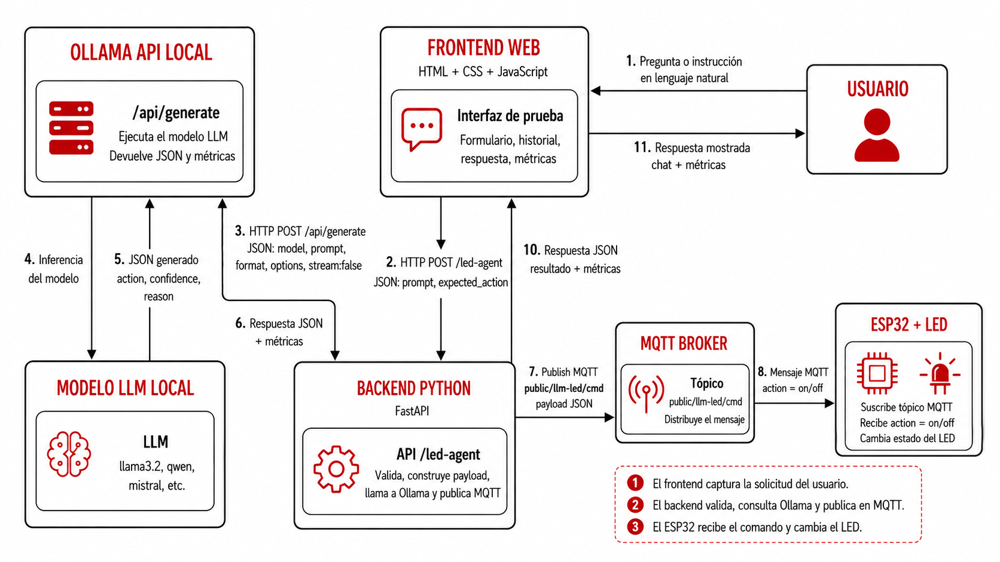
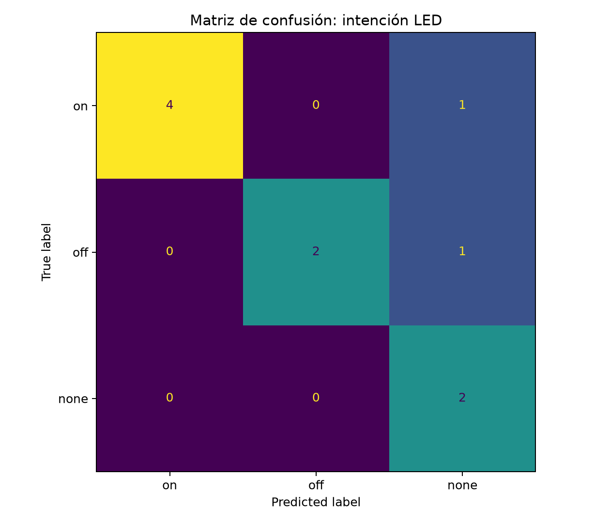
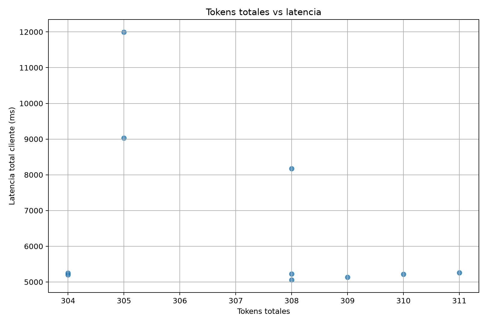

# Evaluación de arquitecturas LLM aplicadas: backend, JSON y MQTT

Esta sección presenta una metodología para evaluar proyectos basados en modelos grandes de lenguaje (*Large Language Models*, LLM) integrados con backend, salida estructurada y mensajería MQTT. El caso de estudio consiste en clasificar instrucciones en lenguaje natural para controlar un LED mediante comandos publicados por MQTT.

El propósito es evaluar el comportamiento completo de una arquitectura aplicada: entrada del usuario, interpretación del modelo, generación de JSON, validación en backend, publicación MQTT, latencia, tokens, costo estimado y supervisión humana.


> 🎯 **Objetivo de aprendizaje:** Al finalizar esta actividad, el estudiante será capaz de diseñar una evaluación experimental para una arquitectura LLM aplicada; calcular métricas de clasificación como accuracy, precision, recall, F1-score y matriz de confusión; medir latencia, tokens y costo estimado; validar salidas JSON generadas por un LLM; verificar publicación MQTT; y construir un instrumento de supervisión humana para revisar resultados.

---

## 1. Evaluación de proyectos que utilizan LLM

En aplicaciones con LLM integradas a backend, APIs, MQTT o hardware, la evaluación debe medir si el sistema completo produce una decisión correcta, estructurada, validable y operable.

En esta clase se evalúan cuatro dimensiones:

| Dimensión | Pregunta principal | Métricas asociadas |
|---|---|---|
| Calidad de decisión | ¿El LLM clasificó correctamente la intención? | Accuracy, precision, recall, F1-score, matriz de confusión |
| Salida estructurada | ¿El LLM entregó JSON válido y usable por software? | JSON validity rate, schema valid |
| Arquitectura | ¿El backend validó y publicó correctamente? | MQTT publish rate, architecture success |
| Operación | ¿Cuánto tarda, cuántos tokens usa y cuánto costaría? | Latencia, tokens, tokens/s, costo estimado |

En esta práctica experimental la medición termina cuando el backend publica correctamente el mensaje MQTT. La recepción o ejecución física del comando en un ESP32 queda fuera del experimento principal. Esta decisión permite repetir pruebas cíclicas sin depender del hardware físico.

---

## 2. Caso de estudio: clasificación de intención para LED

El caso de estudio es un agente simple que recibe una instrucción en lenguaje natural y decide si debe encender, apagar o no modificar un LED.

Las clases son:

| Clase | Significado | Acción física asociada |
|---|---|---|
| `on` | Encender, prender o activar LED | Publicar comando de encendido |
| `off` | Apagar o desactivar LED | Publicar comando de apagado |
| `none` | No hay instrucción clara de control | No modificar el estado del LED |

Ejemplos:

| Prompt | Etiqueta esperada |
|---|---|
| enciende el led | `on` |
| prende la luz del prototipo | `on` |
| apaga el led | `off` |
| desactiva la salida | `off` |
| qué es MQTT | `none` |
| no enciendas el led | `none` |
| mañana prende el led | `none` |

La clase `none` evita que el sistema active hardware cuando el usuario hace una pregunta general, una instrucción ambigua o una instrucción no inmediata.

---

## 3. Arquitectura evaluada

La arquitectura se organiza en cinco componentes:



El backend funciona como capa de seguridad y validación. El LLM no publica directamente en MQTT. Primero genera una intención estructurada y el backend decide si el resultado es válido.

---

## 4. Salida esperada del LLM

La salida esperada del modelo debe ser JSON válido:

<!-- code-open: true -->
```json
{
  "action": "on",
  "confidence": 0.95,
  "reason": "El usuario pidió encender el LED"
}
```

Campos obligatorios:

| Campo | Tipo | Regla |
|---|---|---|
| `action` | string | Debe ser `on`, `off` o `none` |
| `confidence` | number | Debe estar entre `0` y `1` |
| `reason` | string | Explicación breve |

El backend debe rechazar cualquier respuesta que no cumpla el esquema esperado.

---

## 5. Métricas de arquitecturas con LLM

### 5.1 Clasificación de intención

La tarea se modela como un problema de **clasificación multiclase**. Cada muestra corresponde a un prompt escrito por el usuario, cada prompt tiene una etiqueta esperada y el LLM produce una predicción.

En esta práctica, la entrada no es una imagen, una tabla o una señal numérica, sino una instrucción en lenguaje natural.

```text
prompt_usuario → modelo LLM → acción predicha
```

Ejemplo:

| Prompt del usuario | Etiqueta esperada | Predicción del LLM |
|---|---|---|
| `enciende el led` | `on` | `on` |
| `apaga el led` | `off` | `off` |
| `explícame qué es MQTT` | `none` | `none` |

Para calcular métricas se usan dos listas:

```text
y_true = etiquetas reales o esperadas
y_pred = etiquetas predichas por el modelo
```

Donde:

| Elemento | Significado en esta práctica |
|---|---|
| `y_true` | Lista de acciones correctas definidas en el dataset. |
| `y_pred` | Lista de acciones generadas por el LLM. |
| `expected_action` | Acción esperada para un prompt específico. |
| `llm_action` | Acción generada por el LLM para ese prompt. |
| Muestra | Un prompt evaluado. |
| Clase | Una de las acciones posibles: `on`, `off` o `none`. |

Clases del experimento:

```text
on   → encender LED
off  → apagar LED
none → no ejecutar acción de control
```

Ejemplo de listas para evaluación:

```text
y_true = ["on", "off", "none", "on", "none"]
y_pred = ["on", "none", "none", "on", "off"]
```

Lectura:

| Posición | `y_true` | `y_pred` | Interpretación |
|---:|---|---|---|
| 1 | `on` | `on` | Acierto |
| 2 | `off` | `none` | Error: el modelo ignoró una instrucción de apagado |
| 3 | `none` | `none` | Acierto |
| 4 | `on` | `on` | Acierto |
| 5 | `none` | `off` | Error: el modelo activó una acción cuando no debía |

Scikit-learn documenta funciones de evaluación para clasificación, incluyendo accuracy, precision, recall, F1-score y matriz de confusión [1]–[4].

---

### 5.2 Accuracy

**Accuracy** mide la proporción de predicciones correctas respecto al total de pruebas.

```text
accuracy = predicciones_correctas / total_de_pruebas
```

Donde:

| Elemento | Significado |
|---|---|
| `predicciones_correctas` | Número de casos donde `llm_action` coincide con `expected_action`. |
| `total_de_pruebas` | Número total de prompts evaluados. |
| `accuracy` | Proporción de aciertos del sistema. Su valor va de 0 a 1. |

Ejemplo:

| Prompt | Esperado | Predicho | Correcto |
|---|---|---|---|
| enciende el led | `on` | `on` | sí |
| apaga el led | `off` | `none` | no |
| qué es MQTT | `none` | `none` | sí |

En este ejemplo:

```text
predicciones_correctas = 2
total_de_pruebas = 3
accuracy = 2 / 3 = 0.6667
```

Interpretación:

```text
El sistema clasificó correctamente 66.67 % de los prompts.
```

Ejemplo con 100 pruebas:

```text
predicciones_correctas = 80
total_de_pruebas = 100
accuracy = 80 / 100 = 0.80
```

Interpretación:

```text
El sistema tuvo 80 % de aciertos.
```

Accuracy es una métrica fácil de interpretar, pero puede ocultar problemas si el dataset está desbalanceado. Por ejemplo, si hay demasiados prompts de clase `none`, un modelo que predice `none` con mucha frecuencia puede obtener una accuracy alta y fallar en instrucciones reales de encendido o apagado.

---

### 5.3 Precision

**Precision** mide la confiabilidad de las predicciones positivas de una clase.

```text
precision = TP / (TP + FP)
```

Donde:

| Elemento | Significado general | Significado en esta práctica |
|---|---|---|
| `TP` | True Positives, verdaderos positivos | Casos donde el modelo predijo una clase y esa clase era correcta. |
| `FP` | False Positives, falsos positivos | Casos donde el modelo predijo una clase, pero la clase correcta era otra. |
| `TP + FP` | Total de predicciones hechas para esa clase | Todas las veces que el modelo dijo que la acción era una clase específica. |
| `precision` | Proporción de predicciones correctas dentro de todas las predicciones de una clase | Qué tan confiable es el modelo cuando predice una acción. |

Para la clase `on`:

```text
precision_on = TP_on / (TP_on + FP_on)
```

Donde:

| Elemento | Significado para la clase `on` |
|---|---|
| `TP_on` | Casos donde `expected_action = on` y `llm_action = on`. |
| `FP_on` | Casos donde `llm_action = on`, pero `expected_action` era `off` o `none`. |
| `TP_on + FP_on` | Todas las veces que el modelo predijo `on`. |
| `precision_on` | Qué tan confiable es el modelo cuando dice que debe encender el LED. |

Ejemplo:

| Prompt | Esperado | Predicho | Resultado para clase `on` |
|---|---|---|---|
| enciende el led | `on` | `on` | `TP_on` |
| prende la luz | `on` | `on` | `TP_on` |
| qué es MQTT | `none` | `on` | `FP_on` |
| no enciendas el led | `none` | `on` | `FP_on` |

En este ejemplo:

```text
TP_on = 2
FP_on = 2
precision_on = 2 / (2 + 2) = 0.50
```

Interpretación:

```text
Cuando el modelo predijo on, solo acertó en 50 % de los casos.
```

En sistemas físicos, precision es importante porque un falso positivo puede activar hardware sin instrucción válida. Para el caso del LED, un `FP_on` significa que el sistema podría encender el LED cuando no debía hacerlo.

---

### 5.4 Recall

**Recall** mide qué tanto recupera o detecta el modelo una clase cuando realmente aparece.

```text
recall = TP / (TP + FN)
```

Donde:

| Elemento | Significado general | Significado en esta práctica |
|---|---|---|
| `TP` | True Positives, verdaderos positivos | Casos donde el modelo predijo correctamente una clase. |
| `FN` | False Negatives, falsos negativos | Casos donde la clase correcta era una específica, pero el modelo predijo otra. |
| `TP + FN` | Total de casos reales de esa clase | Todas las veces que una acción realmente debía ocurrir. |
| `recall` | Proporción de casos reales detectados correctamente | Qué tanto detecta el modelo una acción cuando sí debía reconocerla. |

Para la clase `on`:

```text
recall_on = TP_on / (TP_on + FN_on)
```

Donde:

| Elemento | Significado para la clase `on` |
|---|---|
| `TP_on` | Casos donde `expected_action = on` y `llm_action = on`. |
| `FN_on` | Casos donde `expected_action = on`, pero `llm_action` fue `off` o `none`. |
| `TP_on + FN_on` | Todas las veces que realmente se debía encender el LED. |
| `recall_on` | Qué proporción de instrucciones de encendido detectó correctamente el modelo. |

Ejemplo:

| Prompt | Esperado | Predicho | Resultado para clase `on` |
|---|---|---|---|
| `enciende el led` | `on` | `on` | `TP_on` |
| `prende la luz` | `on` | `none` | `FN_on` |
| `activa el led` | `on` | `on` | `TP_on` |
| `enciende la salida` | `on` | `off` | `FN_on` |

En este ejemplo:

```text
TP_on = 2
FN_on = 2
recall_on = 2 / (2 + 2) = 0.50
```

Interpretación:

```text
De todas las instrucciones que pedían encender el LED, el modelo detectó correctamente 50 %.
```

Un recall bajo indica que el sistema ignora instrucciones válidas. En esta práctica, un `FN_on` puede significar que el usuario pidió encender el LED y el sistema no ejecutó la acción.

---

### 5.5 F1-score

**F1-score** combina precision y recall en una sola métrica. Se calcula con una media armónica:

```text
F1 = 2 * (precision * recall) / (precision + recall)
```

Donde:

| Elemento | Significado |
|---|---|
| `precision` | Qué tan confiable es el modelo cuando predice una clase. |
| `recall` | Qué tanto detecta el modelo esa clase cuando realmente aparece. |
| `precision * recall` | Producto entre ambas métricas. |
| `precision + recall` | Suma de ambas métricas. |
| `F1` | Balance entre precision y recall. Su valor va de 0 a 1. |

F1 también puede expresarse con `TP`, `FP` y `FN`:

```text
F1 = 2TP / (2TP + FP + FN)
```

Donde:

| Elemento | Significado |
|---|---|
| `TP` | Verdaderos positivos de la clase evaluada. |
| `FP` | Falsos positivos de la clase evaluada. |
| `FN` | Falsos negativos de la clase evaluada. |
| `2TP` | Peso duplicado de los aciertos positivos. |
| `2TP + FP + FN` | Total ponderado de aciertos y errores relevantes para la clase. |

Ejemplo para la clase `on`:

```text
precision_on = 0.80
recall_on = 0.60
```

Entonces:

```text
F1_on = 2 * (0.80 * 0.60) / (0.80 + 0.60)
F1_on = 2 * 0.48 / 1.40
F1_on = 0.6857
```

Interpretación:

```text
El balance entre confiabilidad y detección de la clase on fue 0.6857.
```

F1 es útil cuando se necesita equilibrar dos tipos de error:

```text
1. Actuar cuando no se debía actuar.
2. No actuar cuando sí se debía actuar.
```

En sistemas físicos, ambos errores son importantes. Activar hardware sin instrucción válida puede ser riesgoso; ignorar una instrucción válida puede hacer que el sistema no cumpla la tarea.

---

### 5.6 Macro F1

En clasificación multiclase, se puede calcular un F1-score por cada clase:

```text
F1_on
F1_off
F1_none
```

Después se promedian:

```text
macro_F1 = promedio(F1_on, F1_off, F1_none)
```

Equivalente:

```text
macro_F1 = (F1_on + F1_off + F1_none) / 3
```

Donde:

| Elemento | Significado |
|---|---|
| `F1_on` | F1-score calculado para la clase `on`. |
| `F1_off` | F1-score calculado para la clase `off`. |
| `F1_none` | F1-score calculado para la clase `none`. |
| `3` | Número total de clases evaluadas. |
| `macro_F1` | Promedio simple del F1 de todas las clases. |

Ejemplo:

```text
F1_on = 0.90
F1_off = 0.85
F1_none = 0.70
```

Entonces:

```text
macro_F1 = (0.90 + 0.85 + 0.70) / 3
macro_F1 = 2.45 / 3
macro_F1 = 0.8167
```

Interpretación:

```text
El desempeño promedio balanceado entre las tres clases fue 0.8167.
```

Macro F1 da el mismo peso a todas las clases, aunque el dataset tenga más ejemplos de una clase que de otra. Esto es útil en esta práctica porque interesa evaluar por separado si el sistema reconoce `on`, `off` y `none`.

---

### 5.7 Matriz de confusión

La **matriz de confusión** muestra cómo se distribuyen los aciertos y errores entre clases. Las filas representan la clase esperada y las columnas representan la clase predicha.

Ejemplo:

| Esperado / Predicho | `on` | `off` | `none` |
|---|---:|---:|---:|
| `on` | 30 | 1 | 4 |
| `off` | 0 | 32 | 3 |
| `none` | 2 | 1 | 27 |

Lectura por filas:

| Fila | Significado |
|---|---|
| `on` | Casos donde la acción correcta era encender el LED. |
| `off` | Casos donde la acción correcta era apagar el LED. |
| `none` | Casos donde no se debía ejecutar acción de control. |

Lectura por columnas:

| Columna | Significado |
|---|---|
| `on` | Casos donde el modelo predijo encender el LED. |
| `off` | Casos donde el modelo predijo apagar el LED. |
| `none` | Casos donde el modelo predijo no ejecutar acción. |

Lectura de la diagonal principal:

| Celda | Significado |
|---|---|
| `on → on = 30` | 30 instrucciones de encendido fueron clasificadas correctamente. |
| `off → off = 32` | 32 instrucciones de apagado fueron clasificadas correctamente. |
| `none → none = 27` | 27 prompts sin acción fueron clasificados correctamente. |

Lectura de errores fuera de la diagonal:

| Celda | Significado |
|---|---|
| `on → off = 1` | El usuario pidió encender, pero el modelo predijo apagar. |
| `on → none = 4` | El usuario pidió encender, pero el modelo no ejecutó acción. |
| `off → none = 3` | El usuario pidió apagar, pero el modelo no ejecutó acción. |
| `none → on = 2` | El usuario no pidió acción, pero el modelo predijo encender. |
| `none → off = 1` | El usuario no pidió acción, pero el modelo predijo apagar. |

Interpretación para sistemas físicos:

- La diagonal principal representa aciertos.
- Los valores fuera de la diagonal representan errores.
- Casos none predichos como on indican activaciones no deseadas.
- Casos none predichos como off indican acciones físicas innecesarias.
- Casos on predichos como none indican instrucciones ignoradas.
- Casos off predichos como none indican instrucciones de apagado ignoradas.
- Casos on predichos como off u off predichos como on indican inversión de acción.

La matriz de confusión permite identificar errores específicos que accuracy no muestra. Por ejemplo, dos modelos pueden tener el mismo accuracy, pero uno puede fallar más en `none → on`, lo cual es más riesgoso si se conectan actuadores reales.



---

## 6. Métricas de salida estructurada

En una arquitectura integrada con backend, la respuesta debe ser interpretable por software. Un texto correcto para humanos puede fallar si no respeta el formato requerido.

Métrica principal:

```text
json_validity_rate = respuestas_JSON_validas / total_de_respuestas
```

Una respuesta se considera válida si cumple:

```text
1. Es JSON parseable.
2. Contiene action, confidence y reason.
3. action pertenece a on, off o none.
4. confidence está entre 0 y 1.
5. No contiene estructura ambigua.
```

Ollama permite solicitar salidas estructuradas mediante el parámetro `format`, incluyendo esquemas JSON [5]. Esto reduce respuestas libres, aunque el backend debe validar siempre la salida.

---

## 7. Métricas de arquitectura

Las métricas de arquitectura evalúan el flujo técnico, no la calidad semántica de la respuesta.

| Métrica | Tipo | Definición |
|---|---|---|
| `schema_valid` | Booleano | La salida del LLM cumple el esquema esperado |
| `mqtt_published` | Booleano | El backend logró publicar por MQTT |
| `architecture_success` | Booleano | `schema_valid AND mqtt_published` |
| `architecture_success_rate` | Tasa | Promedio de casos exitosos |
| `architecture_failure_rate` | Tasa | `1 - architecture_success_rate` |

Esto significa que el sistema fue exitoso si el modelo generó JSON válido, el backend lo validó y el comando fue publicado por MQTT.

---

## 8. Métricas de latencia

La latencia mide el tiempo que tarda el sistema en completar la operación.

| Métrica | Qué mide |
|---|---|
| `api_elapsed_ms` | Tiempo observado por el cliente que llama al backend |
| `backend_elapsed_ms` | Tiempo medido dentro del backend |
| `ollama_elapsed_ms` | Tiempo de llamada desde backend a Ollama |
| `mqtt_publish_ms` | Tiempo de publicación MQTT |
| `ollama_total_duration_ms` | Tiempo total reportado por Ollama |

También se deben reportar percentiles:

| Dato | Interpretación |
|---|---|
| Media | Tiempo promedio |
| P50 | Mediana |
| P95 | Tiempo bajo el cual cae el 95 % de pruebas |
| P99 | Cola de latencia |

---

## 9. Métricas de tokens

Ollama reporta métricas de uso como `prompt_eval_count`, `eval_count`, `prompt_eval_duration` y `eval_duration` cuando se usa la API de generación con `stream: false` [6], [7].

| Campo | Significado |
|---|---|
| `prompt_eval_count` | Tokens de entrada |
| `eval_count` | Tokens de salida |
| `total_tokens` | Tokens de entrada + salida |
| `prompt_eval_duration_ms` | Tiempo de evaluación del prompt |
| `eval_duration_ms` | Tiempo de generación |
| `input_tokens_per_s` | Velocidad de procesamiento de entrada |
| `output_tokens_per_s` | Velocidad de generación |

Fórmulas:

```text
input_tokens_per_s = prompt_eval_count / (prompt_eval_duration_ms / 1000)
```

```text
output_tokens_per_s = eval_count / (eval_duration_ms / 1000)
```



---

## 10. Métrica de costo estimado

En Ollama local:

```text
costo_API = 0
```

El experimento conserva la estructura de costo para estimar cuánto costaría ejecutar el mismo flujo con una API externa.

Fórmula:

```text
costo_request =
(input_tokens / 1,000,000) * precio_input_por_1M
+
(output_tokens / 1,000,000) * precio_output_por_1M
```

Ejemplo:

```text
input_tokens = 300
output_tokens = 40
precio_input = 0.25 USD / 1M tokens
precio_output = 1.25 USD / 1M tokens
```

```text
costo_request = (300 / 1,000,000) * 0.25 + (40 / 1,000,000) * 1.25
```

Los precios deben actualizarse antes de cada actividad si se usa API comercial [8].

---

## 11. Evaluación humana supervisada

La evaluación automática compara `expected_action` contra `llm_action`. La evaluación humana permite revisar casos ambiguos, respuestas parciales o errores de interpretación.

Ejemplo ambiguo:

```text
"mañana enciende el led"
```

En control inmediato se puede etiquetar como `none`. Un supervisor puede marcarlo como ambiguo o parcial.

Columnas sugeridas para el instrumento de supervisión:

| Columna | Uso |
|---|---|
| `accion_correcta_supervisor` | Acción correcta según supervisor: `on`, `off`, `none` |
| `evaluacion_supervisor` | `correcto`, `parcial`, `incorrecto`, `no evaluado` |
| `calidad_1_5` | Calificación subjetiva |
| `observaciones_supervisor` | Comentarios |

Niveles de evaluación:

```text
Evaluación automática:
llm_action vs expected_action_dataset
```

```text
Evaluación supervisada:
llm_action vs accion_correcta_supervisor
```

---

## 12. Diseño experimental

### 12.1 Pregunta experimental

¿Qué tan bien una arquitectura LLM local con Ollama, backend FastAPI y MQTT puede interpretar instrucciones de usuario para publicar comandos estructurados de encendido y apagado de un LED?

---

### 12.2 Hipótesis práctica

Un LLM local configurado con prompt estructurado, temperatura baja y salida JSON puede clasificar instrucciones simples de control con alta consistencia, baja tasa de JSON inválido y latencia aceptable para una práctica académica.

---

### 12.3 Variables del experimento

| Tipo | Variable |
|---|---|
| Independiente | Modelo LLM usado en Ollama |
| Independiente | Prompt de sistema |
| Independiente | Temperatura |
| Independiente | Número de pruebas |
| Dependiente | Acción predicha: `on`, `off`, `none` |
| Dependiente | JSON validity rate |
| Dependiente | MQTT publish rate |
| Dependiente | Latencia total |
| Dependiente | Tokens de entrada y salida |
| Dependiente | Costo estimado |

---

### 12.4 Tópico MQTT sugerido

Se recomienda usar un tópico público de prueba:

```text
public/llm-led/cmd
```

Payload publicado:

<!-- code-open: true -->
```json
{
  "request_id": "abc123",
  "source": "llm_backend",
  "device": "esp32_led_01",
  "action": "on",
  "value": 1,
  "confidence": 0.95,
  "reason": "El usuario pidió encender el LED",
  "sent_unix_ms": 1710000000000
}
```

---

## 13. Instalación y ejecución

### 13.1 Requisitos

```text
- Python 3.10 o superior
- Ollama instalado
- Modelo local descargado
- Conexión al broker MQTT
```

Descargar modelo:

```bash
ollama pull llama3.2:3b
```

Modelos alternativos:

```bash
ollama pull qwen2.5:7b
ollama pull mistral:7b
```

---

### 13.2 Crear carpeta de trabajo

```bash
mkdir llm-led-eval
cd llm-led-eval
```

---

### 13.3 Crear entorno virtual

Windows PowerShell:

```powershell
python -m venv .venv
Set-ExecutionPolicy -Scope Process -ExecutionPolicy Bypass
.\.venv\Scripts\Activate.ps1
```

macOS / Linux:

```bash
python3 -m venv .venv
source .venv/bin/activate
```

---

### 13.4 Instalar dependencias

```bash
pip install fastapi uvicorn requests paho-mqtt pydantic pandas numpy openpyxl matplotlib scikit-learn
```

Crear `requirements.txt`:

```bash
pip freeze > requirements.txt
```

---

### 13.5 Verificar Ollama

```bash
ollama list
```

Probar modelo:

```bash
ollama run llama3.2:3b
```

---

## 14. Código 1: backend FastAPI + Ollama + MQTT

Guardar como:

```text
main.py
```

<!-- code-file: main.py -->
```python
import os
import json
import time
import uuid
from typing import Optional, Literal

import requests
import paho.mqtt.client as mqtt

from fastapi import FastAPI
from fastapi.middleware.cors import CORSMiddleware
from pydantic import BaseModel


OLLAMA_URL = os.getenv("OLLAMA_URL", "http://localhost:11434/api/generate")
OLLAMA_MODEL = os.getenv("OLLAMA_MODEL", "llama3.2:3b")

MQTT_BROKER = os.getenv("MQTT_BROKER", "mqtt.mecatronica-ibero.mx")
MQTT_PORT = int(os.getenv("MQTT_PORT", "1883"))
CMD_TOPIC = os.getenv("CMD_TOPIC", "public/llm-led/cmd")

ALLOWED_ACTIONS = {"on", "off", "none"}

SYSTEM_PROMPT = """
Eres un clasificador de intención para controlar un LED conectado a un ESP32 por MQTT.

Tu tarea es decidir si el usuario quiere:
- "on": encender, prender o activar el LED.
- "off": apagar o desactivar el LED.
- "none": no hay una instrucción clara para cambiar el LED.

Reglas:
1. Responde únicamente JSON válido.
2. No escribas texto fuera del JSON.
3. Si el usuario pregunta algo general, responde action = "none".
4. Si el usuario dice "no enciendas", "no prendas" o algo equivalente, responde action = "none".
5. Si el usuario pide explícitamente apagar, responde action = "off".
6. Si el usuario pide explícitamente encender, responde action = "on".
7. confidence debe estar entre 0 y 1.

Formato obligatorio:
{
  "action": "on" | "off" | "none",
  "confidence": número entre 0 y 1,
  "reason": "explicación breve"
}
""".strip()

OLLAMA_RESPONSE_SCHEMA = {
    "type": "object",
    "properties": {
        "action": {"type": "string", "enum": ["on", "off", "none"]},
        "confidence": {"type": "number", "minimum": 0, "maximum": 1},
        "reason": {"type": "string"}
    },
    "required": ["action", "confidence", "reason"],
    "additionalProperties": False
}

app = FastAPI(title="LLM LED Agent Evaluation")

app.add_middleware(
    CORSMiddleware,
    allow_origins=["*"],
    allow_credentials=True,
    allow_methods=["*"],
    allow_headers=["*"],
)

class LedAgentRequest(BaseModel):
    prompt: str
    expected_action: Optional[Literal["on", "off", "none"]] = None

class LedAgentResponse(BaseModel):
    request_id: str
    prompt: str
    expected_action: Optional[str]
    llm_action: Optional[str]
    confidence: Optional[float]
    reason: Optional[str]
    schema_valid: bool
    mqtt_published: bool
    architecture_success: bool
    api_elapsed_ms: float
    backend_elapsed_ms: float
    ollama_elapsed_ms: float
    mqtt_publish_ms: float
    prompt_eval_count: int
    eval_count: int
    total_tokens: int
    input_tokens_per_s: float
    output_tokens_per_s: float
    raw_llm_response: str
    error: Optional[str]


def now_ms() -> float:
    return time.perf_counter() * 1000


def wall_unix_ms() -> int:
    return int(time.time() * 1000)


def safe_float(value, default=0.0) -> float:
    try:
        return float(value)
    except Exception:
        return default


def validate_llm_json(raw_text: str):
    try:
        data = json.loads(raw_text)
    except json.JSONDecodeError:
        return False, None, "La respuesta del LLM no es JSON parseable."

    if not isinstance(data, dict):
        return False, None, "La respuesta JSON no es un objeto."

    required = {"action", "confidence", "reason"}
    missing = required - set(data.keys())

    if missing:
        return False, data, f"Faltan campos requeridos: {missing}"

    if data.get("action") not in ALLOWED_ACTIONS:
        return False, data, "El campo action no pertenece a on, off o none."

    confidence = data.get("confidence")
    if not isinstance(confidence, (int, float)) or not 0 <= confidence <= 1:
        return False, data, "El campo confidence debe ser numérico entre 0 y 1."

    if not isinstance(data.get("reason"), str):
        return False, data, "El campo reason debe ser texto."

    return True, data, None


def call_ollama(prompt: str):
    full_prompt = f"{SYSTEM_PROMPT}\n\nUsuario:\n{prompt}\n"

    payload = {
        "model": OLLAMA_MODEL,
        "prompt": full_prompt,
        "stream": False,
        "format": OLLAMA_RESPONSE_SCHEMA,
        "options": {
            "temperature": 0.0,
            "top_p": 0.9,
            "num_predict": 120,
            "num_ctx": 2048,
            "repeat_penalty": 1.1
        }
    }

    start = now_ms()
    response = requests.post(OLLAMA_URL, json=payload, timeout=180)
    elapsed = now_ms() - start
    response.raise_for_status()

    data = response.json()
    raw_text = data.get("response", "").strip()

    metrics = {
        "ollama_elapsed_ms": elapsed,
        "prompt_eval_count": int(data.get("prompt_eval_count", 0) or 0),
        "eval_count": int(data.get("eval_count", 0) or 0),
        "prompt_eval_duration_ms": safe_float(data.get("prompt_eval_duration", 0)) / 1e6,
        "eval_duration_ms": safe_float(data.get("eval_duration", 0)) / 1e6,
    }

    prompt_duration_s = metrics["prompt_eval_duration_ms"] / 1000
    eval_duration_s = metrics["eval_duration_ms"] / 1000

    metrics["input_tokens_per_s"] = (
        metrics["prompt_eval_count"] / prompt_duration_s if prompt_duration_s > 0 else 0
    )
    metrics["output_tokens_per_s"] = (
        metrics["eval_count"] / eval_duration_s if eval_duration_s > 0 else 0
    )

    return raw_text, metrics


def publish_mqtt(payload: dict):
    start = now_ms()

    client = mqtt.Client(mqtt.CallbackAPIVersion.VERSION2)
    client.connect(MQTT_BROKER, MQTT_PORT, keepalive=30)

    result = client.publish(CMD_TOPIC, json.dumps(payload), qos=0)
    result.wait_for_publish(timeout=5)

    client.disconnect()

    elapsed = now_ms() - start
    success = result.rc == mqtt.MQTT_ERR_SUCCESS

    return success, elapsed


@app.get("/")
def root():
    return {
        "service": "LLM LED Agent Evaluation",
        "endpoint": "/led-agent",
        "model": OLLAMA_MODEL,
        "mqtt_topic": CMD_TOPIC
    }

@app.get("/health")
def health():
    return {"status": "ok"}

@app.post("/led-agent", response_model=LedAgentResponse)
def led_agent(req: LedAgentRequest):
    request_id = str(uuid.uuid4())
    api_start = now_ms()
    error = None

    llm_action = None
    confidence = None
    reason = None
    schema_valid = False
    mqtt_published = False
    mqtt_publish_ms = 0.0

    prompt_eval_count = 0
    eval_count = 0
    input_tokens_per_s = 0.0
    output_tokens_per_s = 0.0
    raw_llm_response = ""
    ollama_metrics = {"ollama_elapsed_ms": 0.0}

    try:
        raw_llm_response, ollama_metrics = call_ollama(req.prompt)

        prompt_eval_count = ollama_metrics["prompt_eval_count"]
        eval_count = ollama_metrics["eval_count"]
        input_tokens_per_s = ollama_metrics["input_tokens_per_s"]
        output_tokens_per_s = ollama_metrics["output_tokens_per_s"]

        schema_valid, parsed, validation_error = validate_llm_json(raw_llm_response)

        if not schema_valid:
            error = validation_error

        if schema_valid and parsed:
            llm_action = parsed["action"]
            confidence = parsed["confidence"]
            reason = parsed["reason"]

            if llm_action in {"on", "off"}:
                mqtt_payload = {
                    "request_id": request_id,
                    "source": "llm_backend",
                    "device": "esp32_led_01",
                    "action": llm_action,
                    "value": 1 if llm_action == "on" else 0,
                    "confidence": confidence,
                    "reason": reason,
                    "sent_unix_ms": wall_unix_ms()
                }

                mqtt_published, mqtt_publish_ms = publish_mqtt(mqtt_payload)
            else:
                mqtt_published = True
                mqtt_publish_ms = 0.0

    except Exception as exc:
        error = str(exc)

    backend_elapsed_ms = now_ms() - api_start
    architecture_success = bool(schema_valid and mqtt_published)
    total_tokens = prompt_eval_count + eval_count

    return LedAgentResponse(
        request_id=request_id,
        prompt=req.prompt,
        expected_action=req.expected_action,
        llm_action=llm_action,
        confidence=confidence,
        reason=reason,
        schema_valid=schema_valid,
        mqtt_published=mqtt_published,
        architecture_success=architecture_success,
        api_elapsed_ms=backend_elapsed_ms,
        backend_elapsed_ms=backend_elapsed_ms,
        ollama_elapsed_ms=ollama_metrics.get("ollama_elapsed_ms", 0.0),
        mqtt_publish_ms=mqtt_publish_ms,
        prompt_eval_count=prompt_eval_count,
        eval_count=eval_count,
        total_tokens=total_tokens,
        input_tokens_per_s=input_tokens_per_s,
        output_tokens_per_s=output_tokens_per_s,
        raw_llm_response=raw_llm_response,
        error=error
    )
```

---

## 15. Código 2: prueba cíclica de 100 ejecuciones

Guardar como:

```text
eval_100.py
```

<!-- code-file: eval_100.py -->
```python
import os
import time
import uuid
import random
from datetime import datetime

import requests
import pandas as pd

from openpyxl import load_workbook
from openpyxl.styles import Font, Alignment, PatternFill, Border, Side
from openpyxl.worksheet.datavalidation import DataValidation

from sklearn.metrics import accuracy_score, f1_score, classification_report, confusion_matrix


BACKEND_URL = os.getenv("BACKEND_URL", "http://localhost:8000/led-agent")
N_RUNS = int(os.getenv("N_RUNS", "100"))
RANDOM_SEED = int(os.getenv("RANDOM_SEED", "42"))

INPUT_PRICE_PER_1M = float(os.getenv("INPUT_PRICE_PER_1M", "0"))
OUTPUT_PRICE_PER_1M = float(os.getenv("OUTPUT_PRICE_PER_1M", "0"))

CSV_OUTPUT = "resultados_llm_led_raw.csv"
XLSX_OUTPUT = "instrumento_supervision_llm_led.xlsx"

random.seed(RANDOM_SEED)

DATASET = [
    ("enciende el led", "on"),
    ("prende el led", "on"),
    ("activa la luz del prototipo", "on"),
    ("enciende la salida digital", "on"),
    ("quiero que el led quede prendido", "on"),
    ("puedes prender la luz", "on"),

    ("apaga el led", "off"),
    ("desactiva el led", "off"),
    ("quita la luz", "off"),
    ("apaga la salida digital", "off"),
    ("quiero que el led quede apagado", "off"),
    ("desconecta la señal de luz", "off"),

    ("explícame qué es MQTT", "none"),
    ("qué es un led", "none"),
    ("cuál es la diferencia entre mqtt y http", "none"),
    ("no enciendas el led", "none"),
    ("no lo prendas todavía", "none"),
    ("mañana enciende el led", "none"),
    ("si puedes, dime cómo funciona un esp32", "none"),
    ("revisa el estado del led", "none"),
]


def estimate_cost(input_tokens: int, output_tokens: int) -> float:
    return (
        (input_tokens / 1_000_000) * INPUT_PRICE_PER_1M
        + (output_tokens / 1_000_000) * OUTPUT_PRICE_PER_1M
    )


def run_single_test(index: int):
    prompt, expected_action = random.choice(DATASET)
    trial_id = str(uuid.uuid4())

    payload = {"prompt": prompt, "expected_action": expected_action}
    start = time.perf_counter()

    try:
        response = requests.post(BACKEND_URL, json=payload, timeout=240)
        api_elapsed_ms = (time.perf_counter() - start) * 1000
        data = response.json()

        llm_action = data.get("llm_action")
        prompt_eval_count = int(data.get("prompt_eval_count", 0) or 0)
        eval_count = int(data.get("eval_count", 0) or 0)

        return {
            "trial_index": index,
            "trial_id": trial_id,
            "timestamp": datetime.now().isoformat(timespec="seconds"),
            "prompt": prompt,
            "expected_action": expected_action,
            "llm_action": llm_action,
            "is_correct": expected_action == llm_action,
            "schema_valid": bool(data.get("schema_valid", False)),
            "mqtt_published": bool(data.get("mqtt_published", False)),
            "architecture_success": bool(data.get("architecture_success", False)),
            "api_elapsed_ms_client": api_elapsed_ms,
            "api_elapsed_ms_backend": data.get("api_elapsed_ms"),
            "backend_elapsed_ms": data.get("backend_elapsed_ms"),
            "ollama_elapsed_ms": data.get("ollama_elapsed_ms"),
            "mqtt_publish_ms": data.get("mqtt_publish_ms"),
            "prompt_eval_count": prompt_eval_count,
            "eval_count": eval_count,
            "total_tokens": data.get("total_tokens"),
            "input_tokens_per_s": data.get("input_tokens_per_s"),
            "output_tokens_per_s": data.get("output_tokens_per_s"),
            "estimated_cost_usd": estimate_cost(prompt_eval_count, eval_count),
            "confidence": data.get("confidence"),
            "reason": data.get("reason"),
            "raw_llm_response": data.get("raw_llm_response"),
            "error": data.get("error")
        }

    except Exception as exc:
        return {
            "trial_index": index,
            "trial_id": trial_id,
            "timestamp": datetime.now().isoformat(timespec="seconds"),
            "prompt": prompt,
            "expected_action": expected_action,
            "llm_action": None,
            "is_correct": False,
            "schema_valid": False,
            "mqtt_published": False,
            "architecture_success": False,
            "api_elapsed_ms_client": (time.perf_counter() - start) * 1000,
            "api_elapsed_ms_backend": None,
            "backend_elapsed_ms": None,
            "ollama_elapsed_ms": None,
            "mqtt_publish_ms": None,
            "prompt_eval_count": 0,
            "eval_count": 0,
            "total_tokens": 0,
            "input_tokens_per_s": 0,
            "output_tokens_per_s": 0,
            "estimated_cost_usd": 0,
            "confidence": None,
            "reason": None,
            "raw_llm_response": None,
            "error": str(exc)
        }


def create_supervision_excel(df: pd.DataFrame):
    supervision = df.copy()
    supervision["accion_correcta_supervisor"] = ""
    supervision["evaluacion_supervisor"] = "no evaluado"
    supervision["calidad_1_5"] = ""
    supervision["observaciones_supervisor"] = ""

    supervision.to_excel(XLSX_OUTPUT, index=False)

    wb = load_workbook(XLSX_OUTPUT)
    ws = wb.active
    ws.title = "Supervision"

    header_fill = PatternFill("solid", fgColor="E00034")
    header_font = Font(color="FFFFFF", bold=True)
    thin = Side(border_style="thin", color="CCCCCC")

    for cell in ws[1]:
        cell.fill = header_fill
        cell.font = header_font
        cell.alignment = Alignment(horizontal="center", vertical="center", wrap_text=True)
        cell.border = Border(top=thin, bottom=thin, left=thin, right=thin)

    for row in ws.iter_rows(min_row=2):
        for cell in row:
            cell.alignment = Alignment(vertical="top", wrap_text=True)
            cell.border = Border(top=thin, bottom=thin, left=thin, right=thin)

    headers = [cell.value for cell in ws[1]]

    def col_letter(name):
        idx = headers.index(name) + 1
        return ws.cell(row=1, column=idx).column_letter

    action_col = col_letter("accion_correcta_supervisor")
    eval_col = col_letter("evaluacion_supervisor")
    quality_col = col_letter("calidad_1_5")

    action_dv = DataValidation(type="list", formula1='"on,off,none"', allow_blank=True)
    eval_dv = DataValidation(type="list", formula1='"correcto,parcial,incorrecto,no evaluado"', allow_blank=True)
    quality_dv = DataValidation(type="whole", operator="between", formula1="1", formula2="5", allow_blank=True)

    ws.add_data_validation(action_dv)
    ws.add_data_validation(eval_dv)
    ws.add_data_validation(quality_dv)

    action_dv.add(f"{action_col}2:{action_col}{len(supervision)+1}")
    eval_dv.add(f"{eval_col}2:{eval_col}{len(supervision)+1}")
    quality_dv.add(f"{quality_col}2:{quality_col}{len(supervision)+1}")

    for col in ws.columns:
        max_len = 0
        col_letter_value = col[0].column_letter
        for cell in col:
            value = str(cell.value) if cell.value is not None else ""
            max_len = max(max_len, len(value))
        ws.column_dimensions[col_letter_value].width = min(max(max_len + 2, 12), 50)

    ws.freeze_panes = "A2"
    wb.save(XLSX_OUTPUT)


def print_summary(df: pd.DataFrame):
    valid = df.dropna(subset=["llm_action"]).copy()

    print("\nResumen del experimento")
    print("=" * 60)
    print(f"Pruebas totales: {len(df)}")
    print(f"Accuracy: {accuracy_score(valid['expected_action'], valid['llm_action']):.4f}")
    print(f"Macro F1: {f1_score(valid['expected_action'], valid['llm_action'], average='macro'):.4f}")
    print(f"JSON validity rate: {df['schema_valid'].mean():.4f}")
    print(f"MQTT publish rate: {df['mqtt_published'].mean():.4f}")
    print(f"Architecture success rate: {df['architecture_success'].mean():.4f}")
    print(f"Costo estimado total USD: {df['estimated_cost_usd'].sum():.8f}")

    print("\nReporte de clasificación")
    print(classification_report(valid["expected_action"], valid["llm_action"]))


def main():
    rows = []

    for i in range(1, N_RUNS + 1):
        print(f"Ejecutando prueba {i}/{N_RUNS}")
        rows.append(run_single_test(i))
        time.sleep(0.2)

    df = pd.DataFrame(rows)
    df.to_csv(CSV_OUTPUT, index=False, encoding="utf-8-sig")

    create_supervision_excel(df)
    print_summary(df)

    print(f"\nCSV generado: {CSV_OUTPUT}")
    print(f"Excel generado: {XLSX_OUTPUT}")


if __name__ == "__main__":
    main()
```

---

## 16. Código 3: análisis de resultados y gráficas

Guardar como:

```text
analizar_resultados.py
```

<!-- code-file: analizar_resultados.py -->
```python
from pathlib import Path

import pandas as pd
import matplotlib.pyplot as plt

from sklearn.metrics import (
    accuracy_score,
    f1_score,
    precision_score,
    recall_score,
    classification_report,
    confusion_matrix,
    ConfusionMatrixDisplay,
)


CSV_INPUT = "resultados_llm_led_raw.csv"
OUT_DIR = Path("graficas_resultados")
OUT_DIR.mkdir(exist_ok=True)

LABELS = ["on", "off", "none"]


def load_data():
    """
    Carga el archivo CSV generado por eval_100.py.
    """
    df = pd.read_csv(CSV_INPUT)
    return df


def clean_boolean_columns(df):
    """
    Asegura que las columnas booleanas se puedan promediar correctamente.
    Esto ayuda cuando el CSV guarda True/False como texto.
    """
    bool_columns = [
        "is_correct",
        "schema_valid",
        "mqtt_published",
        "architecture_success",
    ]

    for col in bool_columns:
        if col in df.columns:
            if df[col].dtype == "object":
                df[col] = df[col].astype(str).str.lower().map(
                    {
                        "true": True,
                        "false": False,
                        "1": True,
                        "0": False,
                        "sí": True,
                        "si": True,
                        "no": False,
                    }
                )
            df[col] = df[col].fillna(False).astype(bool)

    return df


def save_metrics_summary(df):
    """
    Calcula métricas globales y guarda:
    - resumen_metricas.csv
    - classification_report.csv
    """
    valid = df.dropna(subset=["llm_action"]).copy()

    if len(valid) == 0:
        raise ValueError(
            "No hay predicciones válidas en la columna 'llm_action'. "
            "Revisa si el backend respondió correctamente."
        )

    summary = {
        "n_total": len(df),
        "n_valid_predictions": len(valid),
        "accuracy": accuracy_score(valid["expected_action"], valid["llm_action"]),
        "precision_macro": precision_score(
            valid["expected_action"],
            valid["llm_action"],
            average="macro",
            zero_division=0,
        ),
        "recall_macro": recall_score(
            valid["expected_action"],
            valid["llm_action"],
            average="macro",
            zero_division=0,
        ),
        "f1_macro": f1_score(
            valid["expected_action"],
            valid["llm_action"],
            average="macro",
            zero_division=0,
        ),
        "json_validity_rate": df["schema_valid"].mean(),
        "mqtt_publish_rate": df["mqtt_published"].mean(),
        "architecture_success_rate": df["architecture_success"].mean(),
        "latency_mean_ms": df["api_elapsed_ms_client"].mean(),
        "latency_p50_ms": df["api_elapsed_ms_client"].quantile(0.50),
        "latency_p95_ms": df["api_elapsed_ms_client"].quantile(0.95),
        "latency_p99_ms": df["api_elapsed_ms_client"].quantile(0.99),
        "input_tokens_mean": df["prompt_eval_count"].mean(),
        "output_tokens_mean": df["eval_count"].mean(),
        "total_tokens_mean": df["total_tokens"].mean(),
        "estimated_cost_usd_total": df["estimated_cost_usd"].sum(),
    }

    summary_df = pd.DataFrame([summary])
    summary_df.to_csv("resumen_metricas.csv", index=False, encoding="utf-8-sig")

    report = classification_report(
        valid["expected_action"],
        valid["llm_action"],
        labels=LABELS,
        output_dict=True,
        zero_division=0,
    )

    report_df = pd.DataFrame(report).transpose()
    report_df.to_csv("classification_report.csv", encoding="utf-8-sig")

    return summary_df


def plot_confusion_matrix(df):
    """
    Genera matriz de confusión.
    """
    valid = df.dropna(subset=["llm_action"]).copy()

    cm = confusion_matrix(
        valid["expected_action"],
        valid["llm_action"],
        labels=LABELS,
    )

    fig, ax = plt.subplots(figsize=(7, 6))
    disp = ConfusionMatrixDisplay(confusion_matrix=cm, display_labels=LABELS)
    disp.plot(ax=ax, values_format="d", colorbar=False)

    ax.set_title("Matriz de confusión: intención LED")
    fig.tight_layout()
    fig.savefig(OUT_DIR / "confusion_matrix.png", dpi=180)
    plt.close(fig)


def plot_latency_by_trial(df):
    """
    Grafica latencia total y latencia de Ollama por iteración.
    """
    fig, ax = plt.subplots(figsize=(11, 6))

    ax.plot(
        df["trial_index"],
        df["api_elapsed_ms_client"],
        marker="o",
        linewidth=1.3,
        markersize=4,
        label="Latencia total cliente",
    )

    ax.plot(
        df["trial_index"],
        df["ollama_elapsed_ms"],
        marker="o",
        linewidth=1.3,
        markersize=4,
        label="Latencia Ollama",
    )

    ax.set_title("Latencia por iteración")
    ax.set_xlabel("Iteración")
    ax.set_ylabel("Tiempo (ms)")
    ax.grid(True)
    ax.legend()

    fig.tight_layout()
    fig.savefig(OUT_DIR / "latency_by_trial.png", dpi=180)
    plt.close(fig)


def plot_latency_boxplot(df):
    """
    Genera boxplot de latencias.

    Nota:
    En versiones recientes de matplotlib, el argumento correcto es
    tick_labels. En versiones anteriores se usaba labels.
    """
    data = [
        df["api_elapsed_ms_client"].dropna(),
        df["ollama_elapsed_ms"].dropna(),
        df["mqtt_publish_ms"].dropna(),
    ]

    tick_labels = ["Total cliente", "Ollama", "MQTT"]

    fig, ax = plt.subplots(figsize=(9, 6))

    ax.boxplot(
        data,
        tick_labels=tick_labels,
        showmeans=True,
    )

    ax.set_title("Distribución de latencia")
    ax.set_ylabel("Tiempo (ms)")
    ax.grid(True, axis="y")

    fig.tight_layout()
    fig.savefig(OUT_DIR / "latency_boxplot.png", dpi=180)
    plt.close(fig)


def plot_tokens_vs_latency(df):
    """
    Grafica relación entre tokens totales y latencia.
    """
    fig, ax = plt.subplots(figsize=(9, 6))

    ax.scatter(
        df["total_tokens"],
        df["api_elapsed_ms_client"],
        alpha=0.75,
    )

    ax.set_title("Tokens totales vs latencia")
    ax.set_xlabel("Tokens totales")
    ax.set_ylabel("Latencia total cliente (ms)")
    ax.grid(True)

    fig.tight_layout()
    fig.savefig(OUT_DIR / "tokens_vs_latency.png", dpi=180)
    plt.close(fig)


def plot_success_rates(df):
    """
    Grafica tasas de éxito del experimento.
    """
    metrics = {
        "JSON válido": df["schema_valid"].mean(),
        "MQTT publicado": df["mqtt_published"].mean(),
        "Éxito arquitectura": df["architecture_success"].mean(),
        "Clasificación correcta": df["is_correct"].mean(),
    }

    fig, ax = plt.subplots(figsize=(9, 6))
    ax.bar(metrics.keys(), metrics.values())

    ax.set_title("Tasas de éxito del experimento")
    ax.set_ylabel("Tasa")
    ax.set_ylim(0, 1.05)
    ax.grid(True, axis="y")

    for i, value in enumerate(metrics.values()):
        ax.text(i, value + 0.02, f"{value:.2f}", ha="center")

    fig.tight_layout()
    fig.savefig(OUT_DIR / "success_rates.png", dpi=180)
    plt.close(fig)


def main():
    df = load_data()
    df = clean_boolean_columns(df)

    summary = save_metrics_summary(df)

    plot_confusion_matrix(df)
    plot_latency_by_trial(df)
    plot_latency_boxplot(df)
    plot_tokens_vs_latency(df)
    plot_success_rates(df)

    print("Resumen de métricas:")
    print(summary.to_string(index=False))

    print("\nArchivos generados:")
    print("- resumen_metricas.csv")
    print("- classification_report.csv")
    print(f"- {OUT_DIR / 'confusion_matrix.png'}")
    print(f"- {OUT_DIR / 'latency_by_trial.png'}")
    print(f"- {OUT_DIR / 'latency_boxplot.png'}")
    print(f"- {OUT_DIR / 'tokens_vs_latency.png'}")
    print(f"- {OUT_DIR / 'success_rates.png'}")


if __name__ == "__main__":
    main()

```

---

## 17. Ejecución de la práctica

### 17.1 Ejecutar backend

```bash
uvicorn main:app --reload --port 8000
```

Verificar:

```text
http://localhost:8000/health
```

---

### 17.2 Probar endpoint manualmente

```bash
curl -X POST http://localhost:8000/led-agent \
  -H "Content-Type: application/json" \
  -d "{\"prompt\":\"enciende el led\",\"expected_action\":\"on\"}"
```

---

### 17.3 Ejecutar prueba cíclica

```bash
python eval_100.py
```

Archivos generados:

```text
resultados_llm_led_raw.csv
instrumento_supervision_llm_led.xlsx
```

---

### 17.4 Analizar resultados

```bash
python analizar_resultados.py
```

Archivos generados:

```text
resumen_metricas.csv
classification_report.csv
graficas_resultados/confusion_matrix.png
graficas_resultados/latency_by_trial.png
graficas_resultados/latency_boxplot.png
graficas_resultados/tokens_vs_latency.png
graficas_resultados/success_rates.png
```

---

## 18. Práctica 6: evaluación de arquitectura LLM + MQTT

### 18.1 Objetivo

Evaluar una arquitectura LLM aplicada a clasificación de intención, salida JSON estructurada, backend FastAPI y publicación MQTT.

---

### 18.2 Requerimientos

El estudiante debe:
1. Ejecutar Ollama con un modelo local.
2. Implementar el backend FastAPI.
3. Configurar el tópico MQTT.
4. Probar manualmente el endpoint /led-agent.
5. Ejecutar mínimo 100 pruebas cíclicas.
6. Exportar resultados en CSV.
7. Generar instrumento de supervisión en Excel.
8. Calcular métricas de clasificación.
9. Generar matriz de confusión.
10. Graficar latencias, tokens y tasas de éxito.
11. Analizar errores y proponer mejoras.

---

### 18.3 Variantes sugeridas

| Variante | Qué cambia | Qué comparar |
|---|---|---|
| Modelo | `llama3.2:3b`, `qwen2.5:7b`, `mistral:7b` | Calidad, latencia, tokens |
| Temperatura | `0.0`, `0.3`, `0.7` | Consistencia y JSON válido |
| Prompt de sistema | Estricto vs flexible | JSON validity rate |
| Dataset | Balanceado vs desbalanceado | Accuracy vs macro F1 |
| MQTT | Broker local vs remoto | Latencia de publicación |

---

### 18.4 Plantilla de reporte

| Elemento | Respuesta |
|---|---|
| Modelo usado | |
| Número de pruebas | |
| Accuracy | |
| Macro F1 | |
| JSON validity rate | |
| MQTT publish rate | |
| Architecture success rate | |
| Latencia media | |
| Latencia P95 | |
| Tokens de entrada promedio | |
| Tokens de salida promedio | |
| Costo estimado total | |
| Principal error observado | |
| Mejora propuesta | |

---

### 18.5 Preguntas de análisis

1. ¿Qué clase tuvo mayor número de errores?
2. ¿El modelo confundió instrucciones ambiguas con comandos reales?
3. ¿Qué fue más crítico: calidad de clasificación o validez del JSON?
4. ¿La latencia fue estable durante las 100 pruebas?
5. ¿Qué ocurrió con P95 y P99?
6. ¿El backend publicó mensajes MQTT solo cuando correspondía?
7. ¿Qué cambios harías al prompt de sistema?
8. ¿Qué modelo tuvo mejor relación entre calidad y latencia?
9. ¿Qué riesgos existirían si se conectara un actuador real?
10. ¿Qué validaciones agregarías antes de controlar hardware físico?

---

## 19. Consideraciones para sistemas físicos

En sistemas ciberfísicos, un LLM debe operar como componente de interpretación, asistencia o planificación. La ejecución física debe mantenerse bajo validaciones deterministas.

Recomendaciones:
- No permitir que el LLM publique directamente en MQTT.
- Validar siempre action, confidence y campos requeridos.
- Definir allowlist de acciones permitidas.
- Bloquear acciones ambiguas.
- Registrar request_id y timestamp.
- Usar tópicos de prueba antes de hardware real.
- Mantener lógica de seguridad fuera del LLM.
- Agregar supervisión humana en pruebas críticas.

---

## 20. Conclusión

En esta clase se evaluó una arquitectura LLM aplicada a una tarea de control discreto. La evaluación integra métricas de clasificación, salida estructurada, arquitectura, latencia, tokens, costo estimado y supervisión humana.

En una arquitectura LLM aplicada a sistemas ciberfísicos, se debe medir si el modelo tomó la decisión correcta, si generó una salida estructurada válida, si el backend pudo procesarla, si se publicó correctamente por MQTT y cuánto costó en tiempo, tokens y dinero.

---

## 25. Referencias

[1] Scikit-learn. (s. f.). *Model evaluation: quantifying the quality of predictions*. Disponible en: <https://scikit-learn.org/stable/modules/model_evaluation.html>

[2] Scikit-learn. (s. f.). *classification_report*. Disponible en: <https://scikit-learn.org/stable/modules/generated/sklearn.metrics.classification_report.html>

[3] Scikit-learn. (s. f.). *confusion_matrix*. Disponible en: <https://scikit-learn.org/stable/modules/generated/sklearn.metrics.confusion_matrix.html>

[4] Scikit-learn. (s. f.). *f1_score*. Disponible en: <https://scikit-learn.org/stable/modules/generated/sklearn.metrics.f1_score.html>

[5] Ollama. (s. f.). *Structured outputs*. Documentación oficial para solicitar salidas JSON estructuradas. Disponible en: <https://docs.ollama.com/capabilities/structured-outputs>

[6] Ollama. (s. f.). *Generate API*. Documentación oficial del endpoint `/api/generate`, incluyendo uso de `stream`, `format`, `options` y métricas de respuesta. Disponible en: <https://docs.ollama.com/api/generate>

[7] Ollama. (s. f.). *Usage*. Documentación oficial sobre métricas como `total_duration`, `load_duration`, `prompt_eval_count`, `eval_count` y `eval_duration`. Disponible en: <https://docs.ollama.com/api/usage>

[8] OpenAI. (s. f.). *API pricing*. Disponible en: <https://developers.openai.com/api/docs/pricing>

[9] FastAPI. (s. f.). *CORS (Cross-Origin Resource Sharing)*. Documentación oficial sobre comunicación entre frontend y backend en orígenes diferentes mediante `CORSMiddleware`. Disponible en: <https://fastapi.tiangolo.com/tutorial/cors/>

[10] Eclipse Foundation. (s. f.). *Eclipse Paho MQTT Python Client*. Disponible en: <https://eclipse.dev/paho/files/paho.mqtt.python/html/>

[11] Mecatrónica Ibero. (s. f.). *Broker MQTT*. Disponible en: <https://mecatronica.ibero.mx/mqtt/>

[12] Liang, P., Bommasani, R., Lee, T., Tsipras, D., Soylu, D., Yasunaga, M., Zhang, Y., Narayanan, D., Wu, Y., Kumar, A., Newman, B., Yuan, B., Yan, B., Zhang, C., Cosgrove, C., Manning, C. D., Ré, C., Acosta-Navas, D., Hudson, D. A., ... Wu, P. (2022). *Holistic Evaluation of Language Models*. arXiv. Disponible en: <https://arxiv.org/abs/2211.09110>

[13] RAGAS. (s. f.). *Metrics*. Disponible en: <https://docs.ragas.io/>
