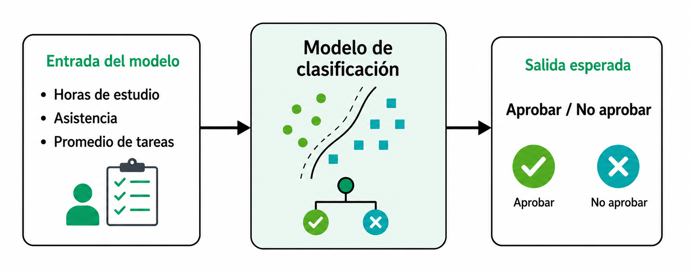
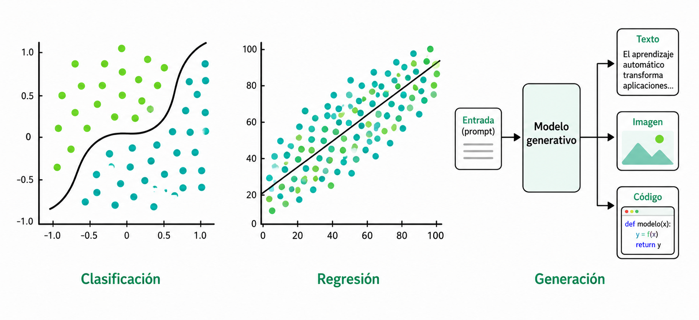
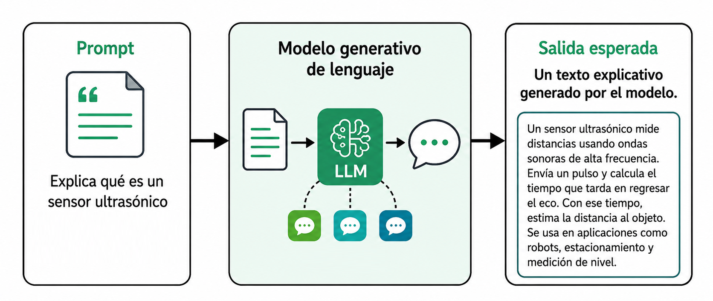
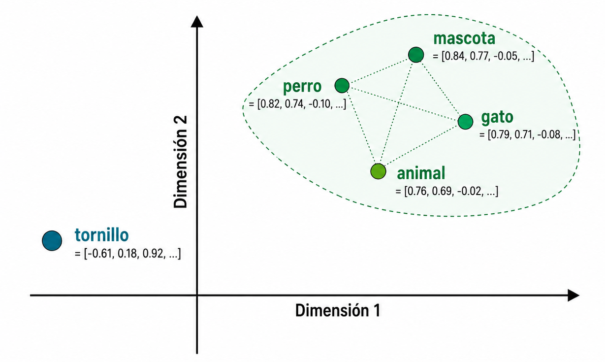
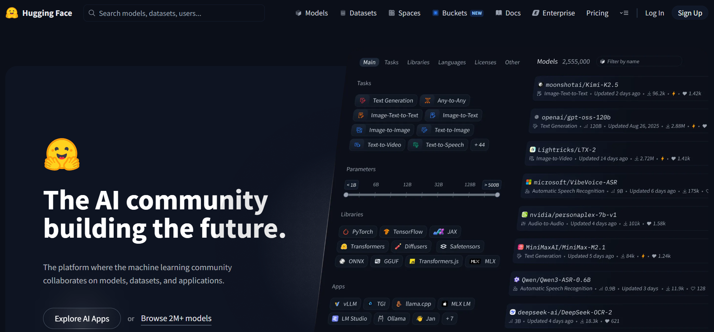
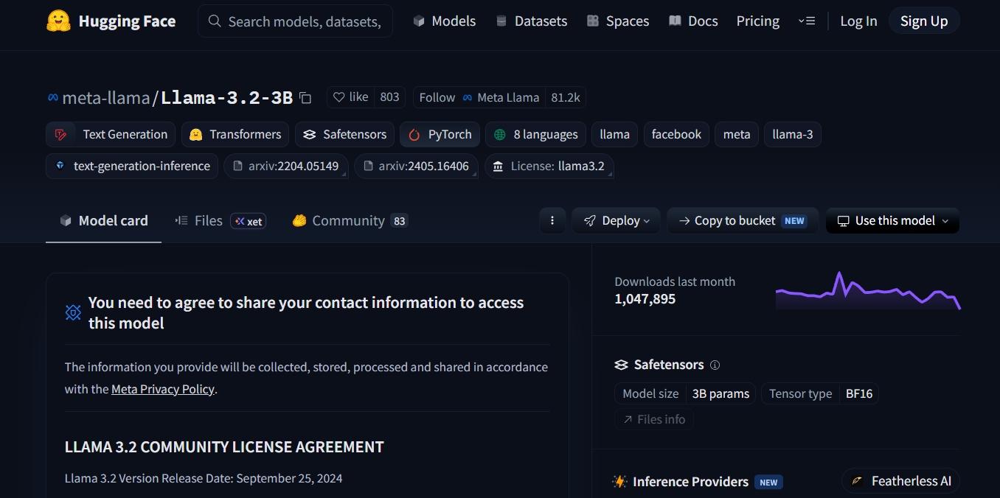
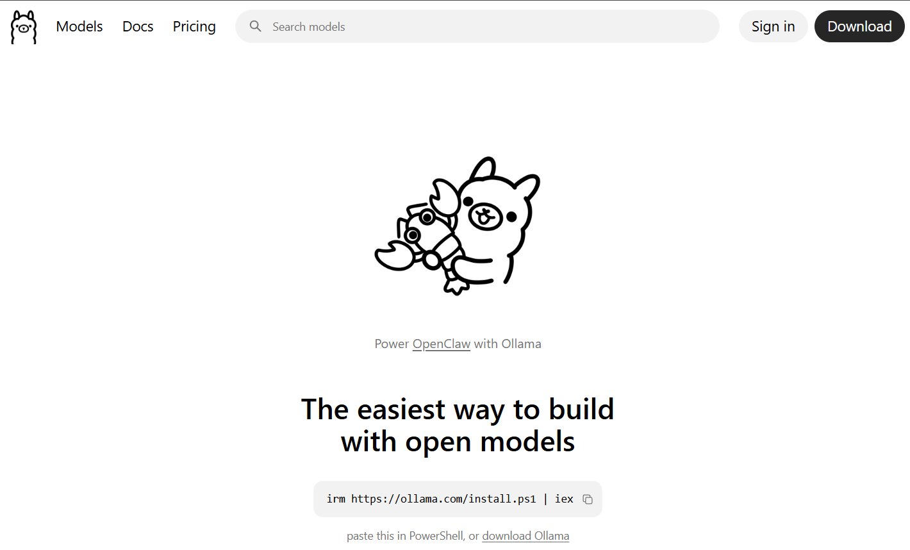
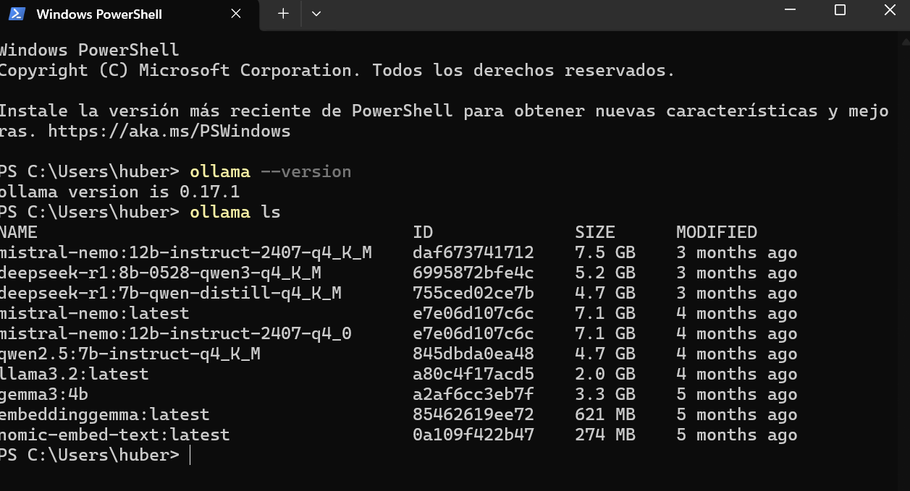
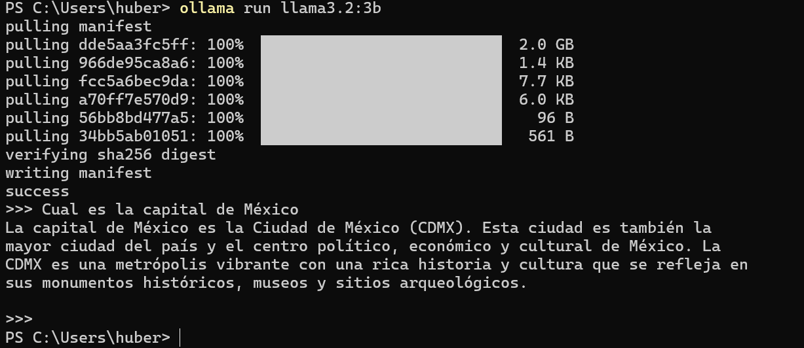
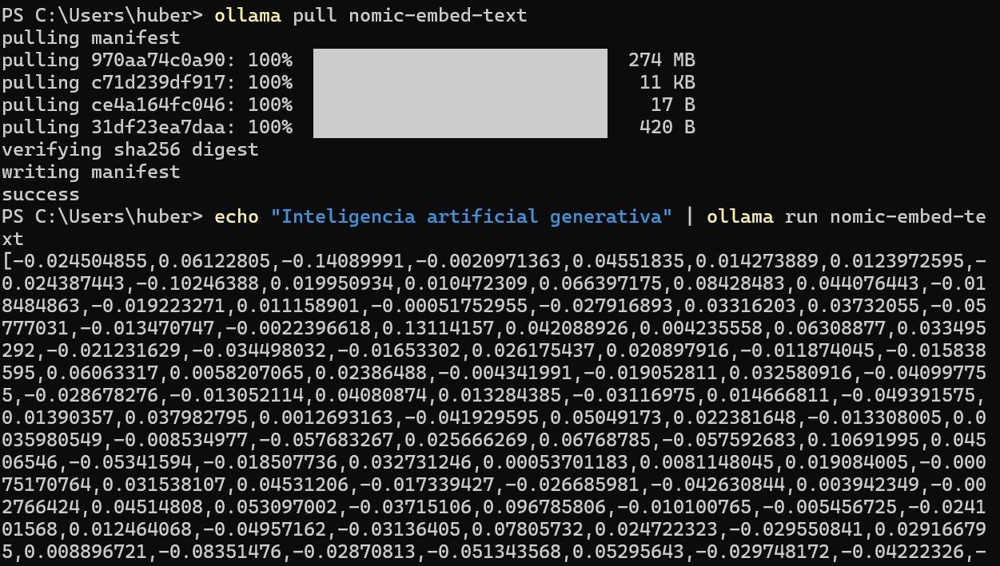

# Panorama de IA generativa y LLM

Esta sección presenta un panorama de la **inteligencia artificial generativa** y los **modelos grandes de lenguaje** (*Large Language Models*, LLM). El propósito es distinguir los conceptos de inteligencia artificial, aprendizaje automático, aprendizaje profundo, IA generativa, embeddings, transformers y LLM, y después llevar esos conceptos a una práctica con **Ollama** y **Hugging Face**.

El contenido toma como base conceptual el *Machine Learning Crash Course* de Google, en particular los módulos de aprendizaje automático, embeddings, modelos grandes de lenguaje y transformers [1]–[3]. También se integran referencias oficiales de Ollama y Hugging Face para la parte práctica [4]–[6].

> 🎯 **Objetivo de aprendizaje:** Al finalizar esta actividad, el estudiante será capaz de explicar la diferencia entre IA, aprendizaje automático, IA generativa, embeddings, transformers y LLM; instalar y usar Ollama desde terminal; consultar modelos en Hugging Face; y comparar modelos según fabricante, licencia, tamaño, idioma y requerimientos técnicos.

---

## 1. De inteligencia artificial a LLM

La **inteligencia artificial** es el campo general que estudia y desarrolla sistemas capaces de realizar tareas asociadas con percepción, razonamiento, aprendizaje, lenguaje, toma de decisiones o generación de contenido. Dentro de ese campo, el **aprendizaje automático** (*machine learning*) se enfoca en construir modelos que aprenden patrones a partir de datos, en lugar de depender únicamente de reglas programadas manualmente.

Una forma útil de entender la relación entre los conceptos es la siguiente:

```text
Inteligencia artificial (IA)
└── Aprendizaje automático (Machine Learning, ML)
    └── Aprendizaje profundo (Deep Learning)
        └── Modelos generativos modernos
            └── Transformers y modelos grandes de lenguaje (LLM)
```

---

## 2. Aprendizaje automático

En aprendizaje automático, un modelo aprende una relación entre **entradas** y **salidas esperadas**. En un problema supervisado, las entradas suelen describirse mediante **características** (*features*) y la salida esperada se conoce como **etiqueta** (*label*). El objetivo del entrenamiento es ajustar los parámetros del modelo para reducir el error entre las predicciones y las respuestas correctas.

Ejemplo sencillo:



En este caso, el modelo no está generando contenido nuevo. Está aprendiendo una relación estadística para clasificar o predecir una salida. Esta distinción será importante para diferenciar modelos predictivos tradicionales de modelos generativos.

### 2.1 Diferencia entre regresión, clasificación y generación

| Tipo de tarea | Pregunta principal | Ejemplo de entrada | Ejemplo de salida |
|---|---|---|---|
| Regresión | ¿Qué valor numérico se espera? | Temperatura, humedad, presión | Consumo energético estimado |
| Clasificación | ¿A qué categoría pertenece? | Texto de correo electrónico | Spam / No spam |
| Generación | ¿Qué contenido nuevo puede producirse? | Prompt textual | Explicación, resumen, código o imagen |



---

## 3. IA generativa

La **IA generativa** se refiere a modelos capaces de producir contenido nuevo a partir de una entrada. Ese contenido puede ser texto, imagen, audio, video, código o una combinación de modalidades.

En lugar de limitarse a responder con una clase o un valor numérico, un modelo generativo puede construir una respuesta completa. Por ejemplo:



La IA generativa no significa que el sistema “comprenda” como un humano. En términos técnicos, el modelo aprende patrones estadísticos en grandes conjuntos de datos y utiliza esos patrones para generar una salida plausible. Por eso sus respuestas pueden ser útiles, pero también pueden contener errores, omisiones o afirmaciones no verificadas.

> ⚠️ **Consideración:** Una respuesta fluida no equivale necesariamente a una respuesta correcta. Los LLM pueden producir información falsa con apariencia convincente; a este fenómeno se le conoce comúnmente como *alucinación*.

---

## 4. Modelos de lenguaje, tokens y LLM

Un **modelo de lenguaje** estima la probabilidad de que un **token** o una secuencia de tokens aparezca dentro de una secuencia más larga. De acuerdo con Google, un token puede ser una palabra, una subpalabra o incluso un carácter [2].

Ejemplo conceptual:

```text
Frase incompleta:
El aprendizaje automático permite que una computadora ________.

Posibles continuaciones:
- aprenda
- clasifique
- prediga
- genere
```

El modelo asigna probabilidades a posibles continuaciones y selecciona una respuesta con base en su entrenamiento y en los parámetros de generación.

Un **LLM** es un modelo de lenguaje de gran escala. Normalmente se caracteriza por:

- una gran cantidad de parámetros;
- entrenamiento con grandes volúmenes de texto y código;
- capacidad de procesar contexto amplio;
- arquitectura basada en transformers;
- habilidad para generar lenguaje, resumir, traducir, responder preguntas, seguir instrucciones y producir código.

---

## 5. Embeddings

Los **embeddings** son representaciones vectoriales de datos. Una palabra, frase, documento, imagen o fragmento de código puede representarse como un vector numérico. La utilidad de un embedding es que elementos con significado parecido tienden a quedar cercanos en el espacio vectorial.

Ejemplo simplificado:

```text
"perro"       → [0.12, -0.45, 0.88, ...]
"gato"        → [0.10, -0.40, 0.81, ...]
"Tornillo"  → [0.72,  0.33, -0.21, ...]
```

En una aplicación real, estos vectores pueden tener cientos o miles de dimensiones. Su uso es importante para:

- búsqueda semántica;
- recuperación aumentada por generación (*Retrieval-Augmented Generation*, RAG);
- clasificación de documentos;
- recomendación de contenido;
- comparación de similitud entre textos.



---

## 6. Transformers y autoatención

El **transformer** es la arquitectura dominante en muchos modelos modernos de lenguaje. Google presenta el transformer como una arquitectura exitosa para construir LLM y explica que puede estar formado por codificadores, decodificadores o combinaciones de ambos [3].

La idea central es la **autoatención** (*self-attention*). Este mecanismo permite que el modelo evalúe qué tokens del contexto son más importantes para interpretar otro token.

Ejemplo conceptual:

```text
Frase:
El robot tomó la herramienta porque la necesitaba para cortar madera.

Pregunta:
¿A qué se refiere "la"?

La autoatención ayuda a relacionar "la" con "herramienta".
```

Los modelos solo de decodificador son especialmente importantes en generación de texto, porque generan nuevos tokens a partir del texto previo. Muchos LLM conversacionales modernos utilizan arquitecturas de este tipo.

[Simulador de Transformer](https://poloclub.github.io/transformer-explainer/)

---

## 7. Diferencias principales entre conceptos

La **inteligencia artificial** es el campo general que busca construir sistemas capaces de realizar tareas asociadas con percepción, razonamiento, lenguaje, aprendizaje o toma de decisiones. Dentro de ella, el **aprendizaje automático** permite que un modelo aprenda patrones a partir de datos. A su vez, el **deep learning** utiliza redes neuronales con muchas capas para aprender representaciones complejas. La **IA generativa** forma parte de esta evolución, ya que no solo clasifica o predice valores, sino que produce nuevo contenido, como texto, imágenes, código o audio [1].

Los **modelos de lenguaje de gran escala**, conocidos como LLM, son un caso particular de IA generativa orientado principalmente al procesamiento y generación de texto. Para que un LLM pueda trabajar con lenguaje humano, primero debe transformar las palabras o fragmentos de palabras en unidades procesables llamadas **tokens**. Sin embargo, una computadora no comprende directamente el significado de una palabra como lo haría una persona; por ello, cada token se representa mediante un vector numérico. A estas representaciones se les conoce como embeddings [2].

Los **embeddings** permiten representar el lenguaje como vectores numéricos, mientras que los **transformers** permiten procesar esos vectores considerando el contexto y las relaciones entre tokens [3]. Los LLM combinan ambos elementos: usan embeddings para convertir el texto en información matemática y transformers para modelar relaciones complejas dentro de secuencias de lenguaje. Esta combinación es una de las razones por las que los modelos actuales pueden generar texto coherente, adaptado al contexto y útil para múltiples tareas académicas, técnicas y profesionales.

| Concepto | Definición breve | Ejemplo |
|---|---|---|
| **IA** | Campo general de sistemas capaces de realizar tareas asociadas con inteligencia | Un asistente que interpreta lenguaje natural |
| **Aprendizaje automático** | Subcampo donde los modelos aprenden patrones a partir de datos | Clasificador de correos spam |
| **Deep Learning** | Aprendizaje automático con redes neuronales profundas | Reconocimiento de imágenes |
| **IA generativa** | Modelos que producen contenido nuevo | Generación de texto, imagen o código |
| **Embeddings** | Representaciones vectoriales de datos | Vectores para búsqueda semántica |
| **Transformer** | Arquitectura neuronal basada en mecanismos de atención | Base de muchos LLM modernos |
| **LLM** | Modelo grande de lenguaje entrenado para procesar y generar texto | Llama, Gemma, Qwen, Mistral, Phi |

---

## 8. Repositorios y modelos: Hugging Face

**Hugging Face** es una plataforma donde la comunidad de aprendizaje automático comparte modelos, datasets y aplicaciones. Para esta clase, se utilizará como fuente para consultar información técnica y documental de modelos.

[Página de Hugging Face](https://huggingface.co/)



Un elemento central es la **model card**. Según la documentación de Hugging Face, una model card es un archivo que acompaña al modelo y contiene información útil; normalmente corresponde al archivo `README.md` del repositorio del modelo [6].



La siguiente tabla muestra los elementos principales usando como ejemplo el modelo **Llama 3.2 3B Instruct**.

| Elemento | Pregunta guía | Ejemplo real: Llama 3.2 3B Instruct | ¿Cómo interpretarlo en clase? |
|---|---|---|---|
| Fabricante o desarrollador | ¿Quién creó el modelo? | **Meta**. En la model card aparece como *Model Developer: Meta*. | Permite identificar la institución, empresa o comunidad responsable del modelo. Esto es importante para evaluar confianza, documentación, soporte y condiciones de uso. |
| Nombre del modelo | ¿Cómo se identifica exactamente el modelo? | `meta-llama/Llama-3.2-3B-Instruct` en Hugging Face. En Ollama puede ejecutarse como `llama3.2:3b` o `llama3.2`, según la variante instalada. | El nombre exacto evita confundir versiones. No es lo mismo un modelo base, un modelo *instruct*, una versión cuantizada o una variante modificada por otra comunidad. |
| Tipo de modelo | ¿Es base, instruct, chat, embedding, multimodal o código? | Es un modelo **instruct** de generación de texto. Está optimizado para diálogo multilingüe, recuperación de información, resumen y tareas tipo asistente. | Un modelo *instruct* está ajustado para seguir instrucciones del usuario. Es más adecuado para clase y uso conversacional que un modelo base sin ajuste instruccional. |
| Arquitectura | ¿Qué arquitectura técnica utiliza? | Modelo de lenguaje **autoregresivo** basado en una arquitectura **transformer optimizada**. | Esto significa que genera texto prediciendo tokens de manera secuencial, usando mecanismos de atención para considerar el contexto. |
| Licencia | ¿Permite uso académico, comercial, redistribución o modificación? | Usa la **Llama 3.2 Community License**, una licencia propia de Meta. | No debe asumirse que todos los modelos de Hugging Face son “libres” o “open source” en el mismo sentido. La licencia debe leerse antes de usar el modelo en proyectos, productos o repositorios públicos. |
| Parámetros | ¿Cuántos parámetros tiene? | La versión 3B reporta aproximadamente **3.21 mil millones de parámetros**. | Los parámetros son valores internos aprendidos durante el entrenamiento. En general, más parámetros pueden implicar mayor capacidad, pero también mayor consumo de memoria y cómputo. |
| Tamaño de descarga | ¿Cuánto ocupa en disco la versión usada? | En Ollama, la variante `llama3.2:3b` aparece como modelo de aproximadamente **2 GB** en una versión cuantizada. En Hugging Face, el tamaño puede variar según los archivos y formato descargado. | El tamaño de descarga no siempre coincide con el número de parámetros. Una versión cuantizada ocupa menos espacio que una versión en precisión completa o BF16. |
| Idiomas | ¿Qué idiomas soporta oficialmente? | Soporta oficialmente **inglés, alemán, francés, italiano, portugués, hindi, español y tailandés**. | Que un modelo “pueda responder” en un idioma no significa que ese idioma esté oficialmente soportado. |
| Modalidad de entrada | ¿Qué tipo de datos recibe? | Texto multilingüe. | Este modelo es de entrada textual. No debe confundirse con modelos multimodales que aceptan imágenes, audio o video. |
| Modalidad de salida | ¿Qué tipo de resultado produce? | Texto y código. | Puede generar explicaciones, respuestas, resúmenes, instrucciones y fragmentos de código, pero no genera imágenes directamente. |
| Ventana de contexto | ¿Cuántos tokens puede procesar? | La versión text-only reporta una ventana de contexto de hasta **128k tokens**. | La ventana de contexto indica cuánta información puede considerar el modelo en una sola interacción. No equivale a memoria permanente ni garantiza razonamiento correcto sobre todo el texto. |
| Formato | ¿Está en Safetensors, GGUF u otro formato? | En Hugging Face aparece asociado con **Transformers**, **PyTorch** y **Safetensors**. En Ollama se usa una variante cuantizada lista para ejecución local. | El formato define con qué herramientas puede usarse. Safetensors suele utilizarse con bibliotecas como Transformers; GGUF o variantes cuantizadas suelen usarse para ejecución local eficiente. |
| Requerimientos técnicos | ¿Necesita GPU? ¿Puede ejecutarse cuantizado? | En Hugging Face puede usarse con `transformers`, `vLLM`, Docker u otros entornos. En Ollama, la versión cuantizada de aproximadamente 2 GB puede ejecutarse localmente con menor consumo de memoria. | Para una clase práctica conviene usar Ollama porque simplifica instalación y ejecución. Para uso avanzado con Hugging Face, una GPU mejora mucho el rendimiento. |
| Comando de prueba | ¿Cómo puedo ejecutarlo? | `ollama run llama3.2:3b` | El comando permite validar rápidamente que el modelo está instalado y responde desde la terminal. |
| Caso de uso recomendado | ¿Para qué tareas fue diseñado? | Asistentes conversacionales, recuperación de conocimiento, resumen, reescritura de prompts y aplicaciones de lenguaje. | Ayuda a seleccionar el modelo correcto. No todos los modelos sirven para lo mismo: algunos son para texto, otros para código, embeddings, visión o clasificación. |
| Limitaciones | ¿Reporta sesgos, restricciones, riesgos o alucinaciones? | La model card advierte que, como otros LLM, puede producir respuestas inexactas, sesgadas u objetables, y recomienda realizar pruebas de seguridad según la aplicación. | Una respuesta convincente no siempre es correcta. Todo uso académico o profesional requiere verificación, especialmente si se trabaja con información técnica, legal, médica o sensible. |
| Acceso | ¿Está disponible directamente o requiere aceptar condiciones? | En Hugging Face puede requerir aceptar condiciones de acceso y compartir información de contacto. | Algunos modelos no se descargan automáticamente desde Hugging Face hasta aceptar su licencia o condiciones. Esto debe explicarse para evitar confusión durante la práctica. |

> ⚠️ **Consideración:** el número de parámetros, el tamaño de descarga y los requerimientos técnicos no son lo mismo. Un modelo puede tener 3B parámetros, pero ocupar diferentes cantidades de espacio según el formato y la cuantización.

---

## 9. Tipos de modelos que se pueden encontrar

| Tipo de modelo | Uso principal | Ejemplo de uso |
|---|---|---|
| Base / pretrained | Continuación de texto e investigación | Analizar cómo completa texto sin estar optimizado para chat |
| Instruct / chat | Seguimiento de instrucciones y conversación | Preguntar conceptos de IA en lenguaje natural |
| Embedding | Representación vectorial para búsqueda semántica | Buscar documentos parecidos dentro de un repositorio |
| Multimodal | Procesar texto e imagen | Describir una imagen o responder sobre una captura |
| Code model | Generar, completar o explicar código | Pedir un script simple de Python o JavaScript |
| Clasificador | Asignar categorías | Detección de sentimiento o moderación |
| GGUF cuantizado | Ejecución local eficiente | Ejecutar modelos en Ollama o llama.cpp |

> ⚠️ **Consideración:** No todos los modelos de Hugging Face pueden instalarse directamente con Ollama. Ollama trabaja especialmente bien con modelos disponibles en formato GGUF o con modelos ya publicados en la biblioteca de Ollama. Los modelos en Safetensors pueden requerir otra herramienta, conversión o una versión GGUF preparada por la comunidad.

---

## 10. Ollama

**Ollama** es una herramienta para descargar, ejecutar y administrar modelos localmente desde la terminal. Es útil para el aprendizaje porque permite experimentar con LLM en la computadora del estudiante sin depender necesariamente de una API comercial externa.

La documentación oficial de Ollama incluye comandos para ejecutar modelos, descargar modelos, listar modelos instalados, generar embeddings, eliminar modelos, ver modelos en ejecución y detener modelos [4].



---

## 11. Instalación de Ollama

### 11.1 Windows

En Windows, se puede instalar desde el **instalador oficial de Ollama** o desde PowerShell.

```powershell
irm https://ollama.com/install.ps1 | iex
ollama --version
```

### 11.2 macOS y Linux

En macOS y Linux, la instalación puede realizarse desde terminal con:

```bash
curl -fsSL https://ollama.com/install.sh | sh
ollama --version
```

---

## 12. Comandos básicos de Ollama

### 12.1 Descargar un modelo

```bash
ollama pull llama3.2:3b
```

### 12.2 Ejecutar un modelo

```bash
ollama run llama3.2:3b
```

### 12.3 Listar modelos instalados

```bash
ollama ls
```



### 12.4 Ver modelos cargados en memoria

```bash
ollama ps
```

### 12.5 Detener un modelo

```bash
ollama stop llama3.2:3b
```

### 12.6 Eliminar un modelo

```bash
ollama rm llama3.2:3b
```

### 12.7 Ejecutar un prompt directo

```bash
ollama run llama3.2:3b "Explica qué es un LLM en máximo 100 palabras."
```



---

## 13. Ejecución de modelos de embeddings con Ollama

Ollama también puede ejecutar modelos de embeddings. Estos modelos no están pensados principalmente para conversación, sino para convertir texto en vectores numéricos.

```bash
ollama pull nomic-embed-text
echo "Inteligencia artificial generativa" | ollama run nomic-embed-text
```

También puede utilizarse un modelo como `embeddinggemma`, siguiendo la documentación de Ollama:

```bash
ollama run embeddinggemma "Hello world"
```



---

## 14. Uso de modelos de Hugging Face con Ollama

Hugging Face documenta que Ollama puede ejecutar modelos GGUF del Hub directamente con el formato [5]:

```bash
ollama run hf.co/{usuario}/{repositorio}
```

También permite indicar una cuantización específica:

```bash
ollama run hf.co/{usuario}/{repositorio}:{cuantizacion}
```

Ejemplo con un modelo GGUF de Qwen:

```bash
ollama run hf.co/Qwen/Qwen2.5-7B-Instruct-GGUF:Q4_K_M
```

> ⚠️ **Consideración:** usar `hf.co/...` con Ollama requiere que el repositorio sea compatible, normalmente porque contiene archivos GGUF. Si el modelo solo está en Safetensors, no necesariamente podrá ejecutarse directamente con Ollama.

---

## 15. Modelos sugeridos para la actividad

Para la práctica, se recomiendan modelos pequeños o medianos que puedan ejecutarse en laptops con recursos razonables. Los modelos de 1B a 4B parámetros son más accesibles para equipos modestos. Los modelos de 7B pueden requerir más RAM, tardar más o beneficiarse claramente de GPU.

```bash
ollama pull llama3.2:3b
ollama pull gemma3:4b
ollama pull qwen2.5:7b
ollama pull mistral:7b
ollama pull phi4-mini
ollama pull tinyllama:1.1b-chat-v1-q8_0
```
Después de descargarlos, revisar los modelos instalados:

```bash
ollama ls
```


---

## 16. Prompts de prueba

Para comparar modelos, todos los equipos deben usar los mismos prompts.

### Prompt 1: explicación conceptual

```text
Explica la diferencia entre inteligencia artificial, aprendizaje automático,
IA generativa y LLM para estudiantes universitarios. Responde en español,
con tono académico y máximo 200 palabras.
```

### Prompt 2: embeddings

```text
Dame un ejemplo sencillo de uso de embeddings en una búsqueda semántica
dentro de un repositorio de documentos académicos.
```

### Prompt 3: evaluación crítica

```text
Menciona tres riesgos académicos de usar LLM sin verificar fuentes.
Incluye un ejemplo breve para cada riesgo.
```

### Prompt 4: uso técnico

```text
Dame un ejemplo de cómo un estudiante de ingeniería podría usar un LLM
para apoyar el desarrollo de un proyecto con ESP32, sin sustituir su aprendizaje.
```
---

## 17. Tabla comparativa de modelos

La siguiente tabla se llena con información de Hugging Face, Ollama y la terminal del estudiante. Algunos campos se proporcionan como referencia inicial; el estudiante debe confirmar la información en la model card oficial y con `ollama ls`.

| Modelo | Fabricante / desarrollador | Tipo | Licencia | Parámetros | Idiomas reportados | Requerimiento sugerido para clase | Comando sugerido | Tamaño en Ollama |
|---|---|---|---|---:|---|---|---|---|
| Llama 3.2 3B Instruct | Meta | LLM instruct, texto a texto | Llama 3.2 Community License | 3.21B | Inglés, alemán, francés, italiano, portugués, hindi, español y tailandés [7] | Recomendable para equipos con recursos moderados; mejor con 8 GB RAM o más | `ollama run llama3.2:3b` | Completar con `ollama ls` |
| Gemma 3 4B IT | Google | LLM instruct multimodal, texto e imagen a texto | Gemma License | 4B | Más de 140 idiomas [8] | Requiere Ollama 0.6 o posterior; recomendable 8 GB RAM o más | `ollama run gemma3:4b` | Completar con `ollama ls` |
| Qwen2.5 7B Instruct | Qwen / Alibaba | LLM instruct | Apache 2.0 | 7.61B | Más de 29 idiomas, incluyendo español, inglés, chino, francés, portugués, alemán, italiano, ruso, japonés, coreano y otros [9] | Recomendable 16 GB RAM o GPU para mejor desempeño | `ollama run qwen2.5:7b` o `ollama run hf.co/Qwen/Qwen2.5-7B-Instruct-GGUF:Q4_K_M` | Completar con `ollama ls` |
| Mistral 7B Instruct v0.3 | Mistral AI | LLM instruct | Apache 2.0 | 7B | No siempre declara lista cerrada de idiomas; evaluar respuesta en español e inglés | Recomendable 16 GB RAM o GPU para mejor desempeño | `ollama run mistral:7b` | Completar con `ollama ls` |
| Phi-4-mini-instruct | Microsoft | LLM instruct compacto | MIT | 3.8B | Árabe, chino, checo, danés, neerlandés, inglés, finés, francés, alemán, hebreo, húngaro, italiano, japonés, coreano, noruego, polaco, portugués, ruso, español, sueco, tailandés, turco y ucraniano [11] | Diseñado para entornos con memoria/cómputo restringidos; requiere Ollama 0.5.13 o posterior según biblioteca de Ollama | `ollama run phi4-mini` | Completar con `ollama ls` |
| TinyLlama 1.1B Chat | TinyLlama | LLM chat compacto | Apache 2.0 | 1.1B | Principalmente inglés según tags de Hugging Face | Útil para equipos con recursos limitados; menor calidad esperada que modelos más grandes | `ollama run tinyllama:1.1b-chat-v1-q8_0` | Completar con `ollama ls` |

> ⚠️ **Consideraciones:** En la tabla, “parámetros” se refiere al tamaño arquitectónico del modelo. El “tamaño en Ollama” es el espacio que ocupa la variante descargada en la computadora y depende del tag, formato y cuantización. Por eso debe registrarse desde `ollama ls`.

---

## 18. Práctica 1

### Nombre de la actividad

**Instalación, ejecución y comparación de modelos LLM locales con Ollama y Hugging Face**

### Modalidad

Trabajo en equipos para reportar en su repositorio.

### Instrucciones

1. Instalar Ollama en la computadora.
2. Verificar la instalación con:

   ```bash
   ollama --version
   ```

3. Descargar al menos 6 modelos desde Ollama. (Captura evidencia de pantalla)
4. Ejecutar al menos 6 modelos con el mismo prompt. (Captura evidencia de pantalla)
5. Revisar los modelos instalados con:

   ```bash
   ollama ls
   ```

6. Consultar en Hugging Face la model card de los modelos.
7. Identificar fabricante, tipo de modelo, licencia, parámetros, idiomas y requerimientos.
8. Realiza una tabla comparativa como la de la [sección 17](#17-tabla-comparativa-de-modelos).
9. Escribir una reflexión breve sobre la experiencia:


- ¿Qué modelo fue más fácil de instalar y ejecutar?
- ¿Qué modelo respondió mejor en español?
- ¿Qué diferencia observaste entre un modelo pequeño y uno más grande?
- ¿Qué importancia tiene la licencia del modelo?
- ¿Por qué no debe usarse un LLM como única fuente académica?
- ¿Qué ventajas y limitaciones tiene ejecutar modelos localmente?

---

## Referencias

[1] Google for Developers, “Machine Learning Crash Course,” *Google Machine Learning Education*. [En línea]. Disponible en: https://developers.google.com/machine-learning/crash-course?hl=es-419

[2] Google for Developers, “Introducción a los modelos de lenguaje grandes,” *Machine Learning Crash Course*. [En línea]. Disponible en: https://developers.google.com/machine-learning/crash-course/llm?hl=es-419

[3] Google for Developers, “LLM: ¿Cuál es un modelo grande de lenguaje? Transformers y autoatención,” *Machine Learning Crash Course*. [En línea]. Disponible en: https://developers.google.com/machine-learning/crash-course/llm/transformers?hl=es-419

[4] Ollama, “CLI Reference,” *Ollama Documentation*. [En línea]. Disponible en: https://docs.ollama.com/cli

[5] Hugging Face, “Use Ollama with any GGUF Model on Hugging Face Hub,” *Hugging Face Docs*. [En línea]. Disponible en: https://huggingface.co/docs/hub/ollama

[6] Hugging Face, “Model Cards,” *Hugging Face Docs*. [En línea]. Disponible en: https://huggingface.co/docs/hub/en/model-cards

[7] Meta, “Llama-3.2-3B-Instruct,” *Hugging Face Model Card*. [En línea]. Disponible en: https://huggingface.co/meta-llama/Llama-3.2-3B-Instruct

[8] Google, “Gemma 3 4B IT,” *Hugging Face Model Card*. [En línea]. Disponible en: https://huggingface.co/google/gemma-3-4b-it

[9] Qwen, “Qwen2.5-7B-Instruct,” *Hugging Face Model Card*. [En línea]. Disponible en: https://huggingface.co/Qwen/Qwen2.5-7B-Instruct

[10] Mistral AI, “Mistral-7B-Instruct-v0.3,” *Hugging Face Model Card*. [En línea]. Disponible en: https://huggingface.co/mistralai/Mistral-7B-Instruct-v0.3

[11] Microsoft, “Phi-4-mini-instruct,” *Hugging Face Model Card*. [En línea]. Disponible en: https://huggingface.co/microsoft/Phi-4-mini-instruct

[12] TinyLlama, “TinyLlama-1.1B-Chat-v1.0,” *Hugging Face Model Card*. [En línea]. Disponible en: https://huggingface.co/TinyLlama/TinyLlama-1.1B-Chat-v1.0

[13] Ollama, “llama3.2,” *Ollama Library*. [En línea]. Disponible en: https://ollama.com/library/llama3.2

[14] Ollama, “gemma3:4b,” *Ollama Library*. [En línea]. Disponible en: https://ollama.com/library/gemma3:4b

[15] Ollama, “phi4-mini,” *Ollama Library*. [En línea]. Disponible en: https://ollama.com/library/phi4-mini

[16] Qwen, “Qwen2.5-7B-Instruct-GGUF,” *Hugging Face Model Card*. [En línea]. Disponible en: https://huggingface.co/Qwen/Qwen2.5-7B-Instruct-GGUF

---