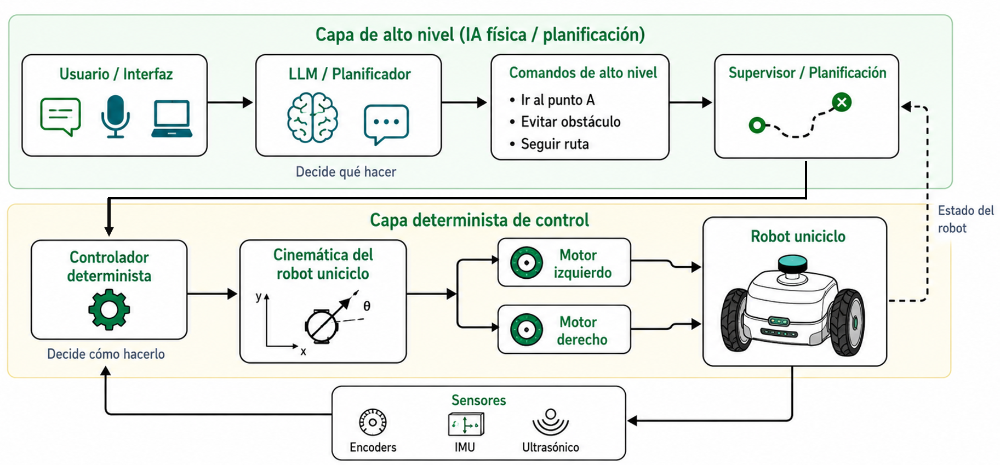
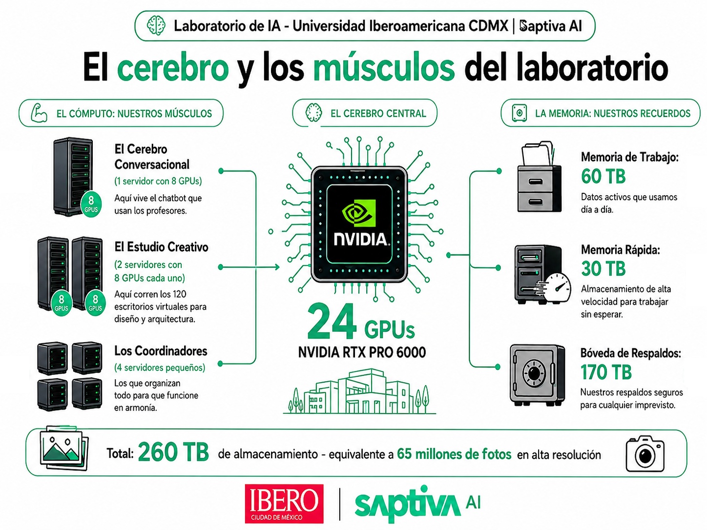
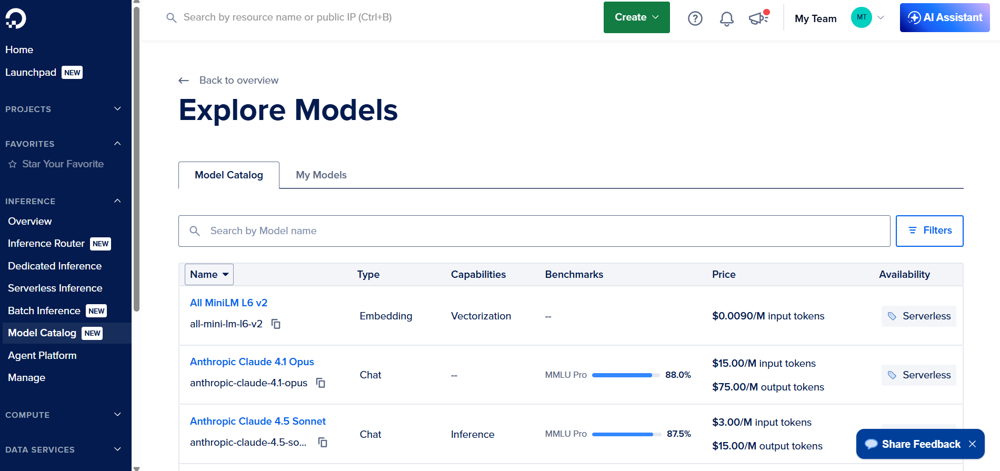
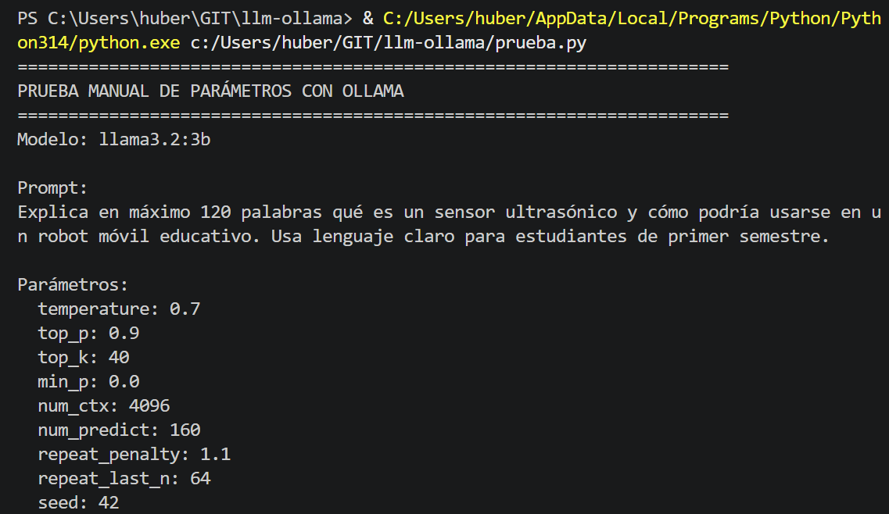
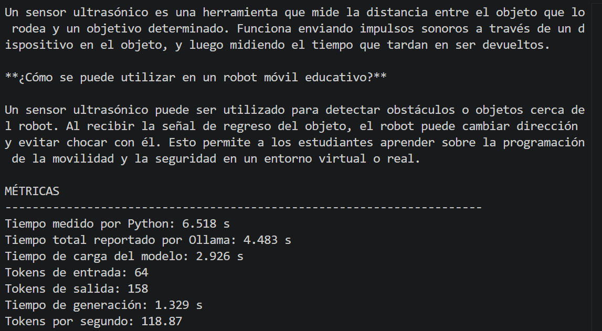
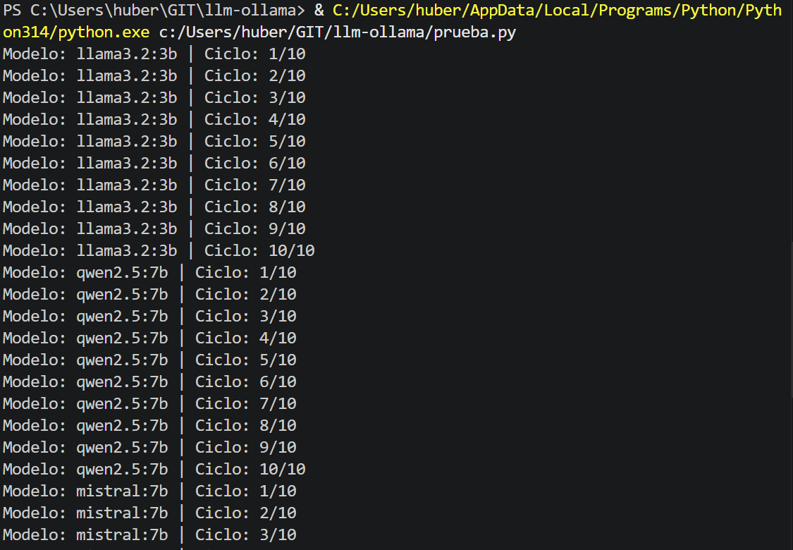
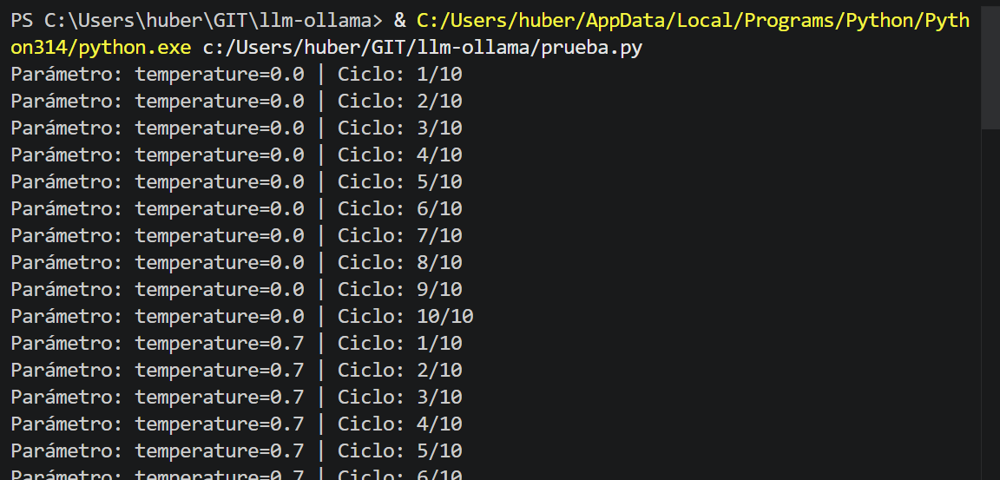

# Requerimientos técnicos, costos, parámetros y benchmarking de LLM

Esta sección aborda los criterios técnicos para ejecutar modelos grandes de lenguaje (*Large Language Models*, LLM) en una computadora local, un servidor, una API en la nube o una plataforma embebida. El propósito es que el estudiante comprenda la relación entre **memoria**, **cómputo**, **latencia**, **tokens**, **costo**, **parámetros de generación** y **calidad de respuesta** antes de seleccionar un modelo o una arquitectura de implementación.

El tema se apoya en documentación oficial de Ollama, Hugging Face, OpenAI, Google AI, NVIDIA y Espressif, así como en literatura sobre eficiencia, cuantización, consumo energético e integración de modelos de lenguaje en robótica [1]–[11].

> 🎯 **Objetivo de aprendizaje:** Al finalizar esta actividad, el estudiante será capaz de explicar los requerimientos técnicos para ejecutar LLM; distinguir entre CPU, GPU, RAM y VRAM; estimar costos locales y en la nube; configurar parámetros de generación; diseñar un benchmark con Python y Ollama; exportar resultados en CSV; y justificar la selección de un modelo en alguna plataforma de cómputo.

---

## 1. Elegir “el mejor Modelo”

Seleccionar un LLM no consiste únicamente en escoger el modelo con mayor número de parámetros o el que aparece mejor posicionado en una tabla de evaluación. En una aplicación real, especialmente si se relaciona con sistemas al borde o **edge computing** como en robótica, automatización o sistemas ciberfísicos, la decisión debe considerar simultáneamente:

- Si el modelo cabe en la memoria disponible;
- Si la velocidad de respuesta es aceptable;
- Si la latencia permite interactuar con el usuario o con el sistema;
- Si el costo local o en la nube es sostenible;
- Si el modelo puede ejecutarse con privacidad suficiente;
- Si la calidad de respuesta justifica los recursos usados;
- Si el modelo es adecuado para la tarea específica.

En este contexto, el uso de LLM en robótica y sistemas ciberfísicos puede entenderse como parte del campo emergente de la **IA física** (Physical AI). A diferencia de una IA limitada al procesamiento de texto, imágenes o datos en entornos digitales, la IA física se refiere a sistemas capaces de percibir el mundo real mediante sensores, razonar o planificar a partir de esa información, y actuar sobre el entorno mediante actuadores, robots, vehículos o máquinas autónomas. Por ello, cuando un LLM se integra con plataformas robóticas, sistemas embebidos, cámaras, sensores, motores o servicios de control, deja de ser únicamente un modelo conversacional y se convierte en un componente de una arquitectura que conecta lenguaje, percepción, decisión y acción física. Esta distinción es importante porque los requerimientos técnicos ya no dependen de la calidad del modelo, sino también de la latencia, memoria, consumo energético, seguridad, conectividad y capacidad de operar en tiempo real o cerca del tiempo real [14].

En la IA física, un LLM no se utiliza como controlador de bajo nivel en tiempo real, sino como interfaz conversacional, planificador de alto nivel, generador de instrucciones, traductor de lenguaje natural a comandos estructurados o asistente de diagnóstico. Donde el control directo de motores, la lectura de sensores y los lazos de realimentación de baja latencia deben mantenerse en componentes deterministas y verificables.

Un modelo de lenguaje aporta conocimiento semántico de alto nivel, pero sus propuestas se combinan con funciones a habilidades robóticas para seleccionar acciones que sean lingüísticamente plausibles y físicamente ejecutables por el robot [10], [11].

> ⚠️ **Consideración:** En aplicaciones robóticas, un LLM debe tratarse como un componente de razonamiento, planificación o interacción, no como sustituto directo de los controladores de seguridad, navegación, cinemática, dinámica o control de motores.



---

## 2. Requerimientos técnicos para ejecutar LLM

### 2.1 RAM, VRAM y pesos del modelo

La memoria es uno de los factores más importantes para ejecutar un LLM. Un modelo no puede responder si sus pesos, su contexto y sus estructuras temporales no caben en la memoria disponible.

La **RAM** es la memoria principal del sistema. Se utiliza cuando el modelo se ejecuta en CPU o cuando parte del modelo no cabe en la GPU. La **VRAM** es la memoria de la tarjeta gráfica. Si el modelo cabe en VRAM, la inferencia suele ser más rápida porque la GPU puede realizar operaciones matriciales en paralelo y con mayor ancho de banda de memoria.

Durante la inferencia se requiere memoria para:

- Cargar los pesos del modelo;
- Almacenar el prompt y el contexto de conversación;
- Mantener la caché de atención;
- Procesar tokens de entrada;
- Generar tokens de salida;
- Almacenar buffers internos del sistema de inferencia.

Una aproximación inicial para estimar memoria es:

```text
memoria_pesos ≈ número_de_parámetros × bytes_por_parámetro
```

Por ejemplo, un modelo de 7 mil millones de parámetros puede requerir aproximadamente:

| Precisión o cuantización | Bytes aproximados por parámetro | Memoria aproximada para 7B parámetros |
|---|---:|---:|
| FP32 | 4 bytes | 28 GB |
| FP16 / BF16 | 2 bytes | 14 GB |
| INT8 | 1 byte | 7 GB |
| INT4 | 0.5 bytes | 3.5 GB |

Hugging Face explica que la cuantización reduce el costo de memoria y cómputo al representar pesos y activaciones con tipos de menor precisión, como 8 bits o 4 bits. Esto permite cargar modelos más grandes en hardware limitado, aunque puede introducir compromisos en precisión, compatibilidad o velocidad [4].

---

### 2.2 CPU vs GPU

La **CPU** es flexible y está presente en prácticamente cualquier computadora. Puede ejecutar modelos pequeños o medianos, sobre todo si están cuantizados. Sin embargo, suele ser más lenta para inferencia de LLM porque estos modelos requieren muchas operaciones matriciales y acceso intensivo a memoria.

La **GPU** está diseñada para cómputo paralelo. Cuando el modelo cabe en VRAM, puede generar más tokens por segundo y reducir la latencia. Por esa razón, las GPUs son ampliamente utilizadas para entrenamiento e inferencia de modelos profundos.

| Elemento | CPU | GPU |
|---|---|---|
| Ventaja principal | Flexibilidad y disponibilidad | Paralelismo y velocidad |
| Limitación principal | Baja velocidad en modelos grandes | VRAM limitada y mayor costo |
| Memoria usada | RAM del sistema | VRAM de la tarjeta gráfica |
| Uso recomendado | Pruebas, modelos pequeños, equipos sin GPU | Modelos medianos, baja latencia, experimentación intensiva |
| Ejemplos de modelos viables | TinyLlama, Llama 3.2 1B/3B cuantizados | Llama 3.2 3B, Qwen 7B, Mistral 7B cuantizados |

En LLM, el cuello de botella no siempre es solo la capacidad de cómputo; también puede ser el ancho de banda de memoria. La literatura sobre cuantización y eficiencia en LLM muestra que reducir precisión puede disminuir memoria y acelerar inferencia, especialmente en hardware limitado [5], [6].

---

### 2.3 Tamaño de contexto y memoria

La **ventana de contexto** indica cuántos tokens puede considerar el modelo durante una interacción. El contexto es la información disponible para el modelo en una solicitud o **conversación activa**.

Ejemplos de configuración:

```text
num_ctx = 2048   → contexto corto
num_ctx = 4096   → contexto medio
num_ctx = 8192   → contexto amplio
num_ctx = 64000  → contexto largo para documentos, agentes o código
```

Ollama define la longitud de contexto como el número máximo de tokens accesibles en memoria para el modelo. Su documentación indica que, por defecto, Ollama ajusta la longitud de contexto según la VRAM disponible: menos de 24 GiB usa 4k, entre 24 y 48 GiB usa 32k y 48 GiB o más usa 256k. También advierte que incrementar la ventana de contexto incrementa la memoria requerida [3].

Para un tema experimental, es recomendable iniciar con valores moderados:

```text
num_ctx = 2048 o 4096
num_predict = 100 a 200
```

Esto ayuda a evitar que equipos con poca RAM o VRAM se saturen y permite comparar modelos bajo condiciones más controladas.

> ⚠️ **Consideración:** Aumentar `num_ctx` puede mejorar la capacidad para procesar documentos largos, pero también puede aumentar memoria, tiempo de procesamiento y riesgo de saturar la GPU.

---

## 3. Plataformas de cómputo

### 3.1 Computadora local

Una computadora local es una plataforma adecuada para aprendizaje, pruebas, desarrollo de prototipos y ejecución de modelos pequeños o medianos. Su ventaja principal es que permite trabajar sin pagar por tokens y sin depender de una API externa. Su limitación es que el rendimiento depende directamente del hardware disponible.

En una PC local deben revisarse:

- Memoria RAM;
- CPU;
- GPU;
- VRAM;
- Almacenamiento disponible (SSD);
- Ventilación y consumo energético;
- Sistema operativo;
- Compatibilidad con Ollama, drivers y bibliotecas.

---

### 3.2 API en la nube o servidor

Una API en la nube permite usar modelos potentes sin administrar directamente servidores ni GPUs. El proveedor se encarga del modelo, infraestructura, escalabilidad y disponibilidad. En este esquema, el costo suele calcularse por tokens de entrada y salida. OpenAI y Google AI publican precios por millón de tokens, con tarifas diferenciadas por modelo, entrada, salida y, en algunos casos, caché de contexto o herramientas adicionales [8], [9].

**Ventajas:**

- No requiere GPU local;
- Acceso a modelos avanzados;
- Implementación rápida;
- Escalabilidad;
- Mantenimiento reducido.

**Desventajas:**

- Costo variable por uso;
- Dependencia de internet;
- Latencia de red;
- Restricciones de privacidad;
- Límites de tasa;
- Cambios de precio o disponibilidad;
- Dependencia del proveedor.

[Benchmarking LLM API Pricing](https://benchlm.ai/llm-pricing)

[Costos modelos Digital Ocean](https://docs.digitalocean.com/products/inference/details/pricing/)
---

### 3.3 Servidor propio en la nube con GPU

Un servidor en la nube con GPU permite ejecutar modelos open-source o personalizados con mayor control que una API comercial. A diferencia de una API, aquí se paga por la máquina virtual, almacenamiento, tráfico, administración y tiempo de uso.

**Ventajas:**

- Control del modelo;
- Posibilidad de servir múltiples usuarios;
- Integración con backend propio;
- Uso de modelos específicos;
- Despliegue de servicios con Ollama, vLLM, TGI u otras herramientas.

**Desventajas:**

- Configuración de drivers y dependencias;
- Administración de seguridad;
- Monitoreo;
- Costo por hora aunque no haya uso constante;
- Necesidad de mantenimiento técnico.

[Ejemplo costos Digital Ocean](https://www.digitalocean.com/pricing/calculator)

**Laboratorio IA IBERO (ONLINE-Julio 2026)**


---

### 3.4 Sistemas embebidos: microcontroladores y tarjetas de IA

Es importante diferenciar entre **microcontroladores** y **computadoras embebidas para IA**.

Un microcontrolador como ESP32, Arduino o STM32 no es una plataforma adecuada para ejecutar localmente un LLM moderno. Puede leer sensores, controlar motores, comunicarse por WiFi/BLE/MQTT y enviar datos a un servidor o API, pero no tiene memoria suficiente para cargar modelos de lenguaje generales. Por ejemplo, módulos ESP32-S3-MINI pueden tener hasta 8 MB de flash y opcionalmente 2 MB de PSRAM, cantidades muy por debajo de los GB requeridos por modelos LLM incluso cuantizados [7].

En cambio, una tarjeta como NVIDIA Jetson Orin Nano Super Developer Kit es una computadora embebida orientada a IA. NVIDIA reporta hasta 67 INT8 TOPS, GPU Ampere con 1024 núcleos CUDA y 32 Tensor Cores, CPU Arm de 6 núcleos, 8 GB LPDDR5 y consumo de 7 W a 25 W [6]. Esta clase de plataforma puede ejecutar modelos pequeños o medianos cuantizados, especialmente en aplicaciones de borde, robótica, visión e inferencia local.

| Plataforma | ¿Puede ejecutar LLM local? | Uso recomendado |
|---|---|---|
| Microcontrolador ESP32 | No para LLM modernos generales | Sensores, actuadores, comunicación, adquisición de datos |
| Raspberry Pi | Limitado; modelos pequeños cuantizados con baja velocidad | Prototipos educativos, cliente local, interfaz |
| Jetson Orin Nano | Sí, con modelos pequeños/medianos cuantizados y restricciones | Robótica móvil, visión, inferencia en borde |
| PC con CPU | Sí, modelos pequeños/medianos cuantizados | Entorno educativo, pruebas, prototipos |
| PC con GPU | Sí, mejor velocidad si el modelo cabe en VRAM | Desarrollo, evaluación, integración robótica |
| Servidor GPU | Sí, modelos medianos o grandes | Producción, investigación, múltiples usuarios |
| API comercial | Sí, como servicio externo | Aplicaciones web, prototipos rápidos, modelos avanzados |


---

## 4. Tokens, latencia, memoria y costos

### 4.1 Tokens

Un **token** es una unidad de texto procesada por el modelo. Puede ser una palabra, una parte de una palabra, un signo de puntuación, un número o una pieza de código. En LLM, la memoria, el tiempo y el costo dependen principalmente de:

```text
tokens_totales = tokens_entrada + tokens_salida
```

Un prompt más largo exige más procesamiento de entrada. Una respuesta más larga exige más generación autoregresiva. Por esta razón, en aplicaciones con recursos limitados conviene diseñar prompts compactos y respuestas estructuradas.

Ejemplo:

```text
Prompt corto:
"Resume qué es un sensor ultrasónico en 50 palabras."

Prompt largo:
"Lee todo este manual técnico, analiza sus limitaciones, identifica riesgos,
extrae instrucciones y genera un plan de integración robótica..."
```

El segundo prompt consume más tokens, requiere más memoria y normalmente produce mayor latencia.

---

### 4.2 Latencia

La **latencia** es el tiempo que tarda el sistema en responder. En un LLM puede descomponerse en varios componentes:

| Componente | Descripción |
|---|---|
| Tiempo de carga | Tiempo para cargar el modelo en memoria |
| Evaluación del prompt | Tiempo para procesar tokens de entrada |
| Generación | Tiempo para producir tokens de salida |
| Latencia de red | Aplica si se usa nube o servidor remoto |
| Postprocesamiento | Validar JSON, guardar resultados o ejecutar acciones (En caso de tener algun script, skill, o proceso posterior a la salida del LLM) |

Ollama permite obtener métricas de inferencia cuando se usa su API con `stream: false`. Entre los campos útiles se encuentran `total_duration`, `load_duration`, `prompt_eval_count`, `prompt_eval_duration`, `eval_count` y `eval_duration` [2].

Métricas recomendadas:

```text
tiempo_total_s = total_duration / 1e9
tiempo_carga_s = load_duration / 1e9
tokens_entrada = prompt_eval_count
tokens_salida = eval_count
tiempo_generacion_s = eval_duration / 1e9
tokens_por_segundo = eval_count / tiempo_generacion_s
```

---

### 4.3 Memoria durante la inferencia

La memoria durante una prueba depende de varios factores:

- Tamaño del modelo;
- Nivel de cuantización;
- Longitud de contexto;
- Número de solicitudes paralelas;
- Uso de CPU o GPU;
- Cantidad de modelos cargados simultáneamente;
- Tiempo que el modelo permanece cargado con `keep_alive`.

Ollama permite mantener un modelo cargado cierto tiempo mediante `keep_alive`, lo que **reduce el tiempo de carga en solicitudes posteriores**. Esto mejora la latencia en experimentos repetidos, pero aumenta el tiempo durante el cual **RAM o VRAM permanecen ocupadas** [2].

---

### 4.4 Costo energético local

La literatura académica sobre NLP y LLM ha señalado que el cómputo profundo implica costos financieros y ambientales, tanto en entrenamiento como en inferencia. Strubell, Ganesh y McCallum documentaron la relevancia del costo energético en NLP moderno, y estudios recientes han analizado cómo las optimizaciones de inferencia pueden modificar significativamente el consumo energético en LLM [12], [13].

El costo energético local puede estimarse con:

```text
energía_kWh = (potencia_W / 1000) × tiempo_horas
costo = energía_kWh × precio_kWh
```

Ejemplo:

```text
Una PC que consume 180 W durante 2 horas:
energía = (180 / 1000) × 2 = 0.36 kWh
```

Este costo puede parecer bajo para una práctica individual, pero crece cuando se ejecutan muchos experimentos, se usan GPUs de alto consumo, se realizan pruebas durante varias horas o se atienden múltiples usuarios.

---

### 4.5 Costo por tokens en la nube

En servicios API, el costo depende del número de tokens procesados y del modelo seleccionado. Generalmente se cobra por millón de tokens de entrada y salida. La salida suele ser más costosa que la entrada porque generar texto implica inferencia autoregresiva.

Fórmula general:

```text
costo_total =
(tokens_entrada / 1,000,000 × precio_entrada)
+
(tokens_salida / 1,000,000 × precio_salida)
```

Ejemplo Anthropic Claude 4.1 Opus (Digital Ocean - 02 Junio 2026):

| Variable | Valor de ejemplo |
|---|---:|
| Tokens de entrada | 100,000 |
| Tokens de salida | 50,000 |
| Precio entrada por 1M tokens | USD $15.00/M input tokens |
| Precio salida por 1M tokens | USD $75.00/M output tokens |
| Costo total | **USD $5.25** |

> ⚠️ **Consideración:** Los precios de APIs cambian con frecuencia, se recomienda consultar siempre la página oficial del proveedor el día de la actividad [8], [9].

---

### 4.6 Costo de implementación

El costo de implementación no se limita al pago de energía o tokens. También incluye:

- Tiempo de instalación y configuración;
- Selección del modelo;
- Evaluación de calidad;
- Integración con backend;
- Seguridad;
- Monitoreo;
- Almacenamiento de logs;
- Pruebas;
- Documentación;
- Mantenimiento;
- Capacitación de usuarios;
- Mitigación de errores y alucinaciones.

En un proyecto físico, además deben considerarse sensores, comunicación, sistemas de seguridad, pruebas de campo y mecanismos de recuperación ante errores.

---

## 5. Parámetros de configuración de un LLM

Los parámetros de generación modifican el comportamiento del modelo. No cambian los pesos entrenados, pero sí afectan cómo se seleccionan los tokens durante la respuesta. Ollama permite configurar muchos de estos parámetros desde el `Modelfile` o desde la API mediante el campo `options` [1], [2].

| Parámetro | Para qué sirve | Valores típicos | Efecto esperado |
|---|---|---|---|
| `temperature` | Controla creatividad o aleatoriedad. Bajo = más determinista; alto = más creativo. | `0.0` a `1.2` | Aumentar puede producir respuestas más variadas, pero también más errores. |
| `top_p` | Filtra tokens por probabilidad acumulada. Bajo = más conservador. | `0.7` a `0.95` | Reduce o amplía el conjunto de tokens candidatos. |
| `top_k` | Limita cuántos tokens candidatos considera. | `20`, `40`, `80` | Bajo = generación más cerrada; alto = más diversidad. |
| `min_p` | Filtra tokens demasiado improbables respecto al token más probable. | `0.0` a `0.1` | Alternativa moderna para controlar variedad sin abrir excesivamente la distribución. |
| `num_predict` | Máximo de tokens que puede generar la respuesta. | `100`, `500`, `1000` | Limita longitud, costo, memoria y latencia. |
| `num_ctx` | Tamaño de ventana de contexto. | `2048`, `4096`, `8192` | A mayor contexto, mayor memoria requerida. |
| `repeat_penalty` | Penaliza repeticiones. Mayor = menos repetitivo. | `1.1` a `1.5` | Reduce bucles o frases repetidas, pero valores altos pueden afectar fluidez. |
| `repeat_last_n` | Define cuántos tokens recientes revisa para evitar repetición. | `64`, `128`, `-1` | `-1` suele indicar revisar toda la ventana disponible. |
| `seed` | Semilla para reproducibilidad. | `42`, `123`, `2026` | Permite comparar salidas de forma más controlada. |
| `stop` | Secuencias donde debe detenerse la generación. | `["\nUsuario:", "</final>"]` | Útil en chat, agentes o respuestas estructuradas. |
| `num_thread` | Hilos de CPU usados. | `4`, `8`, `12` | Puede mejorar rendimiento en CPU, según procesador. |
| `num_gpu` | Capas o uso de GPU según backend y hardware. | `0`, `1`, `-1`, depende | Permite controlar si se usa GPU o CPU, según compatibilidad. |
| `keep_alive` | Tiempo que el modelo queda cargado en memoria. | `"5m"`, `"30m"`, `0` | Reduce tiempo de carga entre solicitudes, pero ocupa memoria. |
| `format` | Fuerza salida JSON o esquema estructurado. | `"json"` o JSON Schema | Útil para evaluación automática, APIs e IA física. |
| `stream` | Devuelve respuesta por partes o completa. | `true` / `false` | `false` facilita benchmark porque devuelve métricas al final. |

Ejemplo de uso desde la API de Ollama:

```json
{
  "model": "llama3.2:3b",
  "prompt": "Explica qué es un sensor ultrasónico en máximo 100 palabras.",
  "stream": false,
  "keep_alive": "30m",
  "options": {
    "temperature": 0.7,
    "top_p": 0.9,
    "top_k": 40,
    "num_ctx": 4096,
    "num_predict": 120,
    "repeat_penalty": 1.1
  }
}
```
---

## 6. Metodología de benchmark con Python y Ollama

### 6.1 Objetivo del benchmark

Un benchmark nos permite responder “qué modelo es mejor para cierta aplicación”. Mide el comportamiento del modelo bajo condiciones controladas. En esta práctica se propone evaluar:

- Tiempo total de respuesta;
- Tiempo de carga;
- Tokens de entrada;
- Tokens de salida;
- Tokens por segundo;
- Longitud de la respuesta;
- Variabilidad entre ciclos;
- Calidad conceptual;
- Cumplimiento del límite de tokens;
- Viabilidad para la aplicación.

Ollama expone una API local en `http://localhost:11434/api`, lo que permite automatizar pruebas desde Python evaluando varias iteracciones de prompts y guardar resultados en CSV [2].

---

### 6.2 Preparación del entorno

Antes de ejecutar el benchmark, se recomienda instalar los modelos seleccionados:

```bash
ollama pull llama3.2:3b
ollama pull qwen2.5:7b
ollama pull mistral:7b
```

Verificar los modelos instalados:

```bash
ollama ls
```

Verificar modelos cargados en memoria:

```bash
ollama ps
```

Instalar dependencias de Python:

```bash
pip install requests pandas
pip install requests
```

---

### 6.3 Prueba manual de un prompt con parámetros de generación

Antes de ejecutar un benchmark con varios ciclos por modelo o por configuración, conviene realizar una prueba manual con un solo prompt, lo que permitira observar de manera directa cómo cambia la respuesta del modelo al modificar parámetros como `temperature`, `top_p`, `top_k`, `num_predict`, `num_ctx`, `repeat_penalty` o `seed`. La finalidad es comprender experimentalmente que un LLM no responde únicamente en función del prompt: también depende del modelo seleccionado, de la ventana de contexto, del límite de tokens y de los parámetros de muestreo configurados.

En esta prueba se utilizará la API local de Ollama. Por defecto, Ollama expone un servicio local en `http://localhost:11434/api/generate`, desde el cual es posible enviar un modelo, un prompt y un conjunto de opciones de generación. Para este primer ejercicio se recomienda usar `stream: false`, porque de esta manera Ollama devuelve la respuesta completa y, al final, incluye métricas útiles como tiempo total, tiempo de carga, tokens de entrada, tokens de salida y duración de generación [15].

Crea un archivo llamado `prueba_manual_parametros.py` y copia el siguiente código.

```python
import requests
import time

# ============================================================
# Prueba manual de un prompt con parámetros de generación
# Requiere Ollama ejecutándose localmente.
# Endpoint por defecto: http://localhost:11434/api/generate
# ============================================================

OLLAMA_URL = "http://localhost:11434/api/generate"

# Cambia este modelo por uno que ya tengas instalado en Ollama.
MODEL = "llama3.2:3b"

# Prompt fijo para observar cómo cambian las respuestas al modificar parámetros.
PROMPT = (
    "Explica en máximo 120 palabras qué es un sensor ultrasónico "
    "y cómo podría usarse en un robot móvil educativo. "
    "Usa lenguaje claro para estudiantes de primer semestre."
)

# Modifica manualmente estos parámetros y vuelve a ejecutar el script.
OPTIONS = {
    "temperature": 0.7,
    "top_p": 0.9,
    "top_k": 40,
    "min_p": 0.0,
    "num_ctx": 4096,
    "num_predict": 160,
    "repeat_penalty": 1.1,
    "repeat_last_n": 64,
    "seed": 42
}

payload = {
    "model": MODEL,
    "prompt": PROMPT,
    "stream": False,
    "keep_alive": "5m",
    "options": OPTIONS
}

print("=" * 70)
print("PRUEBA MANUAL DE PARÁMETROS CON OLLAMA")
print("=" * 70)
print(f"Modelo: {MODEL}")
print("\nPrompt:")
print(PROMPT)
print("\nParámetros:")
for key, value in OPTIONS.items():
    print(f"  {key}: {value}")
print("=" * 70)

try:
    start_time = time.perf_counter()
    response = requests.post(OLLAMA_URL, json=payload, timeout=300)
    end_time = time.perf_counter()

    response.raise_for_status()
    data = response.json()

    generated_text = data.get("response", "")

    total_duration_s = data.get("total_duration", 0) / 1e9
    load_duration_s = data.get("load_duration", 0) / 1e9
    prompt_eval_count = data.get("prompt_eval_count", 0)
    eval_count = data.get("eval_count", 0)
    eval_duration_s = data.get("eval_duration", 0) / 1e9

    tokens_per_second = (
        eval_count / eval_duration_s if eval_duration_s > 0 else 0
    )

    print("\nRESPUESTA DEL MODELO")
    print("-" * 70)
    print(generated_text)

    print("\nMÉTRICAS")
    print("-" * 70)
    print(f"Tiempo medido por Python: {end_time - start_time:.3f} s")
    print(f"Tiempo total reportado por Ollama: {total_duration_s:.3f} s")
    print(f"Tiempo de carga del modelo: {load_duration_s:.3f} s")
    print(f"Tokens de entrada: {prompt_eval_count}")
    print(f"Tokens de salida: {eval_count}")
    print(f"Tiempo de generación: {eval_duration_s:.3f} s")
    print(f"Tokens por segundo: {tokens_per_second:.2f}")

except requests.exceptions.ConnectionError:
    print("ERROR: No se pudo conectar con Ollama.")
    print("Verifica que Ollama esté instalado y ejecutándose.")
    print("Puedes probar en terminal: ollama run llama3.2:3b")

except requests.exceptions.Timeout:
    print("ERROR: La solicitud tardó demasiado tiempo.")
    print("Prueba con un modelo más pequeño o reduce num_predict.")

except requests.exceptions.HTTPError as error:
    print("ERROR HTTP:", error)
    print("Respuesta del servidor:", response.text)

except Exception as error:
    print("ERROR inesperado:", error)
```

Ejecuta el archivo desde la terminal:

```bash
python prueba_manual_parametros.py
```



---

### 6.4 Diseño experimental A: comparación entre modelos

El primer experimento compara mínimo tres modelos con el mismo prompt y los mismos parámetros.

```text
Ejemplo Modelos:
- llama3.2:3b
- qwen2.5:7b
- mistral:7b

Ejemplo Prompt fijo:
"Explica en máximo 120 palabras cómo podría usarse un LLM
como asistente de alto nivel para un robot móvil universitario."

Ciclos:
100 repeticiones por modelo

Total:
3 modelos × 100 ciclos = 300 ejecuciones
```

Condiciones recomendadas:

```json
{
  "temperature": 0.7,
  "top_p": 0.9,
  "top_k": 40,
  "min_p": 0.0,
  "num_ctx": 4096,
  "num_predict": 160,
  "repeat_penalty": 1.1
}
```

Para observar variabilidad, no se debe fijar una misma `seed` en todas las repeticiones. Para una comparación más reproducible, sí puede fijarse una semilla, pero eso reduce la variabilidad esperada.

---

### 6.5 Diseño experimental B: variación de parámetros

El segundo experimento usa un solo modelo y modifica tres parámetros, cada uno con tres configuraciones.

```text
Ejemplo Modelo :
llama3.2:3b

Ejemplo Prompt fijo:
"Explica en máximo 120 palabras qué es un sensor ultrasónico
y cómo podría usarse en un robot móvil educativo."
```

| Parámetro | Configuración 1 | Configuración 2 | Configuración 3 |
|---|---:|---:|---:|
| `temperature` | `0.0` | `0.7` | `1.1` |
| `top_p` | `0.7` | `0.9` | `0.95` |
| `repeat_penalty` | `1.0` | `1.2` | `1.5` |

Diseño total:

```text
3 parámetros × 3 configuraciones × 100 ciclos = 900 ejecuciones
```

Este experimento permite observar cómo cambian estabilidad, longitud, repetición, diversidad y calidad de respuesta.

---

### 6.6 Campos mínimos del CSV

El CSV debe incluir variables suficientes para reproducir y analizar el experimento.

| Campo | Descripción |
|---|---|
| `timestamp` | Fecha y hora de la ejecución |
| `experiment_id` | Identificador del experimento |
| `model` | Modelo usado |
| `cycle` | Número de ciclo |
| `prompt` | Prompt utilizado |
| `temperature` | Valor usado |
| `top_p` | Valor usado |
| `top_k` | Valor usado |
| `min_p` | Valor usado |
| `num_ctx` | Ventana de contexto |
| `num_predict` | Límite de tokens generados |
| `repeat_penalty` | Penalización por repetición |
| `response` | Respuesta generada |
| `total_duration_s` | Tiempo total |
| `load_duration_s` | Tiempo de carga |
| `prompt_eval_count` | Tokens de entrada |
| `eval_count` | Tokens de salida |
| `eval_duration_s` | Tiempo de generación |
| `tokens_per_second` | Velocidad de generación |
| `response_chars` | Longitud en caracteres |
| `quality_score` | Evaluación de calidad |
| `notes` | Errores u observaciones |

---

## 7. Benchmark comparativo entre modelos

Guarda el siguiente archivo como `benchmark_modelos.py`.

```python
import csv
import time
from datetime import datetime

import requests

OLLAMA_URL = "http://localhost:11434/api/generate"

MODELS = [
    "llama3.2:3b",
    "qwen2.5:7b",
    "mistral:7b",
]

PROMPT = (
    "Explica en máximo 120 palabras cómo podría usarse un LLM "
    "como asistente de alto nivel para un robot móvil universitario."
)

BASE_OPTIONS = {
    "temperature": 0.7,
    "top_p": 0.9,
    "top_k": 40,
    "min_p": 0.0,
    "num_ctx": 4096,
    "num_predict": 160,
    "repeat_penalty": 1.1,
}

N_CYCLES = 100
OUTPUT_CSV = "benchmark_modelos.csv"


def evaluate_basic_quality(response_text: str) -> int:
    """
    Evaluación heurística sencilla de 0 a 10.
    No sustituye una evaluación académica humana.
    """
    text = response_text.lower().strip()

    if not text:
        return 0

    score = 0
    keywords = ["llm", "robot", "alto nivel", "lenguaje", "tarea"]

    # Longitud razonable para una respuesta breve.
    if 200 <= len(response_text) <= 900:
        score += 2

    # Presencia de palabras clave esperadas.
    matches = sum(1 for word in keywords if word in text)
    score += min(matches, 4)

    # Respuesta no vacía y con desarrollo mínimo.
    if len(text) > 50:
        score += 2

    # Penalización simple por repetición extrema.
    words = text.split()
    unique_ratio = len(set(words)) / max(len(words), 1)
    if unique_ratio > 0.45:
        score += 2

    return min(score, 10)


def run_ollama(model: str, prompt: str, options: dict) -> dict:
    payload = {
        "model": model,
        "prompt": prompt,
        "stream": False,
        "keep_alive": "30m",
        "options": options,
    }

    start = time.perf_counter()
    response = requests.post(OLLAMA_URL, json=payload, timeout=300)
    end = time.perf_counter()

    response.raise_for_status()
    data = response.json()

    total_duration_s = data.get("total_duration", 0) / 1e9
    load_duration_s = data.get("load_duration", 0) / 1e9
    prompt_eval_count = data.get("prompt_eval_count", 0)
    eval_count = data.get("eval_count", 0)
    eval_duration_s = data.get("eval_duration", 0) / 1e9

    tokens_per_second = eval_count / eval_duration_s if eval_duration_s > 0 else 0

    return {
        "response": data.get("response", ""),
        "total_duration_s": total_duration_s,
        "wall_time_s": end - start,
        "load_duration_s": load_duration_s,
        "prompt_eval_count": prompt_eval_count,
        "eval_count": eval_count,
        "eval_duration_s": eval_duration_s,
        "tokens_per_second": tokens_per_second,
    }


fieldnames = [
    "timestamp",
    "experiment_id",
    "model",
    "cycle",
    "prompt",
    "temperature",
    "top_p",
    "top_k",
    "min_p",
    "num_ctx",
    "num_predict",
    "repeat_penalty",
    "response",
    "total_duration_s",
    "wall_time_s",
    "load_duration_s",
    "prompt_eval_count",
    "eval_count",
    "eval_duration_s",
    "tokens_per_second",
    "response_chars",
    "quality_score",
    "notes",
]

with open(OUTPUT_CSV, mode="w", newline="", encoding="utf-8") as file:
    writer = csv.DictWriter(file, fieldnames=fieldnames)
    writer.writeheader()

    for model in MODELS:
        for cycle in range(1, N_CYCLES + 1):
            print(f"Modelo: {model} | Ciclo: {cycle}/{N_CYCLES}")

            row = {
                "timestamp": datetime.now().isoformat(),
                "experiment_id": "comparacion_modelos",
                "model": model,
                "cycle": cycle,
                "prompt": PROMPT,
                "temperature": BASE_OPTIONS["temperature"],
                "top_p": BASE_OPTIONS["top_p"],
                "top_k": BASE_OPTIONS["top_k"],
                "min_p": BASE_OPTIONS["min_p"],
                "num_ctx": BASE_OPTIONS["num_ctx"],
                "num_predict": BASE_OPTIONS["num_predict"],
                "repeat_penalty": BASE_OPTIONS["repeat_penalty"],
                "response": "",
                "total_duration_s": "",
                "wall_time_s": "",
                "load_duration_s": "",
                "prompt_eval_count": "",
                "eval_count": "",
                "eval_duration_s": "",
                "tokens_per_second": "",
                "response_chars": "",
                "quality_score": "",
                "notes": "",
            }

            try:
                result = run_ollama(model, PROMPT, BASE_OPTIONS)
                response_text = result["response"]
                quality_score = evaluate_basic_quality(response_text)

                row.update({
                    "response": response_text,
                    "total_duration_s": result["total_duration_s"],
                    "wall_time_s": result["wall_time_s"],
                    "load_duration_s": result["load_duration_s"],
                    "prompt_eval_count": result["prompt_eval_count"],
                    "eval_count": result["eval_count"],
                    "eval_duration_s": result["eval_duration_s"],
                    "tokens_per_second": result["tokens_per_second"],
                    "response_chars": len(response_text),
                    "quality_score": quality_score,
                })

            except Exception as error:
                row["notes"] = str(error)

            writer.writerow(row)

print(f"Benchmark terminado. Resultados guardados en {OUTPUT_CSV}")
```

Ejecutar:

```bash
python benchmark_modelos.py
```


---

## 8. Benchmark por variación de parámetros

Guarda el siguiente archivo como `benchmark_parametros.py`.

```python
import csv
import time
from datetime import datetime

import requests

OLLAMA_URL = "http://localhost:11434/api/generate"

MODEL = "llama3.2:3b"

PROMPT = (
    "Explica en máximo 120 palabras qué es un sensor ultrasónico "
    "y cómo podría usarse en un robot móvil educativo."
)

BASE_OPTIONS = {
    "temperature": 0.7,
    "top_p": 0.9,
    "top_k": 40,
    "min_p": 0.0,
    "num_ctx": 4096,
    "num_predict": 160,
    "repeat_penalty": 1.1,
}

PARAMETER_TESTS = {
    "temperature": [0.0, 0.7, 1.1],
    "top_p": [0.7, 0.9, 0.95],
    "repeat_penalty": [1.0, 1.2, 1.5],
}

N_CYCLES = 100
OUTPUT_CSV = "benchmark_parametros.csv"


def run_ollama(model: str, prompt: str, options: dict) -> dict:
    payload = {
        "model": model,
        "prompt": prompt,
        "stream": False,
        "keep_alive": "30m",
        "options": options,
    }

    start = time.perf_counter()
    response = requests.post(OLLAMA_URL, json=payload, timeout=300)
    end = time.perf_counter()

    response.raise_for_status()
    data = response.json()

    eval_duration_s = data.get("eval_duration", 0) / 1e9
    eval_count = data.get("eval_count", 0)

    return {
        "response": data.get("response", ""),
        "total_duration_s": data.get("total_duration", 0) / 1e9,
        "wall_time_s": end - start,
        "load_duration_s": data.get("load_duration", 0) / 1e9,
        "prompt_eval_count": data.get("prompt_eval_count", 0),
        "eval_count": eval_count,
        "eval_duration_s": eval_duration_s,
        "tokens_per_second": eval_count / eval_duration_s if eval_duration_s > 0 else 0,
    }


fieldnames = [
    "timestamp",
    "experiment_id",
    "model",
    "parameter_changed",
    "parameter_value",
    "cycle",
    "prompt",
    "temperature",
    "top_p",
    "top_k",
    "min_p",
    "num_ctx",
    "num_predict",
    "repeat_penalty",
    "response",
    "total_duration_s",
    "wall_time_s",
    "load_duration_s",
    "prompt_eval_count",
    "eval_count",
    "eval_duration_s",
    "tokens_per_second",
    "response_chars",
    "notes",
]

with open(OUTPUT_CSV, mode="w", newline="", encoding="utf-8") as file:
    writer = csv.DictWriter(file, fieldnames=fieldnames)
    writer.writeheader()

    for parameter, values in PARAMETER_TESTS.items():
        for value in values:
            options = BASE_OPTIONS.copy()
            options[parameter] = value

            for cycle in range(1, N_CYCLES + 1):
                print(f"Parámetro: {parameter}={value} | Ciclo: {cycle}/{N_CYCLES}")

                row = {
                    "timestamp": datetime.now().isoformat(),
                    "experiment_id": "variacion_parametros",
                    "model": MODEL,
                    "parameter_changed": parameter,
                    "parameter_value": value,
                    "cycle": cycle,
                    "prompt": PROMPT,
                    "temperature": options["temperature"],
                    "top_p": options["top_p"],
                    "top_k": options["top_k"],
                    "min_p": options["min_p"],
                    "num_ctx": options["num_ctx"],
                    "num_predict": options["num_predict"],
                    "repeat_penalty": options["repeat_penalty"],
                    "response": "",
                    "total_duration_s": "",
                    "wall_time_s": "",
                    "load_duration_s": "",
                    "prompt_eval_count": "",
                    "eval_count": "",
                    "eval_duration_s": "",
                    "tokens_per_second": "",
                    "response_chars": "",
                    "notes": "",
                }

                try:
                    result = run_ollama(MODEL, PROMPT, options)
                    row.update({
                        "response": result["response"],
                        "total_duration_s": result["total_duration_s"],
                        "wall_time_s": result["wall_time_s"],
                        "load_duration_s": result["load_duration_s"],
                        "prompt_eval_count": result["prompt_eval_count"],
                        "eval_count": result["eval_count"],
                        "eval_duration_s": result["eval_duration_s"],
                        "tokens_per_second": result["tokens_per_second"],
                        "response_chars": len(result["response"]),
                    })

                except Exception as error:
                    row["notes"] = str(error)

                writer.writerow(row)

print(f"Benchmark terminado. Resultados guardados en {OUTPUT_CSV}")
```

Ejecutar:

```bash
python benchmark_parametros.py
```



---

## Análisis gráfico de resultados del benchmark

Después de ejecutar los experimentos de benchmark, no basta con observar únicamente el tiempo promedio de respuesta. Es importante analizar la variabilidad entre iteraciones, la relación entre latencia y número de tokens, y la diferencia de comportamiento entre modelos. Para ello, se recomienda generar gráficas que permitan visualizar el desempeño de cada modelo a lo largo de las 100 repeticiones del experimento.

Este análisis permite responder preguntas como:

- ¿El modelo mantiene una latencia estable durante todas las iteraciones?
- ¿Existen valores atípicos donde el tiempo de respuesta aumenta significativamente?
- ¿Qué modelo genera más tokens por segundo?
- ¿Las respuestas más largas incrementan la latencia?
- ¿Qué modelo tiene mejor equilibrio entre tiempo de respuesta, longitud de salida y calidad?
- ¿Qué configuración sería más adecuada para una aplicación robótica donde la latencia es crítica?

> **Nota:** en aplicaciones robóticas, la latencia no debe analizarse solamente como un dato técnico aislado. Un modelo puede producir buenas respuestas, pero si su tiempo de respuesta es demasiado alto o muy variable, puede no ser adecuado para interacción humano-robot, supervisión en línea o toma de decisiones de alto nivel.

El script utiliza como entrada el archivo CSV generado por los experimentos anteriores, por ejemplo:

```text
benchmark_modelos.csv
```

El CSV debe incluir, al menos, las siguientes columnas:

| Columna | Descripción |
|---|---|
| `model` | Nombre del modelo evaluado |
| `cycle` | Número de iteración |
| `total_duration_s` | Tiempo total de respuesta en segundos |
| `prompt_eval_count` | Tokens de entrada procesados |
| `eval_count` | Tokens de salida generados |
| `eval_duration_s` | Tiempo de generación de la salida |
| `tokens_per_second` | Tokens de salida por segundo |

Si el CSV contiene también `quality_score`, el resumen estadístico incluirá la calidad promedio por modelo.

El script completo está disponible como archivo independiente. Su función es leer el CSV de resultados, calcular métricas derivadas y generar gráficas en formato PNG.

Guarda el siguiente archivo como `graficar_benchmark.py`.

```python
import argparse
from pathlib import Path

import pandas as pd
import matplotlib.pyplot as plt


def ensure_numeric(df: pd.DataFrame, columns: list[str]) -> pd.DataFrame:
    """Convierte columnas a numéricas cuando existan en el CSV."""
    for col in columns:
        if col in df.columns:
            df[col] = pd.to_numeric(df[col], errors="coerce")
    return df


def prepare_dataframe(csv_path: Path) -> pd.DataFrame:
    """Carga el CSV y prepara columnas derivadas para análisis."""
    df = pd.read_csv(csv_path)

    required = ["model", "cycle"]
    missing = [col for col in required if col not in df.columns]
    if missing:
        raise ValueError(f"Faltan columnas obligatorias en el CSV: {missing}")

    numeric_cols = [
        "cycle",
        "total_duration_s",
        "wall_time_s",
        "load_duration_s",
        "prompt_eval_count",
        "eval_count",
        "eval_duration_s",
        "tokens_per_second",
        "response_chars",
        "quality_score",
    ]
    df = ensure_numeric(df, numeric_cols)

    # Si no existe total_duration_s o está vacío, usar wall_time_s como respaldo.
    if "total_duration_s" not in df.columns and "wall_time_s" in df.columns:
        df["total_duration_s"] = df["wall_time_s"]

    if "total_duration_s" in df.columns and "wall_time_s" in df.columns:
        df["total_duration_s"] = df["total_duration_s"].fillna(df["wall_time_s"])

    if "total_duration_s" not in df.columns:
        raise ValueError(
            "El CSV necesita 'total_duration_s' o 'wall_time_s' para graficar latencia."
        )

    # Convertir segundos a milisegundos.
    df["latency_ms"] = df["total_duration_s"] * 1000

    # Tokens totales.
    if "prompt_eval_count" in df.columns and "eval_count" in df.columns:
        df["total_tokens"] = df["prompt_eval_count"] + df["eval_count"]
    else:
        df["total_tokens"] = pd.NA

    # Si no existe tokens_per_second, calcularlo cuando sea posible.
    if "tokens_per_second" not in df.columns:
        df["tokens_per_second"] = pd.NA

    if "eval_count" in df.columns and "eval_duration_s" in df.columns:
        calculated_tps = df["eval_count"] / df["eval_duration_s"]
        df["tokens_per_second"] = df["tokens_per_second"].fillna(calculated_tps)

    # Filtrar ejecuciones con errores o métricas inválidas.
    df = df.dropna(subset=["model", "cycle", "latency_ms"])
    df = df[df["latency_ms"] > 0]

    return df


def save_summary(df: pd.DataFrame, out_dir: Path) -> pd.DataFrame:
    """Genera resumen estadístico por modelo."""
    agg_dict = {"latency_ms": ["count", "mean", "std", "min", "max"]}

    if "prompt_eval_count" in df.columns:
        agg_dict["prompt_eval_count"] = ["mean", "std", "min", "max"]
    if "eval_count" in df.columns:
        agg_dict["eval_count"] = ["mean", "std", "min", "max"]
    if "total_tokens" in df.columns:
        agg_dict["total_tokens"] = ["mean", "std", "min", "max"]
    if "tokens_per_second" in df.columns:
        agg_dict["tokens_per_second"] = ["mean", "std", "min", "max"]
    if "quality_score" in df.columns:
        agg_dict["quality_score"] = ["mean", "std", "min", "max"]

    summary = df.groupby("model").agg(agg_dict)
    summary.columns = ["_".join(col).strip() for col in summary.columns.values]
    summary = summary.reset_index()

    summary_path = out_dir / "resumen_estadistico_por_modelo.csv"
    summary.to_csv(summary_path, index=False, encoding="utf-8-sig")
    return summary


def plot_latency_per_model(df: pd.DataFrame, out_dir: Path) -> None:
    """
    Genera una gráfica individual por modelo:
    latencia por iteración con línea de media y banda ±1 desviación estándar.
    """
    for model, group in df.groupby("model"):
        group = group.sort_values("cycle")
        mean_ms = group["latency_ms"].mean()
        std_ms = group["latency_ms"].std()

        fig, ax = plt.subplots(figsize=(10, 7))
        ax.scatter(group["cycle"], group["latency_ms"], s=28, label="Iteraciones")
        ax.axhline(mean_ms, linestyle="--", linewidth=1.5, label=f"media = {mean_ms:.2f} ms")

        if pd.notna(std_ms):
            ax.fill_between(
                group["cycle"],
                mean_ms - std_ms,
                mean_ms + std_ms,
                alpha=0.2,
                label=f"±1σ = {std_ms:.2f} ms",
            )

        in_tok = group["prompt_eval_count"].mean() if "prompt_eval_count" in group else None
        out_tok = group["eval_count"].mean() if "eval_count" in group else None

        token_text = ""
        if pd.notna(in_tok) and pd.notna(out_tok):
            token_text = f"\nin_tok≈{in_tok:.0f} out_tok≈{out_tok:.0f}"

        ax.set_title(f"Latencia por iteración\nmodelo={model}{token_text}")
        ax.set_xlabel("Iteración")
        ax.set_ylabel("Tiempo (ms)")
        ax.grid(True)
        ax.legend()

        safe_model_name = (
            model.replace("/", "_")
            .replace(":", "_")
            .replace(" ", "_")
            .replace(".", "_")
        )
        fig.tight_layout()
        fig.savefig(out_dir / f"latencia_iteracion_{safe_model_name}.png", dpi=150)
        plt.close(fig)


def plot_all_models_latency(df: pd.DataFrame, out_dir: Path) -> None:
    """Grafica todos los modelos en la misma figura: latencia por iteración."""
    fig, ax = plt.subplots(figsize=(12, 7))

    for model, group in df.groupby("model"):
        group = group.sort_values("cycle")
        ax.plot(group["cycle"], group["latency_ms"], marker="o", linewidth=1, markersize=3, label=model)

    ax.set_title("Latencia por iteración comparando modelos")
    ax.set_xlabel("Iteración")
    ax.set_ylabel("Tiempo total (ms)")
    ax.grid(True)
    ax.legend()
    fig.tight_layout()
    fig.savefig(out_dir / "latencia_iteracion_todos_los_modelos.png", dpi=150)
    plt.close(fig)


def plot_tokens_per_second(df: pd.DataFrame, out_dir: Path) -> None:
    """Grafica velocidad de generación por iteración."""
    if "tokens_per_second" not in df.columns:
        return

    plot_df = df.dropna(subset=["tokens_per_second"])
    if plot_df.empty:
        return

    fig, ax = plt.subplots(figsize=(12, 7))

    for model, group in plot_df.groupby("model"):
        group = group.sort_values("cycle")
        ax.plot(group["cycle"], group["tokens_per_second"], marker="o", linewidth=1, markersize=3, label=model)

    ax.set_title("Velocidad de generación por iteración")
    ax.set_xlabel("Iteración")
    ax.set_ylabel("Tokens de salida por segundo")
    ax.grid(True)
    ax.legend()
    fig.tight_layout()
    fig.savefig(out_dir / "tokens_por_segundo_todos_los_modelos.png", dpi=150)
    plt.close(fig)


def plot_latency_vs_output_tokens(df: pd.DataFrame, out_dir: Path) -> None:
    """Grafica latencia contra tokens de salida."""
    if "eval_count" not in df.columns:
        return

    plot_df = df.dropna(subset=["eval_count", "latency_ms"])
    if plot_df.empty:
        return

    fig, ax = plt.subplots(figsize=(12, 7))

    for model, group in plot_df.groupby("model"):
        ax.scatter(group["eval_count"], group["latency_ms"], s=35, alpha=0.75, label=model)

    ax.set_title("Latencia respecto a tokens de salida")
    ax.set_xlabel("Tokens de salida")
    ax.set_ylabel("Tiempo total (ms)")
    ax.grid(True)
    ax.legend()
    fig.tight_layout()
    fig.savefig(out_dir / "latencia_vs_tokens_salida.png", dpi=150)
    plt.close(fig)


def plot_latency_vs_total_tokens(df: pd.DataFrame, out_dir: Path) -> None:
    """Grafica latencia contra tokens totales."""
    if "total_tokens" not in df.columns:
        return

    plot_df = df.dropna(subset=["total_tokens", "latency_ms"])
    if plot_df.empty:
        return

    fig, ax = plt.subplots(figsize=(12, 7))

    for model, group in plot_df.groupby("model"):
        ax.scatter(group["total_tokens"], group["latency_ms"], s=35, alpha=0.75, label=model)

    ax.set_title("Latencia respecto a tokens totales")
    ax.set_xlabel("Tokens totales = entrada + salida")
    ax.set_ylabel("Tiempo total (ms)")
    ax.grid(True)
    ax.legend()
    fig.tight_layout()
    fig.savefig(out_dir / "latencia_vs_tokens_totales.png", dpi=150)
    plt.close(fig)


def plot_boxplot_latency(df: pd.DataFrame, out_dir: Path) -> None:
    """Genera un boxplot para comparar la distribución de latencia por modelo."""
    models = list(df["model"].dropna().unique())
    data = [df[df["model"] == model]["latency_ms"].dropna() for model in models]

    if not models:
        return

    fig, ax = plt.subplots(figsize=(12, 7))
    ax.boxplot(data, labels=models, showmeans=True)
    ax.set_title("Distribución de latencia por modelo")
    ax.set_xlabel("Modelo")
    ax.set_ylabel("Tiempo total (ms)")
    ax.grid(True, axis="y")
    plt.xticks(rotation=20, ha="right")
    fig.tight_layout()
    fig.savefig(out_dir / "boxplot_latencia_por_modelo.png", dpi=150)
    plt.close(fig)


def main() -> None:
    parser = argparse.ArgumentParser(description="Genera gráficas de resultados de benchmark de LLM con Ollama.")
    parser.add_argument("--csv", required=True, help="Ruta al archivo CSV de benchmark.")
    parser.add_argument("--out", default="graficas_benchmark", help="Carpeta de salida para guardar PNG y resumen CSV.")

    args = parser.parse_args()

    csv_path = Path(args.csv)
    out_dir = Path(args.out)
    out_dir.mkdir(parents=True, exist_ok=True)

    df = prepare_dataframe(csv_path)
    summary = save_summary(df, out_dir)

    plot_latency_per_model(df, out_dir)
    plot_all_models_latency(df, out_dir)
    plot_tokens_per_second(df, out_dir)
    plot_latency_vs_output_tokens(df, out_dir)
    plot_latency_vs_total_tokens(df, out_dir)
    plot_boxplot_latency(df, out_dir)

    print("\nAnálisis terminado.")
    print(f"Archivo CSV leído: {csv_path}")
    print(f"Carpeta de salida: {out_dir}")
    print("\nResumen estadístico por modelo:")
    print(summary.to_string(index=False))


if __name__ == "__main__":
    main()

```

```bash
python graficar_benchmark.py --csv benchmark_modelos.csv --out graficas_benchmark
```

**Ejemplo de uso**

Ejecutar el benchmark de modelos:

```bash
python benchmark_modelos.py
```

Después, generar las gráficas:

```bash
python graficar_benchmark.py --csv benchmark_modelos.csv --out graficas_benchmark
```

### Interpretación de las gráficas

#### 1. Latencia por iteración de cada modelo

Esta gráfica muestra el tiempo de respuesta en cada repetición. La línea punteada representa la media y la banda sombreada representa una desviación estándar.

Permite identificar:

- estabilidad del modelo;
- iteraciones lentas o atípicas;
- efecto de carga inicial;
- variabilidad durante las 100 pruebas.

Si un modelo tiene muchos puntos fuera de la banda de una desviación estándar, puede considerarse menos estable para aplicaciones donde la latencia debe ser predecible.

---

#### 2. Latencia por iteración comparando todos los modelos

Esta gráfica coloca todos los modelos en la misma figura. Permite observar cuál modelo responde más rápido y cuál presenta mayor variabilidad.

En robótica, esta gráfica es útil porque un modelo con menor latencia promedio puede ser preferible para interacción rápida, siempre que mantenga calidad suficiente en las respuestas.

---

#### 3. Tokens por segundo

La gráfica de tokens por segundo mide la velocidad de generación. Esta métrica es importante porque dos modelos pueden tener tiempos similares, pero uno puede producir muchas más palabras o tokens durante ese tiempo.

Una velocidad mayor en tokens por segundo indica mejor rendimiento de generación, aunque no necesariamente mejor calidad.

---

#### 4. Latencia contra tokens de salida

Esta gráfica permite observar si las respuestas más largas incrementan el tiempo total de respuesta. En general, mientras más tokens genera el modelo, mayor suele ser la latencia.

Si se observa una relación muy fuerte entre tokens de salida y tiempo de respuesta, puede ser conveniente reducir `num_predict` o pedir respuestas más breves en el prompt.

---

#### 5. Latencia contra tokens totales

Esta gráfica considera:

```text
tokens_totales = tokens_entrada + tokens_salida
```

Es útil para analizar el efecto combinado del tamaño del prompt y la longitud de la respuesta.

---

#### 6. Boxplot de latencia por modelo

El boxplot permite comparar la distribución de latencia entre modelos. Muestra mediana, dispersión y valores atípicos.

Puede usarse para justificar una decisión técnica:

- modelo más rápido;
- modelo más estable;
- modelo con menos valores atípicos;
- modelo con mejor consistencia entre iteraciones.

---


## 9. Análisis del CSV

Guarda el siguiente archivo como `analizar_benchmark.py`.

```python
import pandas as pd

INPUT_CSV = "benchmark_modelos.csv"
OUTPUT_CSV = "resumen_benchmark_modelos.csv"

# Cargar resultados
results = pd.read_csv(INPUT_CSV)

# Convertir columnas numéricas
numeric_columns = [
    "total_duration_s",
    "wall_time_s",
    "load_duration_s",
    "prompt_eval_count",
    "eval_count",
    "eval_duration_s",
    "tokens_per_second",
    "response_chars",
    "quality_score",
]

for column in numeric_columns:
    results[column] = pd.to_numeric(results[column], errors="coerce")

# Resumen estadístico por modelo
summary = results.groupby("model").agg({
    "total_duration_s": ["mean", "std", "min", "max"],
    "prompt_eval_count": ["mean"],
    "eval_count": ["mean", "std", "min", "max"],
    "tokens_per_second": ["mean", "std", "min", "max"],
    "response_chars": ["mean", "std"],
    "quality_score": ["mean", "std", "min", "max"],
})

# Aplanar encabezados
summary.columns = ["_".join(col).strip() for col in summary.columns.values]
summary = summary.reset_index()

print("Resumen del benchmark:")
print(summary)

summary.to_csv(OUTPUT_CSV, index=False, encoding="utf-8")
print(f"Resumen guardado en {OUTPUT_CSV}")
```

Ejecutar:

```bash
python analizar_benchmark.py
```


Tabla esperada:

| Modelo | Tiempo promedio | Tokens entrada | Tokens salida | Tokens/s | Calidad promedio | Observación |
|---|---:|---:|---:|---:|---:|---|
| `llama3.2:3b` | | | | | | |
| `qwen2.5:7b` | | | | | | |
| `mistral:7b` | | | | | | |

> 🖼️ **Espacio para captura:** CSV generado y resumen estadístico en terminal.  
> Archivo sugerido: `assets/img/llm/tema2/captura-csv-benchmark.png`

---

## 10. Práctica 2: Selección de plataforma y benchmark de modelos LLM

### Parte A. Matriz de decisión para proyecto final

El estudiante debe seleccionar que plataformas utilizara para el proyecto final, de cada una escribe las consideraciones de costos latencia, temas de privacidad, consideraciones de implementación y  escalabilidadlas cuales pueden ser:

1. PC local con CPU;
2. PC local con GPU;
3. API en la nube;
4. Servidor GPU en nube;
5. Sistema embebido tipo Jetson;
6. Microcontrolador conectado a API.

| Plataforma | Costo inicial | Costo operativo | Latencia | Privacidad | Implementación | Modelo | Escalabilidad | Notas |
|---|---:|---:|---:|---:|---:|---:|---:|---:|
| PC local CPU | | | | | | | | | 
| PC local GPU | | | | | | | | | 
| API nube | | | | | | | | | 
| Servidor GPU nube | | | | | | | | | 
| Jetson | | | | | | | | | 
| Microcontrolador + API | | | | | | | | |
| Otro | | | | | | | | | 

---

### Parte B. Benchmark de modelos

El estudiante debe:

1. seleccionar mínimo 3 modelos;
2. ejecutar 100 ciclos por modelo;
3. usar el mismo prompt;
4. limitar la respuesta con `num_predict`;
5. exportar un CSV con las respuestas;
6. calcular promedio, desviación estándar, mínimo y máximo de:
   - tiempo total;
   - tokens de entrada;
   - tokens de salida;
   - tokens por segundo;
   - calidad estimada.

Tabla final esperada:

| Modelo | Tiempo promedio | Tokens entrada | Tokens salida | Tokens/s | Calidad promedio | Justificación |
|---|---:|---:|---:|---:|---:|---|
| Modelo 1 | | | | | | |
| Modelo 2 | | | | | | |
| Modelo 3 | | | | | | |

---

### Parte C. Evaluación de calidad

Con el CSV de salida, el estudiante debe evaluar la calidad de al menos 10 respuestas por modelo. Puede usar la rúbrica de 0 a 10 propuesta en la sección 6.6.

Preguntas guía:

1. ¿El modelo responde correctamente al prompt?
2. ¿Respeta el límite de longitud?
3. ¿La respuesta es clara para el público objetivo?
4. ¿Incluye errores conceptuales?
5. ¿La respuesta es útil para una aplicación robótica?
6. ¿El modelo repite frases o genera contenido innecesario?

---

### Parte D. Variación de parámetros

El estudiante debe seleccionar un solo modelo, usar un prompt fijo y variar tres parámetros diferentes, cada uno con tres configuraciones.

Ejemplo:

| Parámetro | Configuraciones |
|---|---|
| `temperature` | `0.0`, `0.7`, `1.1` |
| `top_p` | `0.7`, `0.9`, `0.95` |
| `repeat_penalty` | `1.0`, `1.2`, `1.5` |

Debe ejecutar 100 ciclos por configuración y exportar un CSV.

Preguntas guía:

1. ¿Qué configuración produjo respuestas más consistentes?
2. ¿Qué configuración produjo mayor variabilidad?
3. ¿Qué parámetro afectó más la longitud de la respuesta?
4. ¿Qué parámetro afectó más la calidad?
5. ¿Qué configuración sería más adecuada para una aplicación robótica?
6. ¿Qué configuración sería más adecuada para lluvia de ideas o generación creativa?

---

## 11. Entregables

Cada estudiante o equipo debe entregar:

1. Captura de `ollama ls` con los modelos instalados.
2. Captura de ejecución de al menos un modelo desde terminal.
3. Archivo `benchmark_modelos.csv`.
4. Archivo `resumen_benchmark_modelos.csv`.
5. Archivo `benchmark_parametros.csv`.
6. Matriz de decisión de plataformas.
7. Tabla comparativa final de modelos.
8. Breve justificación de selección de plataforma y modelo.
9. Reflexión sobre limitaciones del experimento.

---

## 12. Criterios de evaluación

| Criterio | Porcentaje |
|---|---:|
| Instalación y ejecución correcta de Ollama | 10 % |
| Diseño adecuado del benchmark | 20 % |
| CSV completo y correctamente estructurado | 20 % |
| Análisis estadístico de resultados | 15 % |
| Evaluación de calidad de respuestas | 15 % |
| Matriz de decisión de plataforma | 10 % |
| Justificación técnica y académica | 10 % |

---

## 13. Consideraciones finales

Los LLM pueden ejecutarse localmente, en servidores propios, mediante APIs en la nube o como parte de arquitecturas híbridas. Cada opción implica compromisos. Una PC local puede ser adecuada para aprendizaje y prototipado, pero puede tener limitaciones de memoria y velocidad. Una API en la nube permite acceder a modelos avanzados, pero introduce costos por token, dependencia de internet y consideraciones de privacidad. Una tarjeta Jetson puede ser útil en robótica de borde, pero requiere seleccionar modelos pequeños o cuantizados. Un microcontrolador, por su parte, debe entenderse como un nodo de sensores, actuadores y comunicación, no como plataforma principal para ejecutar LLM modernos.

La selección responsable de un modelo requiere medir. Por ello, el benchmark debe registrar no solo la respuesta del modelo, sino también tiempo, tokens, velocidad, variabilidad, longitud, calidad y condiciones de ejecución. Sin estos datos, la elección del modelo se vuelve subjetiva y poco reproducible.

---

## 14. Referencias

[1] Ollama. “Modelfile Reference.” Disponible en: <https://docs.ollama.com/modelfile>

[2] Ollama. “Generate a response / API Reference.” Disponible en: <https://docs.ollama.com/api/generate>

[3] Ollama. “Context length.” Disponible en: <https://docs.ollama.com/context-length>

[4] Hugging Face. “Quantization.” *Transformers Documentation*. Disponible en: <https://huggingface.co/docs/transformers/en/main_classes/quantization>

[5] Hugging Face. “Optimizing LLMs for Speed and Memory.” *Transformers Documentation*. Disponible en: <https://huggingface.co/docs/transformers/llm_tutorial_optimization>

[6] NVIDIA. “Jetson Orin Nano Super Developer Kit.” Disponible en: <https://www.nvidia.com/en-us/autonomous-machines/embedded-systems/jetson-orin/nano-super-developer-kit/>

[7] Espressif Systems. “ESP32-S3-MINI-1 & ESP32-S3-MINI-1U Datasheet.” Disponible en: <https://documentation.espressif.com/esp32-s3-mini-1_mini-1u_datasheet_en.pdf>

[8] OpenAI. “API Pricing.” Disponible en: <https://developers.openai.com/api/docs/pricing>

[9] Google AI for Developers. “Gemini Developer API Pricing.” Disponible en: <https://ai.google.dev/gemini-api/docs/pricing>

[10] Ahn, M. et al. “Do As I Can, Not As I Say: Grounding Language in Robotic Affordances.” *arXiv*, 2022. Disponible en: <https://arxiv.org/abs/2204.01691>

[11] SayCan Project. “SayCan: Grounding Language in Robotic Affordances.” Disponible en: <https://say-can.github.io/>

[12] Strubell, E., Ganesh, A., & McCallum, A. “Energy and Policy Considerations for Deep Learning in NLP.” *Proceedings of ACL*, 2019. Disponible en: <https://aclanthology.org/P19-1355/>

[13] Fernandez, J., Na, C., Tiwari, V., Bisk, Y., Luccioni, S., & Strubell, E. “Energy Considerations of Large Language Model Inference and Efficiency Optimizations.” *ACL Anthology*, 2025. Disponible en: <https://aclanthology.org/2025.acl-long.1563/>

[14] NVIDIA. (s. f.). *What is Physical AI?* NVIDIA Glossary. Define la IA física como sistemas que permiten a máquinas autónomas percibir, comprender y realizar acciones complejas en el mundo físico.

[15] Ollama. (s. f.). *Generate API*. Documentación oficial de la API `/api/generate`, incluyendo uso de `stream`, `options`, `keep_alive` y métricas como `total_duration`, `load_duration`, `prompt_eval_count`, `eval_count` y `eval_duration`. https://docs.ollama.com/api/generate

[16] Ollama. (s. f.). *Modelfile reference*. Documentación oficial de parámetros de generación como `temperature`, `top_k`, `top_p`, `min_p`, `num_ctx`, `num_predict`, `repeat_penalty`, `repeat_last_n`, `seed` y `stop`. https://docs.ollama.com/modelfile
