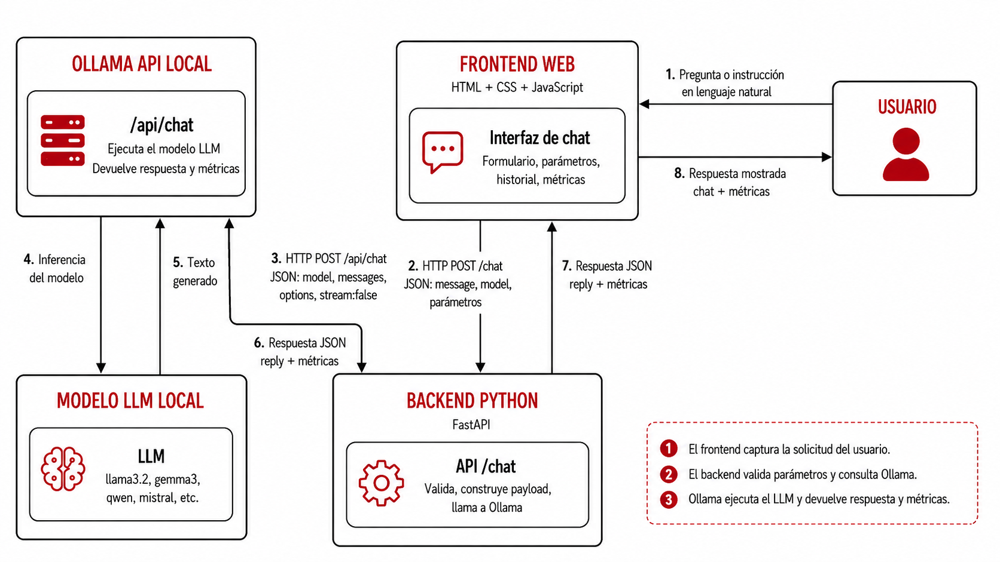

# Uso de APIs externas para LLM: Gemini, Groq y comparación con Ollama

Esta sección continúa el trabajo de los temas anteriores, se modifica esa misma arquitectura para que el backend pueda llamar no solo a Ollama local, sino también a **modelos alojados por proveedores externos** mediante APIs en línea. El objetivo es comparar tres formas de usar modelos de lenguaje:

1. Modelo local con Ollama.
2. Modelo cerrado mediante API externa.
3. Modelo abierto alojado en infraestructura externa.


Esta comparación permite analizar diferencias de **velocidad**, **costo**, **tamaño del modelo**, **tokens**, **privacidad**, **facilidad de integración** y **dependencia de internet**. También permite observar una diferencia importante: en Ollama se controla el entorno local, mientras que en una API externa se consume un servicio remoto con sus propias reglas, límites y costos.

El tema se apoya en documentación oficial de Ollama, FastAPI, Google Gemini API, GroqCloud, Mistral AI, Cohere, Hugging Face, OpenRouter y OpenAI [1]–[16].

> 🎯 **Objetivo de aprendizaje:** Al finalizar esta actividad, el estudiante será capaz de explicar la diferencia entre ejecutar un LLM local y consumir un LLM mediante API externa; configurar llaves de API de forma segura; modificar un backend FastAPI para seleccionar proveedor y modelo; enviar mensajes con `system`, `user` y parámetros de generación; medir latencia y tokens; comparar al menos dos APIs externas contra Ollama; y justificar cuándo conviene usar modelos locales o servicios en la nube.

---

## 1. De chatbot local a chatbot híbrido

En el Tema 3 se construyó un chatbot local con esta arquitectura:



Ahora se agrega una nueva capa de decisión: el **proveedor de inferencia**.


La arquitectura sigue usando el backend como intermediario. Esto es especialmente importante porque las API keys no deben exponerse en el navegador.

> ⚠️ **Consideración:** El frontend nunca debe contener una API key. Si la llave se coloca en JavaScript, cualquier usuario podría verla desde las herramientas de desarrollador del navegador. Por eso, las llaves se guardan en el backend mediante variables de entorno.

```text
[IMAGEN 1: Diagrama de arquitectura]

Usuario
  ↓
Frontend
  - mensaje
  - proveedor
  - modelo
  - parámetros
  - perfil de copiloto
  - system_prompt editable
  ↓
Backend FastAPI
  - valida parámetros
  - valida perfil
  - selecciona plantilla de system_prompt
  - construye messages
  - selecciona proveedor
  - lee API key desde .env
  - llama a Ollama o API externa
  ↓
Proveedor de inferencia
  - Ollama local
  - Gemini API
  - Groq API
  - OpenRouter
  ↓
Backend FastAPI
  - normaliza respuesta
  - calcula latencia
  - extrae tokens
  ↓
Frontend
  - muestra respuesta
  - muestra proveedor/modelo
  - muestra perfil usado
  - muestra métricas
```

---

## 3. ¿Qué cambia respecto al LLM Local?

La lógica del copiloto se mantiene:

```text
perfil de copiloto
+ system_prompt
+ mensaje del usuario
+ parámetros
```

Lo que cambia es el destino de la solicitud.

| Elemento | Tema 4: Copilotos con Ollama | Tema 5: APIs externas |
|---|---|---|
| Modelo | Local | Local o remoto |
| Proveedor | Ollama | Ollama, Gemini, Groq u otro |
| API key | No necesaria | Necesaria |
| Métricas | Devueltas por Ollama | Dependen del proveedor |
| Costo | Hardware local | Puede tener cuota gratuita o costo por tokens |
| Privacidad | Los datos se quedan localmente | El prompt se envía a un proveedor externo |
| Dependencia de internet | No después de instalar el modelo | Sí |

---

## 4. ¿Qué es una API de LLM?

Una **API de LLM** es una interfaz HTTP que permite enviar mensajes a un modelo de lenguaje alojado en servidores externos. En lugar de ejecutar el modelo en la computadora local, el backend envía una solicitud por internet y recibe una respuesta generada por el modelo.

Una solicitud de chat generalmente incluye:

- nombre del modelo;
- lista de mensajes;
- parámetros de generación;
- límite de tokens de salida;
- API key para autenticación.

Ejemplo:

<!-- code-open: true -->
```json
{
  "model": "nombre-del-modelo",
  "messages": [
    {
      "role": "system",
      "content": "Eres un asistente académico claro y preciso."
    },
    {
      "role": "user",
      "content": "Explica qué es la odometría diferencial."
    }
  ],
  "temperature": 0.7,
  "max_tokens": 300
}
```

Una respuesta suele incluir:

<!-- code-open: true -->
```json
{
  "model": "nombre-del-modelo",
  "choices": [
    {
      "message": {
        "role": "assistant",
        "content": "La odometría diferencial es..."
      }
    }
  ],
  "usage": {
    "prompt_tokens": 45,
    "completion_tokens": 180,
    "total_tokens": 225
  }
}
```

> ⚠️ **Consideración:** La estructura exacta depende del proveedor, por eso el backend debe **normalizar** la respuesta antes de enviar la solicitud al proveedor o al recibir la respuesta.

---

## 5. Proveedores recomendados para experimentación

La siguiente tabla resume proveedores que pueden servir para prácticas académicas. Las cuotas gratuitas, modelos disponibles y límites cambian con el tiempo, por lo que se recomienda revisar las ligas oficiales antes de realizar la práctica.

```

| Logo | Proveedor | Liga oficial | Acceso gratuito o de evaluación | Modelos sugeridos | Parámetros publicados | Uso didáctico |
|---|---|---|---|---|---|---|
|  | Google Gemini API | https://ai.google.dev/gemini-api/docs | Tier gratuito o free trial con límites por proyecto | `gemini-2.5-flash`, `gemini-2.5-flash-lite` | No divulgado | Comparar un modelo cerrado de alto rendimiento contra Ollama local. |
| `[LOGO: Groq]` | GroqCloud | https://console.groq.com/docs | Free plan con límites de solicitudes y tokens | `llama-3.3-70b-versatile`, `llama-3.1-8b-instant` | 70B y 8B aproximados | Medir velocidad de inferencia en infraestructura optimizada. |
| `[LOGO: Mistral]` | Mistral AI | https://docs.mistral.ai/ | Free mode para evaluación y prototipado | `ministral-8b`, `mistral-small` | 8B en Ministral; otros no siempre divulgados | Probar modelos eficientes y discutir modelos europeos. |
| `[LOGO: Cohere]` | Cohere | https://docs.cohere.com/ | Evaluation key gratuita con uso limitado | `command-r`, `command-r7b`, `command-a` | 7B en Command R7B; 111B en Command A | Discutir RAG, agentes, tool use y modelos enterprise. |
| `[LOGO: Hugging Face]` | Hugging Face Inference Providers | https://huggingface.co/docs/inference-providers | Créditos mensuales gratuitos pequeños | Modelos Llama, Qwen, Mistral u otros | Depende del modelo | Conectar modelos abiertos con inferencia alojada. |
| `[LOGO: OpenRouter]` | OpenRouter | https://openrouter.ai/docs | Modelos `:free` con límite diario | Modelos `:free` disponibles en catálogo | Depende del modelo | Probar varios modelos con una sola API compatible con OpenAI. |
| `[LOGO: OpenAI]` | OpenAI API | https://platform.openai.com/docs | Normalmente requiere facturación o créditos | Modelos económicos vigentes | No divulgado | Referencia industrial, pero no ideal si se busca evitar cobros. |

---

## 6. Selección recomendada para esta práctica

Para evitar que la práctica se vuelva demasiado extensa, se recomienda trabajar con:

```text
1. Ollama local
   Modelo sugerido: llama3.2:3b

2. Gemini API
   Modelo sugerido: gemini-2.5-flash

3. Groq API
   Modelo sugerido: llama-3.3-70b-versatile
```

Esta combinación permite comparar:

| Caso | Ejemplo | Tipo | Ventaja didáctica |
|---|---|---|---|
| Local pequeño | `llama3.2:3b` | Modelo abierto local | Control, privacidad, bajo costo recurrente |
| Remoto cerrado | `gemini-2.5-flash` | Modelo comercial cerrado | Calidad, velocidad, capacidades avanzadas |
| Remoto abierto grande | `llama-3.3-70b-versatile` | Modelo abierto alojado | Tamaño 70B y alta velocidad con Groq |

---

## 7. Tokens, parámetros y métricas

En esta práctica se compararán variables similares a las usadas en el benchmark con Ollama:

| Métrica | Significado |
|---|---|
| `wall_time_s` | Tiempo total medido por el backend |
| `prompt_tokens` | Tokens de entrada |
| `completion_tokens` | Tokens de salida |
| `total_tokens` | Tokens totales |
| `tokens_per_second` | Velocidad aproximada de generación |
| `provider` | Proveedor usado |
| `model` | Modelo usado |
| `copilot_profile` | Perfil de copiloto usado |

En Ollama se obtienen métricas como `prompt_eval_count`, `eval_count`, `total_duration` y `eval_duration`. En APIs externas, las métricas dependen del proveedor. Algunos devuelven `usage`, otros no reportan todos los campos o los reportan con nombres diferentes.

Por eso, el backend debe convertir todas las respuestas a un formato común.

---

## 8. Nota sobre parámetros del modelo

Cuando un modelo se describe como `3B`, `7B`, `8B`, `70B` o `111B`, la letra `B` se refiere a *billion* en inglés:

```text
1B = 1,000 millones de parámetros
```

Por lo tanto:

```text
3B = 3,000 millones de parámetros
70B = 70,000 millones de parámetros
```

En español conviene decir **mil millones de parámetros** para evitar confusión con la palabra “billón”.

No todos los proveedores publican el número de parámetros. Esto también forma parte de la caracterización del modelo. En la tabla de resultados se puede escribir:

```text
No divulgado públicamente
```

---

## 9. Estructura del proyecto

Se reutiliza el proyecto del Tema 4. La estructura queda así:

```text
chatbot-copilotos-apis/
├── backend/
│   ├── main.py
│   ├── requirements.txt
│   ├── .env
│   └── .env.example
└── frontend/
    ├── index.html
    ├── styles.css
    └── app.js
```

| Carpeta | Archivo | Función |
|---|---|---|
| `backend/` | `main.py` | API intermedia para Ollama y proveedores externos |
| `backend/` | `requirements.txt` | Dependencias de Python |
| `backend/` | `.env` | Llaves privadas de API |
| `backend/` | `.env.example` | Plantilla sin llaves reales |
| `frontend/` | `index.html` | Interfaz del chatbot |
| `frontend/` | `styles.css` | Estilos visuales |
| `frontend/` | `app.js` | Comunicación con backend |

---

## 10. Variables de entorno y seguridad

En el backend, crear un archivo `.env`:

<!-- code-file: .env.example -->
```text
GEMINI_API_KEY=pega_aqui_tu_llave_de_gemini
GROQ_API_KEY=pega_aqui_tu_llave_de_groq
OPENROUTER_API_KEY=pega_aqui_tu_llave_de_openrouter
```

Agregar `.env` al archivo `.gitignore`:

<!-- code-open: true -->
```text
.env
```

> ⚠️ **Consideración:** El archivo `.env` no debe subirse a GitHub. Si una API key se publica por accidente, debe revocarse inmediatamente desde el panel del proveedor.

---

## 11. Instalación de dependencias

En la carpeta del backend:

<!-- code-open: true -->
```bash
python -m venv .venv
```

Activar el entorno virtual en Windows PowerShell:

<!-- code-open: true -->
```bash
.\.venv\Scripts\Activate.ps1
```

Activar el entorno virtual en macOS o Linux:

<!-- code-open: true -->
```bash
source .venv/bin/activate
```

Instalar dependencias:

<!-- code-open: true -->
```bash
pip install fastapi uvicorn requests pydantic python-dotenv google-genai openai
```

Generar `requirements.txt`:

<!-- code-open: true -->
```bash
pip freeze > requirements.txt
```

Archivo mínimo recomendado:

<!-- code-file: requirements.txt -->
```text
fastapi
uvicorn
requests
pydantic
python-dotenv
google-genai
openai
```

---

## 12. Backend FastAPI actualizado

El backend conserva la lógica del Tema 4:

```text
- perfiles de copiloto;
- system_prompt editable;
- validación de parámetros;
- métricas;
- endpoint /profiles;
- endpoint /chat.
```

La diferencia es que ahora el request incluye:

```text
provider: ollama | gemini | groq | openrouter
```

El backend selecciona la función correspondiente:

```text
call_ollama()
call_gemini()
call_openai_compatible()
```

Guarda el siguiente archivo como:

```text
backend/main.py
```

<!-- code-file: main.py -->
```python
import os
import time
from typing import Dict, List, Optional, Tuple

import requests
from dotenv import load_dotenv
from fastapi import FastAPI, HTTPException
from fastapi.middleware.cors import CORSMiddleware
from google import genai
from openai import OpenAI
from pydantic import BaseModel, Field


load_dotenv()

OLLAMA_CHAT_URL = "http://localhost:11434/api/chat"


COPILOT_PROFILES: Dict[str, Dict[str, str]] = {
    "generico": {
        "label": "Asistente genérico",
        "system_prompt": (
            "Eres un asistente académico claro, preciso y útil para estudiantes universitarios. "
            "Responde de forma ordenada, honesta y con lenguaje comprensible."
        ),
    },
    "docente": {
        "label": "Copiloto docente universitario",
        "system_prompt": (
            "Eres un copiloto docente universitario. Ayudas a diseñar clases, actividades, rúbricas, "
            "objetivos de aprendizaje y explicaciones para estudiantes. Respondes con tono académico claro. "
            "Cuando diseñes una actividad, incluye objetivo, duración, materiales, pasos y criterios de evaluación. "
            "Si falta información sobre nivel, duración o materia, pregunta antes de asumir."
        ),
    },
    "robotica": {
        "label": "Copiloto de robótica móvil",
        "system_prompt": (
            "Eres un copiloto de robótica móvil educativa. Ayudas a estudiantes universitarios a comprender sensores, "
            "actuadores, cinemática, control, comunicación y programación de robots. Respondes con lenguaje técnico claro, "
            "ejemplos prácticos y advertencias de seguridad. Cuando la pregunta involucre conexiones eléctricas, motores, "
            "baterías o drivers, debes pedir datos faltantes como voltaje, corriente, modelo de componente y diagrama de conexión "
            "antes de dar instrucciones específicas."
        ),
    },
    "programacion": {
        "label": "Copiloto de programación Python",
        "system_prompt": (
            "Eres un copiloto de programación en Python para estudiantes universitarios. Explicas paso a paso, propones código claro, "
            "comentado y reproducible. Si el usuario muestra un error, primero interpreta el mensaje, luego propone una causa probable "
            "y finalmente da una corrección verificable. No inventes funciones ni librerías inexistentes."
        ),
    },
    "investigacion": {
        "label": "Copiloto de investigación académica",
        "system_prompt": (
            "Eres un copiloto de investigación académica. Ayudas a formular preguntas de investigación, organizar argumentos, "
            "estructurar marcos teóricos y detectar vacíos conceptuales. Debes separar hechos, inferencias y recomendaciones. "
            "No inventes citas, autores, DOI ni resultados. Si no tienes una fuente verificable, dilo explícitamente."
        ),
    },
}


PROVIDER_MODELS = {
    "ollama": [
        "llama3.2:3b",
        "gemma3:4b",
        "qwen2.5:7b",
        "mistral:7b",
    ],
    "gemini": [
        "gemini-2.5-flash",
        "gemini-2.5-flash-lite",
    ],
    "groq": [
        "llama-3.3-70b-versatile",
        "llama-3.1-8b-instant",
    ],
    "openrouter": [
        "meta-llama/llama-3.1-8b-instruct:free",
        "qwen/qwen-2.5-7b-instruct:free",
    ],
}


app = FastAPI(
    title="Chatbot híbrido con Ollama y APIs externas",
    description="API intermedia para comparar LLM local con modelos remotos de Gemini, Groq y OpenRouter.",
    version="3.0.0",
)


app.add_middleware(
    CORSMiddleware,
    allow_origins=[
        "http://localhost:5500",
        "http://127.0.0.1:5500",
        "http://localhost:8000",
        "http://127.0.0.1:8000",
    ],
    allow_credentials=True,
    allow_methods=["*"],
    allow_headers=["*"],
)


class ChatRequest(BaseModel):
    message: str = Field(..., min_length=1, max_length=4000)

    provider: str = Field(default="ollama", min_length=1, max_length=50)
    model: str = Field(default="llama3.2:3b", min_length=1, max_length=150)

    copilot_profile: str = Field(default="generico", min_length=1, max_length=50)
    system_prompt: str = Field(default="", max_length=6000)

    temperature: float = Field(default=0.7, ge=0.0, le=1.2)
    top_p: float = Field(default=0.9, ge=0.1, le=1.0)
    max_tokens: int = Field(default=250, ge=20, le=1000)

    num_ctx: int = Field(default=4096, ge=512, le=8192)
    repeat_penalty: float = Field(default=1.1, ge=1.0, le=2.0)
    keep_alive: str = Field(default="5m", max_length=20)


class ChatMetrics(BaseModel):
    wall_time_s: float
    provider_duration_s: float
    prompt_tokens: int
    completion_tokens: int
    total_tokens: int
    tokens_per_second: float
    raw_provider_metrics: Optional[dict] = None


class ChatResponse(BaseModel):
    provider: str
    model: str
    copilot_profile: str
    copilot_label: str
    system_prompt_used: str
    reply: str
    metrics: ChatMetrics


@app.get("/")
def root():
    return {
        "message": "API de chatbot híbrido con Ollama y APIs externas",
        "docs": "/docs",
        "health": "/health",
        "profiles": "/profiles",
        "providers": "/providers",
    }


@app.get("/health")
def health():
    return {"status": "ok"}


@app.get("/profiles")
def profiles():
    return COPILOT_PROFILES


@app.get("/providers")
def providers():
    return PROVIDER_MODELS


def get_profile(profile_id: str) -> Dict[str, str]:
    if profile_id not in COPILOT_PROFILES:
        raise HTTPException(
            status_code=400,
            detail=f"Perfil no válido: {profile_id}. Usa GET /profiles para ver perfiles disponibles.",
        )
    return COPILOT_PROFILES[profile_id]


def validate_provider(provider: str) -> str:
    provider = provider.strip().lower()
    if provider not in PROVIDER_MODELS:
        raise HTTPException(
            status_code=400,
            detail=f"Proveedor no válido: {provider}. Usa GET /providers para ver proveedores disponibles.",
        )
    return provider


def build_messages(system_prompt: str, user_message: str) -> List[Dict[str, str]]:
    return [
        {
            "role": "system",
            "content": system_prompt,
        },
        {
            "role": "user",
            "content": user_message,
        },
    ]


def call_ollama(
    request: ChatRequest,
    messages: List[Dict[str, str]],
) -> Tuple[str, ChatMetrics]:
    payload = {
        "model": request.model.strip(),
        "messages": messages,
        "stream": False,
        "keep_alive": request.keep_alive,
        "options": {
            "temperature": request.temperature,
            "top_p": request.top_p,
            "num_predict": request.max_tokens,
            "num_ctx": request.num_ctx,
            "repeat_penalty": request.repeat_penalty,
        },
    }

    start_time = time.perf_counter()
    response = requests.post(OLLAMA_CHAT_URL, json=payload, timeout=300)
    end_time = time.perf_counter()

    response.raise_for_status()
    data = response.json()

    message = data.get("message", {})
    reply = message.get("content", "")

    total_duration_s = data.get("total_duration", 0) / 1e9
    prompt_tokens = data.get("prompt_eval_count", 0)
    completion_tokens = data.get("eval_count", 0)
    eval_duration_s = data.get("eval_duration", 0) / 1e9
    total_tokens = prompt_tokens + completion_tokens
    tokens_per_second = completion_tokens / eval_duration_s if eval_duration_s > 0 else 0

    return reply, ChatMetrics(
        wall_time_s=end_time - start_time,
        provider_duration_s=total_duration_s,
        prompt_tokens=prompt_tokens,
        completion_tokens=completion_tokens,
        total_tokens=total_tokens,
        tokens_per_second=tokens_per_second,
        raw_provider_metrics={
            "load_duration_s": data.get("load_duration", 0) / 1e9,
            "eval_duration_s": eval_duration_s,
        },
    )


def call_gemini(
    request: ChatRequest,
    messages: List[Dict[str, str]],
) -> Tuple[str, ChatMetrics]:
    api_key = os.getenv("GEMINI_API_KEY")
    if not api_key:
        raise HTTPException(
            status_code=500,
            detail="Falta GEMINI_API_KEY en el archivo .env del backend.",
        )

    client = genai.Client(api_key=api_key)

    system_prompt = messages[0]["content"]
    user_message = messages[1]["content"]
    contents = f"{system_prompt}\n\nUsuario:\n{user_message}"

    start_time = time.perf_counter()
    response = client.models.generate_content(
        model=request.model,
        contents=contents,
        config={
            "temperature": request.temperature,
            "top_p": request.top_p,
            "max_output_tokens": request.max_tokens,
        },
    )
    end_time = time.perf_counter()

    reply = response.text or ""
    usage = getattr(response, "usage_metadata", None)

    prompt_tokens = int(getattr(usage, "prompt_token_count", 0) or 0)
    completion_tokens = int(getattr(usage, "candidates_token_count", 0) or 0)
    total_tokens = int(getattr(usage, "total_token_count", 0) or (prompt_tokens + completion_tokens))
    wall_time_s = end_time - start_time
    tokens_per_second = completion_tokens / wall_time_s if wall_time_s > 0 else 0

    return reply, ChatMetrics(
        wall_time_s=wall_time_s,
        provider_duration_s=wall_time_s,
        prompt_tokens=prompt_tokens,
        completion_tokens=completion_tokens,
        total_tokens=total_tokens,
        tokens_per_second=tokens_per_second,
        raw_provider_metrics={},
    )


def call_openai_compatible(
    request: ChatRequest,
    messages: List[Dict[str, str]],
    api_key_env: str,
    base_url: str,
) -> Tuple[str, ChatMetrics]:
    api_key = os.getenv(api_key_env)
    if not api_key:
        raise HTTPException(
            status_code=500,
            detail=f"Falta {api_key_env} en el archivo .env del backend.",
        )

    client = OpenAI(api_key=api_key, base_url=base_url)

    start_time = time.perf_counter()
    response = client.chat.completions.create(
        model=request.model,
        messages=messages,
        temperature=request.temperature,
        top_p=request.top_p,
        max_tokens=request.max_tokens,
    )
    end_time = time.perf_counter()

    reply = response.choices[0].message.content or ""
    usage = response.usage

    prompt_tokens = usage.prompt_tokens if usage else 0
    completion_tokens = usage.completion_tokens if usage else 0
    total_tokens = usage.total_tokens if usage else prompt_tokens + completion_tokens
    wall_time_s = end_time - start_time
    tokens_per_second = completion_tokens / wall_time_s if wall_time_s > 0 else 0

    return reply, ChatMetrics(
        wall_time_s=wall_time_s,
        provider_duration_s=wall_time_s,
        prompt_tokens=prompt_tokens,
        completion_tokens=completion_tokens,
        total_tokens=total_tokens,
        tokens_per_second=tokens_per_second,
        raw_provider_metrics={},
    )


@app.post("/chat", response_model=ChatResponse)
def chat(request: ChatRequest):
    provider = validate_provider(request.provider)
    profile = get_profile(request.copilot_profile)

    system_prompt_used = request.system_prompt.strip()
    if not system_prompt_used:
        system_prompt_used = profile["system_prompt"]

    messages = build_messages(system_prompt_used, request.message)

    try:
        if provider == "ollama":
            reply, metrics = call_ollama(request, messages)

        elif provider == "gemini":
            reply, metrics = call_gemini(request, messages)

        elif provider == "groq":
            reply, metrics = call_openai_compatible(
                request=request,
                messages=messages,
                api_key_env="GROQ_API_KEY",
                base_url="https://api.groq.com/openai/v1",
            )

        elif provider == "openrouter":
            reply, metrics = call_openai_compatible(
                request=request,
                messages=messages,
                api_key_env="OPENROUTER_API_KEY",
                base_url="https://openrouter.ai/api/v1",
            )

        else:
            raise HTTPException(status_code=400, detail="Proveedor no implementado.")

    except requests.exceptions.ConnectionError as exc:
        raise HTTPException(
            status_code=503,
            detail="No se pudo conectar con Ollama. Verifica que Ollama esté ejecutándose.",
        ) from exc

    except requests.exceptions.Timeout as exc:
        raise HTTPException(
            status_code=504,
            detail="La solicitud tardó demasiado tiempo.",
        ) from exc

    except requests.exceptions.HTTPError as exc:
        raise HTTPException(
            status_code=500,
            detail=f"Error HTTP del proveedor: {str(exc)}",
        ) from exc

    except HTTPException:
        raise

    except Exception as exc:
        raise HTTPException(
            status_code=500,
            detail=f"Error inesperado al consultar el proveedor {provider}: {str(exc)}",
        ) from exc

    return ChatResponse(
        provider=provider,
        model=request.model,
        copilot_profile=request.copilot_profile,
        copilot_label=profile["label"],
        system_prompt_used=system_prompt_used,
        reply=reply,
        metrics=metrics,
    )
```

---

## 13. Probar backend sin frontend

Ejecutar el backend:

<!-- code-open: true -->
```bash
uvicorn main:app --reload --port 8000
```

Abrir en el navegador:

```text
http://localhost:8000/docs
```

Probar el endpoint:

```text
GET /providers
```

Debe devolver algo parecido a:

<!-- code-open: true -->
```json
{
  "ollama": [
    "llama3.2:3b",
    "gemma3:4b",
    "qwen2.5:7b",
    "mistral:7b"
  ],
  "gemini": [
    "gemini-2.5-flash",
    "gemini-2.5-flash-lite"
  ],
  "groq": [
    "llama-3.3-70b-versatile",
    "llama-3.1-8b-instant"
  ],
  "openrouter": [
    "meta-llama/llama-3.1-8b-instruct:free",
    "qwen/qwen-2.5-7b-instruct:free"
  ]
}
```

Ejemplo para probar `POST /chat` con Ollama:

<!-- code-open: true -->
```json
{
  "provider": "ollama",
  "model": "llama3.2:3b",
  "copilot_profile": "robotica",
  "system_prompt": "",
  "message": "Explica qué es la odometría diferencial en 3 oraciones.",
  "temperature": 0.7,
  "top_p": 0.9,
  "max_tokens": 200,
  "num_ctx": 4096,
  "repeat_penalty": 1.1
}
```

Ejemplo para probar `POST /chat` con Groq:

<!-- code-open: true -->
```json
{
  "provider": "groq",
  "model": "llama-3.3-70b-versatile",
  "copilot_profile": "robotica",
  "system_prompt": "",
  "message": "Explica qué es la odometría diferencial en 3 oraciones.",
  "temperature": 0.7,
  "top_p": 0.9,
  "max_tokens": 200
}
```

---

## 14. Frontend actualizado

El frontend mantiene la idea del Tema 4, pero agrega:

```text
- selector de proveedor;
- selector de modelo dinámico;
- métricas con proveedor/modelo;
- tokens normalizados para Ollama y APIs externas.
```

### 14.1 Archivo `index.html`

Guarda el siguiente contenido como:

```text
frontend/index.html
```

<!-- code-file: index.html -->
```html
<!DOCTYPE html>
<html lang="es">
<head>
  <meta charset="UTF-8" />
  <meta name="viewport" content="width=device-width, initial-scale=1.0" />

  <title>Chatbot híbrido con Ollama y APIs externas</title>

  <link rel="stylesheet" href="styles.css" />
</head>
<body>
  <main class="app">
    <section class="header">
      <h1>Chatbot híbrido con Ollama y APIs externas</h1>
      <p>
        Compara un modelo local con modelos remotos usando perfiles de copiloto, parámetros configurables y métricas de inferencia.
      </p>
    </section>

    <section class="layout">
      <aside class="controls">
        <h2>Configuración</h2>

        <label>
          Proveedor
          <select id="provider">
            <option value="ollama">Ollama local</option>
            <option value="gemini">Google Gemini API</option>
            <option value="groq">Groq API</option>
            <option value="openrouter">OpenRouter</option>
          </select>
        </label>

        <label>
          Modelo
          <select id="model"></select>
        </label>

        <label>
          Perfil de copiloto
          <select id="copilot_profile">
            <option value="generico">Asistente genérico</option>
            <option value="docente">Copiloto docente universitario</option>
            <option value="robotica">Copiloto de robótica móvil</option>
            <option value="programacion">Copiloto de programación Python</option>
            <option value="investigacion">Copiloto de investigación académica</option>
          </select>
        </label>

        <button id="loadProfileBtn" type="button">Cargar plantilla</button>

        <label>
          System prompt
          <textarea id="system_prompt" rows="9"></textarea>
        </label>

        <label>
          Temperatura
          <input id="temperature" type="number" min="0" max="1.2" step="0.1" value="0.7" />
        </label>

        <label>
          Top-p
          <input id="top_p" type="number" min="0.1" max="1" step="0.05" value="0.9" />
        </label>

        <label>
          Tokens máximos de salida
          <input id="max_tokens" type="number" min="20" max="1000" step="10" value="250" />
        </label>

        <label>
          Contexto local Ollama
          <select id="num_ctx">
            <option value="2048">2048</option>
            <option value="4096" selected>4096</option>
            <option value="8192">8192</option>
          </select>
        </label>

        <label>
          Repeat penalty local Ollama
          <input id="repeat_penalty" type="number" min="1" max="2" step="0.1" value="1.1" />
        </label>

        <button id="clearBtn" type="button">Limpiar conversación</button>
      </aside>

      <section class="chat-panel">
        <div class="comparison-note">
          <strong>Prueba sugerida:</strong>
          ejecuta el mismo prompt con Ollama, Gemini y Groq. Compara latencia, tokens y calidad de respuesta.
        </div>

        <div id="chat" class="chat"></div>

        <form id="chatForm" class="chat-form">
          <textarea
            id="message"
            rows="4"
            placeholder="Escribe tu mensaje para el copiloto..."
            required
          ></textarea>

          <button id="sendBtn" type="submit">Enviar</button>
        </form>

        <section class="metrics">
          <h2>Métricas de la última respuesta</h2>
          <div id="profileInfo" class="profile-info">Sin perfil usado todavía</div>
          <div id="metricsGrid" class="metrics-grid">
            <span>Sin datos todavía</span>
          </div>
        </section>
      </section>
    </section>
  </main>

  <script src="app.js"></script>
</body>
</html>
```

### 14.2 Archivo `styles.css`

Se puede reutilizar el archivo del Tema 4. Si quieres dejarlo completo en este tema, usa:

<!-- code-file: styles.css -->
```css
:root {
  --ibero-red: #E00034;
  --dark: #1f2937;
  --text: #333333;
  --muted: #6b7280;
  --border: #e5e7eb;
  --bg: #f8fafc;
  --card: #ffffff;
  --blue: #2563eb;
}

* {
  box-sizing: border-box;
}

body {
  margin: 0;
  font-family: Arial, Helvetica, sans-serif;
  color: var(--text);
  background: var(--bg);
}

.app {
  max-width: 1250px;
  margin: 0 auto;
  padding: 2rem;
}

.header {
  margin-bottom: 1.5rem;
}

.header h1 {
  margin: 0 0 .5rem;
  color: var(--ibero-red);
}

.header p {
  margin: 0;
  color: var(--muted);
}

.layout {
  display: grid;
  grid-template-columns: 360px 1fr;
  gap: 1rem;
}

.controls,
.chat-panel,
.metrics {
  background: var(--card);
  border: 1px solid var(--border);
  border-radius: 14px;
  padding: 1rem;
}

.controls h2,
.metrics h2 {
  margin-top: 0;
  font-size: 1.1rem;
}

label {
  display: block;
  margin-bottom: .9rem;
  font-weight: 600;
}

input,
select,
textarea,
button {
  width: 100%;
  margin-top: .35rem;
  padding: .65rem;
  border: 1px solid var(--border);
  border-radius: 10px;
  font: inherit;
}

textarea {
  resize: vertical;
}

button {
  border: none;
  color: #ffffff;
  background: var(--ibero-red);
  font-weight: 700;
  cursor: pointer;
}

button:disabled {
  opacity: .6;
  cursor: not-allowed;
}

#clearBtn {
  background: var(--dark);
}

#loadProfileBtn {
  margin-bottom: .9rem;
  background: var(--blue);
}

.chat-panel {
  display: flex;
  flex-direction: column;
  min-height: 720px;
}

.comparison-note {
  padding: .8rem 1rem;
  margin-bottom: 1rem;
  background: #fff7ed;
  border-left: 4px solid #f97316;
  border-radius: 10px;
  color: #7c2d12;
}

.chat {
  flex: 1;
  overflow-y: auto;
  padding: .5rem;
  border-radius: 12px;
  background: #f3f4f6;
  margin-bottom: 1rem;
}

.message {
  margin: .75rem 0;
  padding: .85rem 1rem;
  border-radius: 12px;
  line-height: 1.45;
  white-space: pre-wrap;
}

.message.user {
  background: #fee2e2;
  border-left: 4px solid var(--ibero-red);
}

.message.assistant {
  background: #ffffff;
  border-left: 4px solid var(--blue);
}

.message.error {
  background: #fef3c7;
  border-left: 4px solid #f59e0b;
}

.message strong {
  display: block;
  margin-bottom: .25rem;
}

.chat-form {
  display: grid;
  gap: .75rem;
}

.metrics {
  margin-top: 1rem;
}

.profile-info {
  margin-bottom: .75rem;
  padding: .6rem .75rem;
  background: #f8fafc;
  border: 1px solid var(--border);
  border-radius: 10px;
  color: var(--muted);
}

.metrics-grid {
  display: grid;
  grid-template-columns: repeat(4, minmax(120px, 1fr));
  gap: .75rem;
}

.metric-card {
  background: #f8fafc;
  border: 1px solid var(--border);
  border-radius: 10px;
  padding: .75rem;
}

.metric-card small {
  display: block;
  color: var(--muted);
  margin-bottom: .25rem;
}

.metric-card strong {
  font-size: 1.05rem;
}

@media (max-width: 950px) {
  .layout {
    grid-template-columns: 1fr;
  }

  .metrics-grid {
    grid-template-columns: 1fr 1fr;
  }
}
```

### 14.3 Archivo `app.js`

Guarda el siguiente contenido como:

```text
frontend/app.js
```

<!-- code-file: app.js -->
```javascript
const API_URL = "http://localhost:8000/chat";
const PROFILES_URL = "http://localhost:8000/profiles";
const PROVIDERS_URL = "http://localhost:8000/providers";

const form = document.getElementById("chatForm");
const chat = document.getElementById("chat");
const metricsGrid = document.getElementById("metricsGrid");
const profileInfo = document.getElementById("profileInfo");
const sendBtn = document.getElementById("sendBtn");
const clearBtn = document.getElementById("clearBtn");
const loadProfileBtn = document.getElementById("loadProfileBtn");

const messageInput = document.getElementById("message");
const systemPromptInput = document.getElementById("system_prompt");
const profileSelect = document.getElementById("copilot_profile");
const providerSelect = document.getElementById("provider");
const modelSelect = document.getElementById("model");

let profiles = {};
let providerModels = {};

async function loadProfiles() {
  try {
    const response = await fetch(PROFILES_URL);

    if (!response.ok) {
      throw new Error("No se pudo consultar el endpoint /profiles.");
    }

    profiles = await response.json();
    loadSelectedProfile();

  } catch (error) {
    console.error("No se pudieron cargar los perfiles:", error);
    systemPromptInput.value =
      "No se pudieron cargar los perfiles desde el backend. Verifica que FastAPI esté ejecutándose en http://localhost:8000.";
  }
}

async function loadProviders() {
  try {
    const response = await fetch(PROVIDERS_URL);

    if (!response.ok) {
      throw new Error("No se pudo consultar el endpoint /providers.");
    }

    providerModels = await response.json();
    renderModelOptions();

  } catch (error) {
    console.error("No se pudieron cargar los proveedores:", error);
    modelSelect.innerHTML = `<option value="">Error al cargar modelos</option>`;
  }
}

function renderModelOptions() {
  const provider = providerSelect.value;
  const models = providerModels[provider] || [];

  modelSelect.innerHTML = models
    .map((model) => `<option value="${escapeHtml(model)}">${escapeHtml(model)}</option>`)
    .join("");
}

function loadSelectedProfile() {
  const profileId = profileSelect.value;

  if (profiles[profileId]) {
    systemPromptInput.value = profiles[profileId].system_prompt;
  }
}

function getConfig() {
  return {
    provider: providerSelect.value,
    model: modelSelect.value,
    copilot_profile: profileSelect.value,
    system_prompt: systemPromptInput.value,
    temperature: Number(document.getElementById("temperature").value),
    top_p: Number(document.getElementById("top_p").value),
    max_tokens: Number(document.getElementById("max_tokens").value),
    num_ctx: Number(document.getElementById("num_ctx").value),
    repeat_penalty: Number(document.getElementById("repeat_penalty").value)
  };
}

function addMessage(role, content, type = "assistant") {
  const div = document.createElement("div");
  div.className = `message ${type}`;
  div.innerHTML = `<strong>${escapeHtml(role)}</strong>${escapeHtml(content)}`;
  chat.appendChild(div);
  chat.scrollTop = chat.scrollHeight;
}

function renderMetrics(data) {
  const metrics = data.metrics;

  profileInfo.innerHTML = `
    <strong>Proveedor:</strong> ${escapeHtml(data.provider)}
    <br>
    <strong>Modelo:</strong> ${escapeHtml(data.model)}
    <br>
    <strong>Perfil usado:</strong> ${escapeHtml(data.copilot_label)}
  `;

  const items = [
    ["Tiempo backend", `${metrics.wall_time_s.toFixed(3)} s`],
    ["Tiempo proveedor", `${metrics.provider_duration_s.toFixed(3)} s`],
    ["Tokens entrada", metrics.prompt_tokens],
    ["Tokens salida", metrics.completion_tokens],
    ["Tokens totales", metrics.total_tokens],
    ["Tokens/s aprox.", metrics.tokens_per_second.toFixed(2)]
  ];

  metricsGrid.innerHTML = items
    .map(([label, value]) => `
      <div class="metric-card">
        <small>${label}</small>
        <strong>${value}</strong>
      </div>
    `)
    .join("");
}

function escapeHtml(text) {
  return String(text)
    .replaceAll("&", "&amp;")
    .replaceAll("<", "&lt;")
    .replaceAll(">", "&gt;");
}

form.addEventListener("submit", async (event) => {
  event.preventDefault();

  const message = messageInput.value.trim();

  if (!message) {
    return;
  }

  const payload = {
    message,
    ...getConfig()
  };

  addMessage("Usuario", message, "user");
  messageInput.value = "";
  sendBtn.disabled = true;
  sendBtn.textContent = "Generando...";

  try {
    const response = await fetch(API_URL, {
      method: "POST",
      headers: {
        "Content-Type": "application/json"
      },
      body: JSON.stringify(payload)
    });

    const data = await response.json();

    if (!response.ok) {
      throw new Error(data.detail || "Error desconocido");
    }

    addMessage(
      `Copiloto (${data.provider} / ${data.model})`,
      data.reply,
      "assistant"
    );

    renderMetrics(data);

  } catch (error) {
    addMessage("Error", error.message, "error");

  } finally {
    sendBtn.disabled = false;
    sendBtn.textContent = "Enviar";
  }
});

clearBtn.addEventListener("click", () => {
  chat.innerHTML = "";
  profileInfo.textContent = "Sin perfil usado todavía";
  metricsGrid.innerHTML = "<span>Sin datos todavía</span>";
});

loadProfileBtn.addEventListener("click", loadSelectedProfile);
profileSelect.addEventListener("change", loadSelectedProfile);
providerSelect.addEventListener("change", renderModelOptions);

loadProfiles();
loadProviders();
```

---

## 15. Ejecución del proyecto

### 15.1 Backend

En la carpeta `backend/`:

<!-- code-open: true -->
```bash
uvicorn main:app --reload --port 8000
```

Verificar:

```text
http://localhost:8000/health
```

Ver perfiles:

```text
http://localhost:8000/profiles
```

Ver proveedores:

```text
http://localhost:8000/providers
```

### 15.2 Frontend

En la carpeta `frontend/`:

<!-- code-open: true -->
```bash
python -m http.server 5500
```

Abrir:

```text
http://localhost:5500
```

---

## 16. Prueba guiada

Usar el mismo prompt en los tres proveedores:

```text
Explica qué es la odometría diferencial en un robot móvil de dos ruedas.
Incluye:
1. explicación conceptual;
2. ecuaciones básicas;
3. ejemplo para estudiantes de ingeniería;
4. una limitación práctica.
Responde en máximo 250 palabras.
```

Configuración sugerida:

| Parámetro | Valor |
|---|---:|
| `temperature` | 0.7 |
| `top_p` | 0.9 |
| `max_tokens` | 300 |
| Perfil | Copiloto de robótica móvil |

Probar:

| Prueba | Proveedor | Modelo |
|---|---|---|
| 1 | Ollama local | `llama3.2:3b` |
| 2 | Gemini API | `gemini-2.5-flash` |
| 3 | Groq API | `llama-3.3-70b-versatile` |

---

## 17. Tabla de caracterización

Cada equipo debe completar:

| Variable | Ollama local | Gemini API | Groq API |
|---|---:|---:|---:|
| Proveedor | Ollama | Google | Groq |
| Modelo | `llama3.2:3b` | `gemini-2.5-flash` | `llama-3.3-70b-versatile` |
| Tipo | Abierto/local | Cerrado/remoto | Abierto/remoto |
| Parámetros | 3B aprox. | No divulgado | 70B |
| Contexto máximo | | | |
| Tokens entrada | | | |
| Tokens salida | | | |
| Tokens totales | | | |
| Tiempo total | | | |
| Tokens/s | | | |
| ¿Requiere internet? | No | Sí | Sí |
| ¿Requiere API key? | No | Sí | Sí |
| ¿Tiene costo? | Hardware local | Tier gratuito limitado / pago | Free plan limitado / pago |
| Privacidad | Alta | Depende del proveedor | Depende del proveedor |
| Facilidad de integración | Media | Alta | Alta |

---

## 18. Evaluación cualitativa de respuestas

Además de las métricas, evaluar la respuesta generada.

| Criterio | Ollama local | Gemini API | Groq API |
|---|---:|---:|---:|
| Claridad conceptual | | | |
| Precisión técnica | | | |
| Uso correcto de ecuaciones | | | |
| Calidad del ejemplo | | | |
| Nivel adecuado para ingeniería | | | |
| Identificación de limitaciones | | | |
| Alucinaciones o errores | | | |
| Utilidad final | | | |

Escala sugerida:

```text
1 = deficiente
2 = básico
3 = aceptable
4 = bueno
5 = excelente
```

---

## 19. Comparación local vs API externa

### 19.1 Ventajas de Ollama local

- Mayor control sobre el entorno.
- No requiere enviar datos a terceros.
- No depende de cuotas por token.
- Puede funcionar sin internet después de instalar el modelo.
- Permite experimentar con modelos abiertos.

### 19.2 Limitaciones de Ollama local

- Depende del hardware disponible.
- Los modelos grandes requieren mucha RAM o VRAM.
- La velocidad puede ser baja en computadoras modestas.
- La instalación inicial puede ser pesada.
- No siempre se tiene acceso a modelos de frontera.

### 19.3 Ventajas de APIs externas

- Acceso rápido a modelos grandes.
- No requiere GPU local.
- Integración sencilla por HTTP.
- Escalabilidad mayor para prototipos.
- Algunos proveedores ofrecen modelos multimodales.
- Métricas de uso de tokens integradas.

### 19.4 Limitaciones de APIs externas

- Requieren internet.
- Requieren API key.
- Pueden tener costo por tokens.
- Tienen límites por minuto, día o mes.
- El proveedor puede cambiar modelos, precios o políticas.
- Hay implicaciones de privacidad y gobernanza de datos.

---

## 20. Preguntas de análisis

1. ¿Qué modelo respondió más rápido?
2. ¿Qué modelo generó la mejor explicación técnica?
3. ¿El modelo más grande fue siempre mejor?
4. ¿Qué diferencia hubo entre ejecutar localmente y usar una API?
5. ¿Qué riesgos aparecen al enviar datos a un proveedor externo?
6. ¿Qué pasaría si la API cambia de precio o deja de estar disponible?
7. ¿En qué casos conviene usar Ollama local?
8. ¿En qué casos conviene usar una API externa?
9. ¿Qué proveedor fue más fácil de integrar?
10. ¿Qué información técnica no fue publicada por el proveedor?

---

## 21. Práctica 5: Chatbot híbrido con APIs externas

### Objetivo

Modificar el chatbot/copiloto desarrollado en los temas anteriores para que pueda conversar con un modelo local en Ollama y con al menos dos modelos remotos mediante APIs externas.

### Entregables

Cada equipo deberá entregar:

1. Código del backend actualizado.
2. Código del frontend actualizado.
3. Capturas de pantalla de las tres pruebas.
4. Tabla de métricas.
5. Tabla de evaluación cualitativa.
6. Reflexión comparativa.

### Requisitos mínimos

El sistema debe permitir:

- seleccionar proveedor;
- seleccionar modelo;
- seleccionar perfil de copiloto;
- editar `system_prompt`;
- modificar `temperature`, `top_p` y tokens máximos;
- mostrar respuesta;
- mostrar tokens de entrada, salida y totales cuando estén disponibles;
- mostrar tiempo total;
- manejar errores de conexión o API key faltante.

---

## 22. Rúbrica de evaluación

| Criterio | Puntos |
|---|---:|
| Reutiliza correctamente el chatbot/copiloto anterior | 10 |
| Implementa selección de proveedor y modelo | 15 |
| Configura API keys de forma segura con `.env` | 10 |
| Integra al menos dos APIs externas | 15 |
| Ejecuta el mismo prompt en Ollama y APIs externas | 10 |
| Registra correctamente tokens y latencia | 15 |
| Caracteriza modelos, parámetros y límites | 10 |
| Compara críticamente calidad, costo, privacidad y dependencia | 10 |
| Evidencias y claridad del reporte | 5 |
| **Total** | **100** |

---

## 23. Consideraciones de privacidad

Cuando se usa Ollama local, el prompt puede permanecer en la computadora o servidor propio. Cuando se usa una API externa, el prompt se envía a un proveedor externo.

Por ello, en esta práctica no se deben enviar:

- datos personales;
- contraseñas;
- API keys;
- información institucional sensible;
- documentos confidenciales;
- datos privados de pacientes, estudiantes o usuarios.

> ⚠️ **Consideración:** Para ejercicios académicos, usar prompts técnicos genéricos. Si en el futuro se usan documentos institucionales, reglamentos o bases de conocimiento internas, se deberá revisar la política de datos del proveedor.

---

## 24. Consideraciones finales

El uso de APIs externas permite acceder a modelos más grandes, rápidos o especializados sin instalar pesos localmente ni contar con una GPU potente. Sin embargo, esta comodidad implica dependencia de internet, límites de uso, costos por tokens, cambios de disponibilidad y consideraciones de privacidad.

Ollama local, por otro lado, ofrece más control, privacidad y bajo costo recurrente, pero queda limitado por el hardware disponible.

La decisión no debe plantearse como:

```text
Ollama o API externa
```

sino como una decisión de arquitectura:

```text
¿Dónde conviene ejecutar el modelo para esta tarea, con estos datos, este presupuesto y esta latencia esperada?
```

Para prototipos académicos, la comparación entre ambos enfoques es especialmente valiosa porque permite observar que un LLM no es solo un modelo, sino parte de un sistema completo que incluye interfaz, backend, red, costos, seguridad y experiencia del usuario.

---

## 25. Referencias

[1] Ollama. (s. f.). *Chat API*. Disponible en: <https://docs.ollama.com/api/chat>

[2] Ollama. (s. f.). *API introduction*. Disponible en: <https://docs.ollama.com/api>

[3] FastAPI. (s. f.). *Request body*. Disponible en: <https://fastapi.tiangolo.com/tutorial/body/>

[4] FastAPI. (s. f.). *CORS Middleware*. Disponible en: <https://fastapi.tiangolo.com/tutorial/cors/>

[5] Google AI for Developers. (2026). *Gemini API Documentation*. Disponible en: <https://ai.google.dev/gemini-api/docs>

[6] Google AI for Developers. (2026). *Gemini API Rate Limits*. Disponible en: <https://ai.google.dev/gemini-api/docs/rate-limits>

[7] Google AI for Developers. (2026). *Gemini Models*. Disponible en: <https://ai.google.dev/gemini-api/docs/models>

[8] Groq. (s. f.). *GroqCloud Documentation*. Disponible en: <https://console.groq.com/docs>

[9] Groq. (s. f.). *Rate Limits*. Disponible en: <https://console.groq.com/docs/rate-limits>

[10] Groq. (s. f.). *Supported Models*. Disponible en: <https://console.groq.com/docs/models>

[11] Mistral AI. (s. f.). *Documentation*. Disponible en: <https://docs.mistral.ai/>

[12] Mistral AI. (s. f.). *Rate limits and usage tiers*. Disponible en: <https://docs.mistral.ai/admin/user-management-finops/tier>

[13] Cohere. (s. f.). *Documentation*. Disponible en: <https://docs.cohere.com/>

[14] Hugging Face. (s. f.). *Inference Providers*. Disponible en: <https://huggingface.co/docs/inference-providers>

[15] OpenRouter. (s. f.). *Documentation*. Disponible en: <https://openrouter.ai/docs>

[16] OpenAI. (s. f.). *API Documentation*. Disponible en: <https://platform.openai.com/docs>

---

## 26. Anexo: plantilla de reporte

# Reporte de práctica: Chatbot híbrido con APIs externas

## Equipo

```text
Nombre de integrantes:
Fecha:
Curso:
```

## Modelos evaluados

| Proveedor | Modelo | Tipo | Parámetros | Liga |
|---|---|---|---:|---|
| Ollama | | Local | | |
| Gemini | | API externa | | |
| Groq | | API externa | | |

## Prompt usado

```text
Pegar aquí el prompt utilizado.
```

## Resultados cuantitativos

| Modelo | Tiempo total | Tokens entrada | Tokens salida | Tokens totales | Tokens/s |
|---|---:|---:|---:|---:|---:|
| Ollama | | | | | |
| Gemini | | | | | |
| Groq | | | | | |

## Resultados cualitativos

| Modelo | Claridad | Precisión | Ejemplo | Errores | Comentario |
|---|---:|---:|---:|---:|---|
| Ollama | | | | | |
| Gemini | | | | | |
| Groq | | | | | |

## Evidencias

```text
[CAPTURA 1: Prueba con Ollama]
[CAPTURA 2: Prueba con Gemini]
[CAPTURA 3: Prueba con Groq]
```

## Análisis

```text
Responder:
- ¿Qué modelo fue más rápido?
- ¿Qué modelo fue más claro?
- ¿Qué modelo fue más preciso?
- ¿Qué modelo convendría usar en una aplicación real?
- ¿Qué riesgos tendría usar una API externa?
```

## Conclusión

```text
Escribir una conclusión de 150 a 250 palabras.
```
